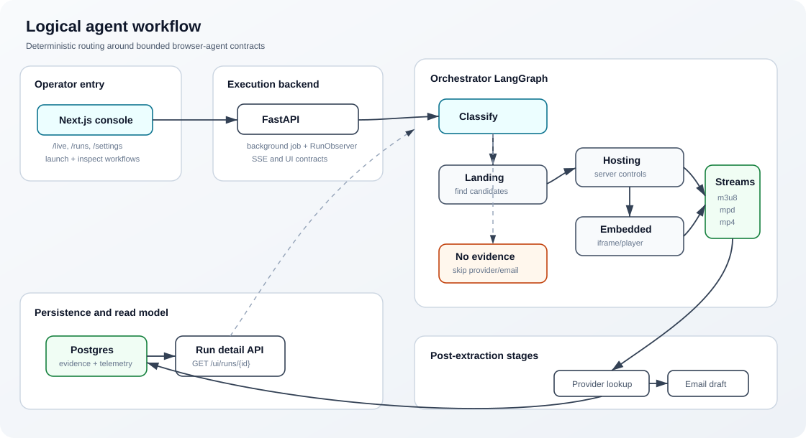
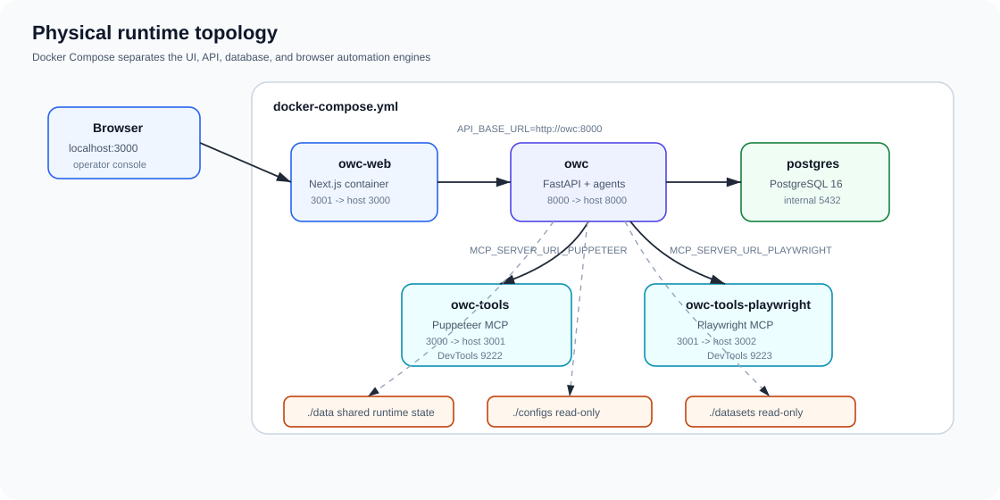
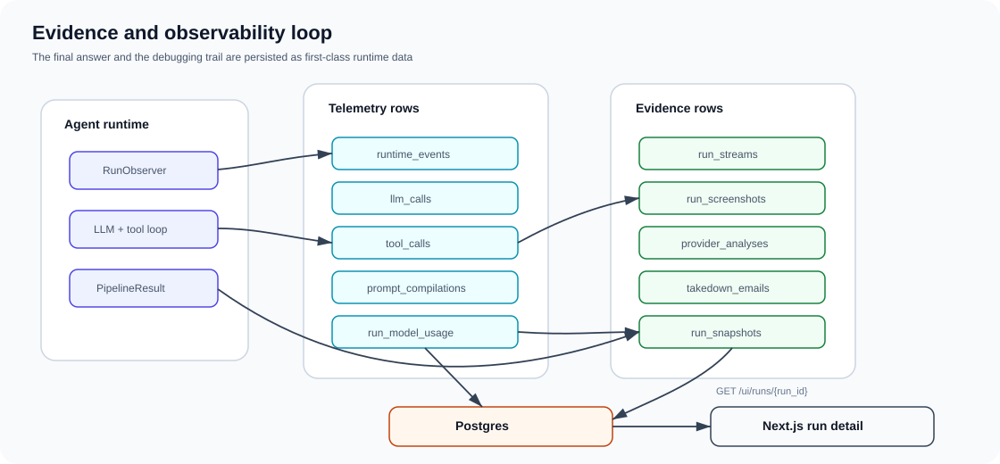

# Open Web Catcher

Open Web Catcher is a multi-agent evidence collection system for investigating unauthorized streaming pages. It takes a target URL, classifies the page, routes it through specialist browser agents, extracts stream evidence, resolves provider infrastructure, drafts reviewable takedown emails, and persists the whole execution path for inspection in a Next.js operator console.

The project is not a single scraper. It is a runtime for controlled browser investigation: FastAPI owns execution, LangGraph owns routing, specialist agents use profile-scoped MCP browser tools, Postgres stores evidence and telemetry, and the console shows both the result and the failure path.

## Main Idea

Most streaming targets do not expose useful media URLs from the first page. A landing page may only contain match cards, a hosting page may hide players behind server controls, and the playable stream may live inside an iframe or embedded player. Open Web Catcher treats those as different jobs instead of forcing one prompt to do everything.

The system splits the investigation into deterministic routing plus smaller agent contracts:

- classify the page before extracting anything;
- discover downstream hosting or player candidates from landing pages;
- operate hosting pages and server selectors without drifting off target;
- inspect embedded player contexts where the actual media requests appear;
- run provider and takedown stages only when concrete stream URLs exist;
- keep every model call, tool call, screenshot, decision, and final artifact tied to the run.

## What It Does

| Capability | What happens | Main source |
| --- | --- | --- |
| URL classification | Determines whether the target is landing, hosting, embedded, unknown, or unsupported. | `src/agents/classification.py` |
| Landing discovery | Finds repeated content cards, watch links, hosting pages, iframe hints, and player URL candidates. | `src/agents/landing_page.py` |
| Hosting extraction | Opens watch pages, handles server/source controls, captures screenshots, and extracts streams or embedded handoffs. | `src/agents/hosting_page.py` |
| Embedded extraction | Stays on iframe/player URLs and harvests media/network evidence from the player context. | `src/agents/embedded_page.py` |
| Provider analysis | Resolves concrete stream URLs to provider, IP, RDAP/whois, geography, and abuse contact evidence. | `src/tools/ipinfo_tool.py` |
| Email drafting | Generates reviewable takedown email drafts from provider, stream, screenshot, and channel evidence. | `src/agents/email_generator.py` |
| Runtime observability | Persists events, LLM calls, tool calls, prompts, costs, screenshots, decisions, and status rollups. | `src/storage/repositories.py` |
| Operator console | Provides launch, live trace, run detail, settings, provider, dataset, and history views. | `web/` |

## How It Works



1. The operator starts a workflow from the console.
2. FastAPI creates a background job and a `RunObserver`.
3. The orchestrator checks memory as soft context, then calls classification.
4. LangGraph routes the run to landing, hosting, embedded, or terminal no-stream paths.
5. Browser-facing agents compile their prompts, open MCP profile sessions, call Gemini with bound tools, and normalize output into Pydantic schemas.
6. Provider analysis and email generation run only after stream evidence exists.
7. The repository layer writes normalized records and snapshots to Postgres.
8. The console reads `GET /ui/runs/{run_id}` and the active SSE stream to show both live progress and persisted evidence.

## Agent Split

| Runtime unit | Responsibility | Boundary |
| --- | --- | --- |
| `OrchestratorAgent` | Owns LangGraph routing, handoffs, aggregation, stop paths, provider/email stages, and final status. | Does not inspect pages directly. |
| `ClassificationAgent` | Uses classification profile tools to identify page type and route confidence. | Does not extract streams. |
| `LandingPageAgent` | Finds hosting/watch candidates and explicit iframe/player hints from listing-style pages. | Does not fabricate downstream URLs when evidence is missing. |
| `HostingPageAgent` | Works on hosting/watch pages, activates players, switches servers, and extracts streams or embedded URLs. | Should not drift into unrelated navigation. |
| `EmbeddedPageAgent` | Works on direct iframe/player contexts and captures media/network evidence. | Should not crawl general site navigation. |
| `IPInfoTool` | Resolves stream hosts and provider metadata from concrete media URLs. | Skips when no stream URL exists. |
| `EmailTool` / email generator | Drafts takedown notices for human review. | Does not send mail automatically. |

The detailed agent docs live in [docs/agents/README.md](docs/agents/README.md).

## Logical Architecture

The logical runtime is centered on a graph, not a linear script. The graph keeps page-type routing, handoff provenance, no-stream handling, and final status deterministic while letting each agent use LLM reasoning and browser tools inside its own bounded task.

```text
operator request
  -> FastAPI background workflow
  -> RunObserver + trace persistence
  -> Orchestrator LangGraph
      -> classification
      -> landing discovery, hosting extraction, embedded extraction
      -> provider analysis
      -> takedown draft generation
  -> normalized Postgres records + run snapshot
  -> Next.js run detail and live SSE views
```

Important runtime rules:

- The orchestrator is the routing source of truth; prompt wording alone does not decide graph transitions.
- Memory is advisory. Current-page classification still runs before specialist extraction.
- Browser tools are profile-scoped by agent role.
- Provider lookup and email generation are skipped when no stream evidence exists.
- Run detail is backend-backed; the primary page payload is `GET /ui/runs/{run_id}`.
- SSE is used for active/live updates, not as the only source of run truth.

See [System Architecture](docs/system/architecture.md), [Workflow Lifecycle](docs/workflow/run-lifecycle.md), and [LangChain And LangGraph Runtime](docs/system/langchain-langgraph.md) for the deeper diagrams.

## Physical Architecture



The local stack is Docker-first and split by failure domain:

| Service | Role | Host access |
| --- | --- | --- |
| `owc-web` | Next.js operator console | `http://localhost:3000` |
| `owc` | FastAPI backend, jobs, agents, repositories, API contracts | `http://localhost:8000` |
| `postgres` | Runtime records, evidence, telemetry, datasets, pricing | internal |
| `owc-tools` | Puppeteer MCP server plus Chrome | `http://localhost:3001`, DevTools `9222` |
| `owc-tools-playwright` | Playwright MCP server plus browser runtime | `http://localhost:3002`, DevTools `9223` |

The backend talks to browser tools through MCP service URLs, not direct frontend calls. The web app talks to FastAPI through `web/lib/api.js`. Postgres access stays behind repository classes in `src/storage/`.

### Technology Stack

| Layer | Main technology |
| --- | --- |
| Agent runtime | Python 3.11, LangChain, LangGraph, Google GenAI / Gemini |
| API | FastAPI, Pydantic, SSE endpoints, background jobs |
| Persistence | PostgreSQL, SQLAlchemy, Alembic |
| Browser tools | MCP servers, Puppeteer, Playwright, Chrome, profile-scoped tool registries |
| Frontend | Next.js 15, React 19, shadcn-style components, Radix UI, React Flow, Recharts |
| Packaging | `uv`, Docker Compose, separate Dockerfiles for API, web, Puppeteer tools, and Playwright tools |
| Runtime config | `.env`, `configs/settings.yaml`, `data/settings.runtime.yaml`, `data/browser.runtime.json` |

More detail is in [Deployment And Physical Runtime](docs/system/deployment.md), [Docker And Ports](docs/operations/docker.md), and [Configuration](docs/operations/configuration.md).

## Evidence And Observability



The database is intentionally more detailed than a final JSON blob. The console needs to answer questions like: which agent failed, which tool returned the bad payload, which screenshot belongs to which step, what did Gemini cost, and why did provider analysis skip?

Postgres table families include:

- run identity and snapshots: `pipeline_runs`, `run_snapshots`, `background_jobs`;
- agent telemetry: `agent_runs`, `agent_outputs`, `runtime_events`;
- model telemetry: `llm_calls`, `run_model_usage`, `prompt_versions`, `prompt_compilations`;
- tool telemetry: `tool_calls`, `tool_playground_calls`;
- evidence: `run_streams`, `run_screenshots`, `provider_analyses`, `takedown_emails`;
- operator state: `run_decisions`, `run_tasks`;
- datasets and pricing: `dataset_sites`, `dataset_batches`, `dataset_site_runs`, `pricing_configs`.

See [Data Model And Persistence](docs/system/data-model.md), [Dashboard Logging And Run Telemetry](docs/workflow/dashboard-logging.md), and [Agent Desk](docs/workflow/agent-desk.md).

## Repository Map

| Path | Purpose |
| --- | --- |
| `src/api/` | FastAPI app, UI contracts, workflow launch, run detail, provider/config/dataset endpoints |
| `src/agents/` | Orchestrator, browser-facing agents, shared loop, prompt compilation, memory, email generation |
| `src/models/` | Pydantic runtime schemas and enums |
| `src/storage/` | SQLAlchemy models, repositories, UI read models, dataset persistence |
| `src/tools/` | MCP client bridge, provider lookup, email tool integration |
| `tools/puppeteer/` | Puppeteer MCP server, profiles, inspect/action/harvest tools |
| `tools/playwright/` | Playwright MCP server and equivalent browser tool surface |
| `web/` | Next.js operator console |
| `configs/prompts/` | Agent contracts and prompt source files |
| `configs/settings.yaml` | Non-secret runtime defaults |
| `data/` | Runtime overrides, memory, generated state, local artifacts |
| `docs/` | Active documentation |
| `alembic/` | Database migrations |
| `datasets/` | Dataset seed inputs for workflow testing |

## Run Locally

### Docker Compose

```powershell
Copy-Item .env.example .env
docker compose up --build
```

Then open:

- console: `http://localhost:3000`;
- backend health: `http://localhost:8000/health`;
- browser runtime status: `http://localhost:8000/ui/browser/status`.

### Backend Development

```powershell
uv venv .venv --python 3.11
uv pip install --python .venv\Scripts\python.exe -e ".[dev]"
```

### Frontend Development

```powershell
cd web
npm install
npm run dev
```

## Validation

Useful checks:

```powershell
python -m compileall src
uv run pytest
cd web
npm run lint
npm run build
```

For Docker runtime checks:

```powershell
docker compose ps
curl.exe http://localhost:8000/health
curl.exe http://localhost:8000/ui/browser/status
```

The full validation guide is [docs/operations/validation.md](docs/operations/validation.md).

## Documentation

Start with [docs/README.md](docs/README.md). The active reading path is:

1. [System](docs/system/README.md)
2. [Architecture](docs/system/architecture.md)
3. [LangChain And LangGraph Runtime](docs/system/langchain-langgraph.md)
4. [Runtime Classes And Function Map](docs/system/runtime-classes-functions.md)
5. [Workflow](docs/workflow/README.md)
6. [Run Lifecycle](docs/workflow/run-lifecycle.md)
7. [Agent Desk](docs/workflow/agent-desk.md)
8. [Agents](docs/agents/README.md)
9. [API Contracts](docs/api/README.md)
10. [MCP And Browser Tools](docs/tools/README.md)
11. [Operations](docs/operations/README.md)

Historical notes are under [docs/archive/README.md](docs/archive/README.md); they are not the active implementation contract.
