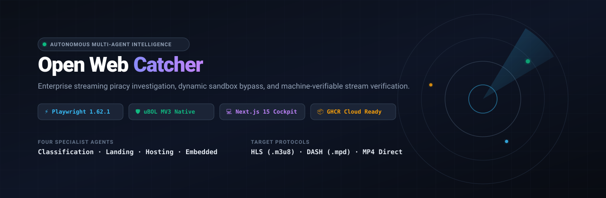
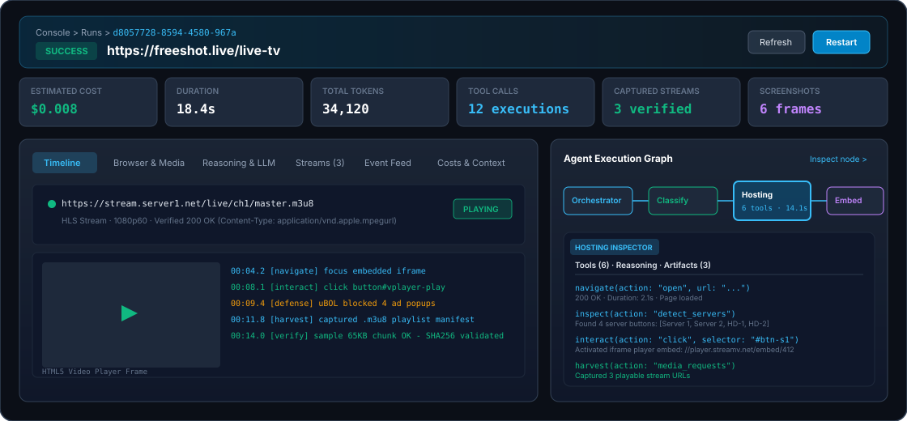
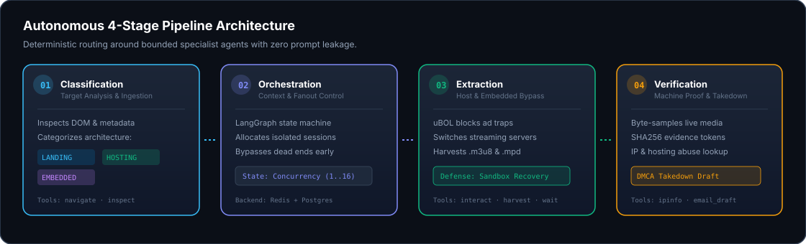
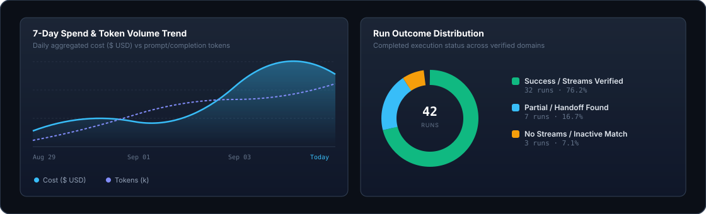
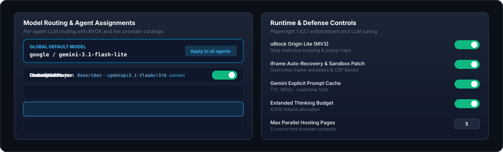

<div align="center">

# Open Web Catcher

### Autonomous Multi-Agent Intelligence for Streaming Piracy Discovery & Verification

[](https://github.com/arfaouiahmed1/Open-Web-Catcher/actions/workflows/publish-images.yml)
[](https://github.com/arfaouiahmed1/Open-Web-Catcher/actions/workflows/ci.yml)
[](https://github.com/arfaouiahmed1/Open-Web-Catcher)
[](https://nextjs.org/)
[](https://playwright.dev/)
[](https://opensource.org/licenses/MIT)

<br/>



<br/>

<p align="center">
  <b>Stop losing hours to hostile ad-traps, shifting player embeds, and obfuscated streaming scripts.</b><br/>
  Open Web Catcher orchestrates bounded specialist browser agents to autonomously hunt, classify, bypass sandboxes, and verify playable live streams (HLS/DASH) with machine-verifiable cryptographic proof.
</p>

[Quick Start](#-quick-start-cloud-containers-in-10-seconds) •
[Features](#-commercial-features) •
[Architecture](#-autonomous-multi-agent-architecture) •
[Documentation & Wiki](#-documentation--wiki) •
[Contributing](#-community--contributing)

</div>

---

## ⚡ The Challenge: Why Traditional Scrapers Fail

Modern illicit streaming platforms do not expose video files on initial page load. They protect high-value live events behind layers of adversarial defense:
- **Deceptive Landing Pages**: Catalogs disguise stream destinations behind dynamic JavaScript schedules and decoy listing cards.
- **Intrusive Ad-Traps & Popups**: Unprotected browsers trigger multiple aggressive window popups and malicious redirect loops on first click.
- **Hostile Sandboxed Iframes**: Playable media manifests (`.m3u8` / `.mpd`) are isolated inside multi-nested frames utilizing strict `X-Frame-Options` and CSP `frame-ancestors` policies.

```text
Single Prompt / Generic Scraper ──► Click ──► Ad Redirect Loop ──► Dead End ❌
Open Web Catcher (OWC)          ──► Classify ──► Route ──► Bypass & Harvest ──► Verified Stream ✅
```

---

## 🌟 Commercial Features

### 1. Ergonomic Run Detail Cockpit & Deep Agent Inspector
Inspect complete agent execution with zero friction. The newly redesigned cockpit layout provides a 6-tile KPI ribbon (Estimated Cost, Duration, Tokens, Tool Executions, Captured Streams, Screenshots) and an interactive 2-column workspace.



- **Interactive Agent Graph**: Visualizes orchestrator handoffs, active subagents, and fanout trees.
- **Rich Agent Node Inspector**: Click any agent node (`Classification`, `Landing`, `Hosting`, `Embedded`) to inspect its exact MCP tool calls with input/output payloads, model thought traces, and network/iframe diagnostics.
- **Built-in HTML5 Video Preview**: Immediately play back captured `.m3u8` and direct media streams with zero third-party player overhead.

---

### 2. Autonomous 4-Stage Pipeline Architecture
Deterministic LangGraph orchestration coordinates four specialized agent contracts. Each agent possesses a bounded execution boundary and role-scoped tool profile, preventing hallucinations and navigation drift.



| Agent | Role & Responsibility | Model Scope |
| :--- | :--- | :--- |
| **01. Classification** | Ingests target URL and determines page type (`Landing`, `Hosting`, `Embedded`) before extraction begins. | Read-only inspect tools |
| **02. Landing Page** | Parses dynamic schedules (e.g. `streamed.pk`, `freeshot.live`) and extracts event listings and player links. | Navigation & interaction |
| **03. Hosting Page** | Operates server dropdowns, switches streaming mirrors, and handles click-to-play overlays. | Full interaction & harvest |
| **04. Embedded Player** | Defeats sandboxed iframe restrictions, recovers media tokens, and captures `.m3u8` / `.mpd` playlists. | Media verification & recovery |

---

### 3. Executive Dashboard & Real-Time Analytics
Monitor pipeline health, infrastructure coverage, and model expenditures without mathematical clutter.



- **7-Day Cost & Token Trend**: Interactive dual-axis Recharts visualization tracking daily model spend against prompt/generation volume.
- **Outcome Distribution**: Donut breakdown displaying verification success rates and classification categories across all runs.
- **Latency & Benchmark Tracking**: Bar chart monitoring wall-clock execution time against performance thresholds.
- **Tool Reliability Matrix**: Real-time reliability and execution frequency tracking across all six MCP tools.

---

### 4. Model Control Plane & Hardened Playwright Runtime
Take full control over your intelligence stack with enterprise Bring-Your-Own-Key (BYOK) support and browser security policies.



- **Multi-Provider BYOK**: Connect 110+ LiteLLM-compatible providers including Google Gemini, Anthropic Claude, OpenAI, OpenRouter, and local runtimes (Ollama, vLLM).
- **Per-Agent Model Routing**: Assign fast lightweight models (e.g. `gemini-3.1-flash-lite`) to classification while reserving reasoning-heavy models for embedded player extraction.
- **Hardened Playwright 1.62.1 MCP**: Zero-knob containerized browser execution with isolated contexts per run and **uBlock Origin Lite (MV3)** pre-installed to strip malicious tracking and popups.
- **Granular Defense Toggles**: Configure Iframe Auto-Recovery, CORS patching, and explicit prompt caching with one-click persistence.

---

## 🚀 Quick Start: Cloud Containers in 10 Seconds

Open Web Catcher publishes pre-compiled, production-optimized multi-architecture images to the **GitHub Container Registry (GHCR)** on every release. You never need to compile images locally.

### 1. Configure Environment
```powershell
Copy-Item .env.example .env
```

Set your credentials in `.env`:
```env
# Point to pre-built GitHub Container Registry images
OWC_IMAGE=ghcr.io/arfaouiahmed1/open-web-catcher
OWC_WEB_IMAGE=ghcr.io/arfaouiahmed1/open-web-catcher-web
OWC_TOOLS_PW_IMAGE=ghcr.io/arfaouiahmed1/open-web-catcher-tools-playwright
OWC_TAG=latest

# Database and LLM credentials
POSTGRES_PASSWORD=your_secure_password
GOOGLE_API_KEY=your_google_gemini_api_key
```

### 2. Pull & Launch
```powershell
docker compose pull
docker compose up -d
```

### 3. Access Console
- **Operator Console**: [http://localhost:3005](http://localhost:3005)
- **FastAPI Backend & Swagger**: [http://localhost:8000/docs](http://localhost:8000/docs)
- **Playwright MCP Health**: [http://localhost:3002/health](http://localhost:3002/health)
- **Headless Chrome CDP Debugger**: [http://localhost:9223](http://localhost:9223)

---

## 🥊 Scraper Comparison Matrix

| Feature | Legacy Scrapers (Scrapy / Puppeteer) | Single-Prompt AI Scrapers | Open Web Catcher (OWC) |
| :--- | :---: | :---: | :---: |
| **Dynamic Schedule Crawling** | ❌ Fragile CSS Selectors | ⚠️ Prompt Drift / Hallucinations | ✅ Dedicated Landing Agent |
| **Malicious Ad & Popup Defense** | ❌ Manual Regex / Crashes | ❌ Fails on New Windows | ✅ Built-in uBlock Origin Lite |
| **Sandboxed Iframe Recovery** | ❌ Blocked by CSP / XFO | ❌ Context Loss | ✅ Automated Context Pivot |
| **Playable Stream Verification** | ❌ None (Extracts text only) | ❌ Cannot verify media | ✅ Byte-level Chunk & SHA256 Probe |
| **Takedown & Evidence Export** | ❌ Manual | ❌ Generic Text | ✅ Verifiable DMCA Dossier |
| **Model Cost Control** | N/A | ❌ Expensive Single Calls | ✅ Role-based Model Routing & Caching |

---

## 📚 Documentation & Wiki

Explore our dedicated documentation guides:
- [**System Architecture**](docs/wiki/Architecture.md) — Multi-tier topology, LangGraph state machine, and data persistence.
- [**Multi-Agent Pipeline**](docs/wiki/Multi-Agent-Pipeline.md) — Detailed agent contract specifications.
- [**Playwright MCP Runtime**](docs/wiki/Playwright-MCP-Runtime.md) — The 6 MCP tool contracts and defense mechanisms.
- [**Operator Console Guide**](docs/wiki/Operator-Console.md) — Live workflow launcher, dataset manager, and telemetry.
- [**API Reference**](docs/wiki/API-Reference.md) — Complete FastAPI REST and SSE endpoints.

Visit the online [GitHub Project Wiki](https://github.com/arfaouiahmed1/Open-Web-Catcher/wiki) for interactive tutorials.

---

## 🤝 Community & Contributing

We welcome contributions! Please review our community guidelines:
- [**Contributing Guidelines**](CONTRIBUTING.md)
- [**Code of Conduct**](CODE_OF_CONDUCT.md)
- [**Security Policy**](SECURITY.md)

---

## 📄 License

Open Web Catcher is licensed under the [MIT License](LICENSE).
