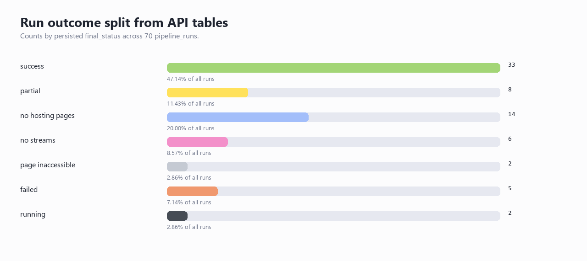
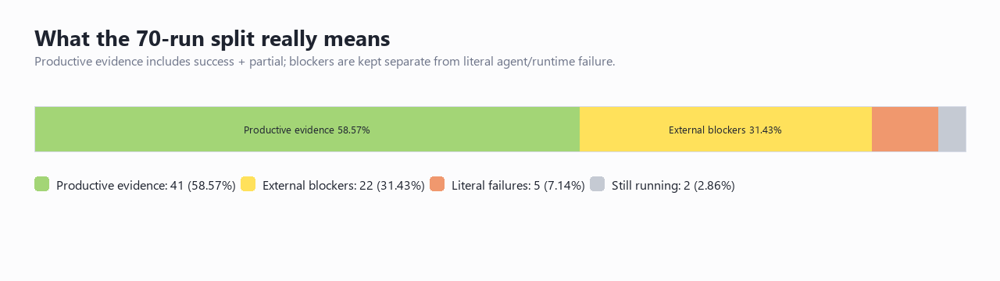
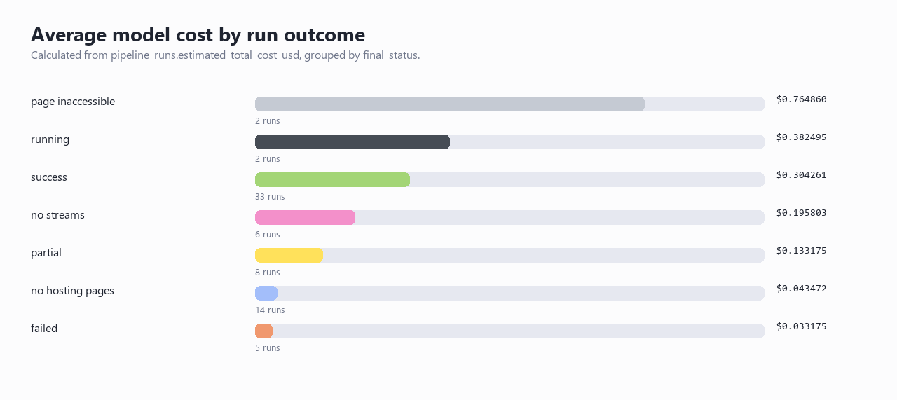
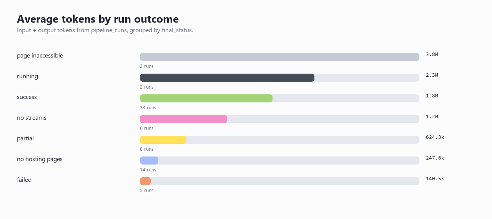
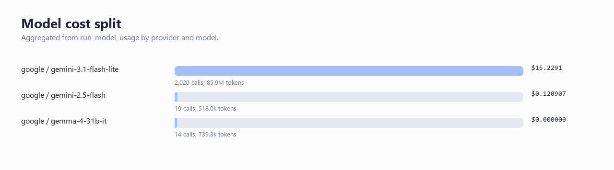
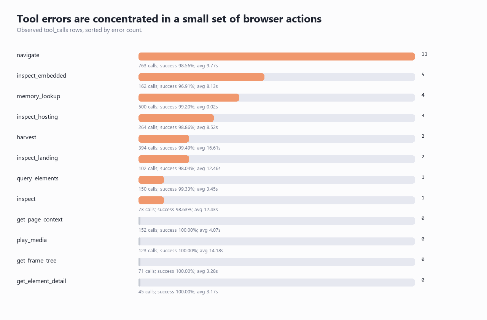
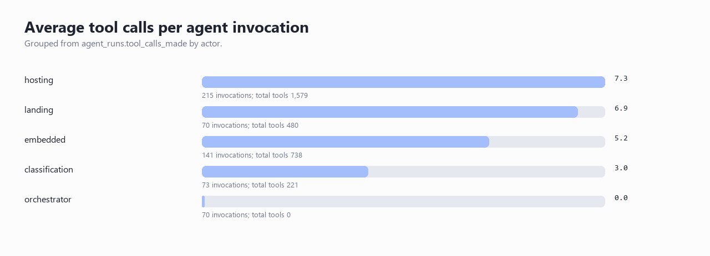

# OWC Evaluation Metrics From The Local API

Generated: 2026-06-28 18:38:10  
Source of truth used here: local API database endpoints under `http://localhost:8000/ui/database/...`  
Current editable chapter/PDF warning: the existing evaluation chapter still contains the older `149 total runs` snapshot, while the API now returns `70` pipeline runs.

## Executive Summary

- **The current batch has 70 total pipeline runs: 68 terminal and 2 still running.** The terminal denominator is the right denominator for strict outcome quality; the all-run denominator is useful for live operational status.
- **Strict success is 33/68 terminal runs (48.53%), or 47.14% of all runs.** If you count partial evidence as productive, the rate becomes 41/68 (60.29%).
- **Only 5 terminal rows are literal agent/runtime failures.** The bigger non-success block is external or expected blockers: 22 terminal rows (32.35%) across no-hosting-page, no-stream, and page-inaccessible outcomes.
- **Total model cost is $15.3500 across all runs, or $14.5850 across terminal runs.** Average cost is $0.219286 per all-run row and $0.214486 per terminal row.
- **Token volume is 87,148,191 input+output tokens.** Average token footprint is 1,244,974 per all-run row and 1,212,632 per terminal row.
- **Cache hit share is 39.55% using cached input / (cached input + new input).** The raw pipeline rows reconcile exactly: cached + new input differs from total input by 0 tokens.
- **Tool execution is not the weak link in aggregate: 2,988/3,017 observed tool-call rows succeeded (99.04%).** The remaining problem is more about site behavior, agent strategy, and unstable browser/player states than generic tool failure.
- **There are 17 distinct seed websites with strict success and at least one stream out of 37 distinct tested seed hosts (45.95%).** Those are the sites that actually worked in this snapshot.

## Metric Definitions Used

| Metric | Definition |
| --- | --- |
| Total runs | Count of `pipeline_runs` rows. |
| Terminal runs | Runs whose `final_status` is not `running` or `queued`. |
| Strict success rate | `success / terminal_runs`. |
| Productive evidence rate | `(success + partial) / terminal_runs`. |
| External blocker rate | `(page_inaccessible + site_dead + no_hosting_pages + no_streams) / terminal_runs`. |
| Literal failure rate | `(failed + timeout + redirect) / terminal_runs`. |
| Total cost | Sum of `pipeline_runs.estimated_total_cost_usd`. |
| Tokens per run | Sum of `total_tokens_in + total_tokens_out`, divided by run count. |
| Cache hit % | `total_cached_input_tokens / (total_cached_input_tokens + total_new_input_tokens)`. |
| Tool success rate | `tool_calls.status == success` divided by all observed `tool_calls` rows. |
| Distinct successful websites | Deduped seed host where `final_status = success` and `stream_count > 0`. |

## Run Outcome Split

| Status | Runs | Share of all | Share of terminal | Avg cost | Avg tokens | Streams | Emails |
| --- | --- | --- | --- | --- | --- | --- | --- |
| success | 33 | 47.14% | 48.53% | $0.304261 | 1.8M | 178 | 85 |
| partial | 8 | 11.43% | 11.76% | $0.133175 | 624.3k | 0 | 0 |
| no_hosting_pages | 14 | 20.00% | 20.59% | $0.043472 | 247.6k | 0 | 0 |
| no_streams | 6 | 8.57% | 8.82% | $0.195803 | 1.2M | 0 | 0 |
| page_inaccessible | 2 | 2.86% | 2.94% | $0.764860 | 3.8M | 0 | 0 |
| failed | 5 | 7.14% | 7.35% | $0.033175 | 140.5k | 0 | 0 |
| running | 2 | 2.86% | - | $0.382495 | 2.3M | 0 | 0 |

### Interpretation

The clean story is not "70 runs and 37 failures." That would be too crude. The right story is:

- **Strictly succeeded:** 33 terminal runs.
- **Partially productive:** 8 terminal runs.
- **Externally blocked:** 22 terminal runs.
- **Literal agent/runtime failure:** 5 terminal runs.
- **Still running:** 2 rows.

This is the key evaluation point: OWC should be judged as an evidence-production system, not only as a binary classifier.

## Cost And Token Figures

| Metric | All runs | Terminal runs |
| --- | ---: | ---: |
| Run count | 70 | 68 |
| Total model cost | $15.3500 | $14.5850 |
| Avg cost / run | $0.219286 | $0.214486 |
| Total tokens | 87,148,191 | 82,458,952 |
| Avg tokens / run | 1,244,974 | 1,212,632 |
| Input tokens | 86,090,555 | 81,442,239 |
| Cached input tokens | 34,046,527 | 32,008,869 |
| New input tokens | 52,044,028 | 49,433,370 |
| Output tokens | 1,057,636 | 1,016,713 |
| Cache hit % | 39.55% | 39.30% |

### Cost Interpretation

The average terminal run costs about **$0.214486**. That is low enough for iterative engineering tests, but it becomes material when the batch is repeated many times. A 1,000-run campaign at the current terminal average would cost roughly **$214.4858** in model usage before human review time and infrastructure costs.

The important business point is that cost is now measurable at the same grain as evidence quality. You can compare prompt/tool changes by asking: did strict success, productive evidence, or provider/email yield improve per dollar?

## LLM Evaluation

| Provider / model | LLM calls | Cache-hit calls | Input | Cached | New | Output | Cost |
| --- | --- | --- | --- | --- | --- | --- | --- |
| google / gemini-3.1-flash-lite | 2,020 | 954 | 84.9M | 33.5M | 51.4M | 1.0M | $15.2291 |
| google / gemini-2.5-flash | 19 | 3 | 507.2k | 37.2k | 470.0k | 10.8k | $0.120907 |
| google / gemma-4-31b-it | 14 | 12 | 728.4k | 504.7k | 223.8k | 10.8k | $0.000000 |

### LLM Interpretation

The system is dominated by `gemini-3.1-flash-lite` model usage in the current persisted run-level model table. The older dashboard-style `Peak context` card is not a useful headline metric for the report; it is a debugging widget. For the evaluation chapter, use:

- total LLM calls;
- input/new/cached/output tokens;
- cache hit share;
- cost per terminal run;
- model cost split;
- evidence produced per dollar.

Those are business-readable and can be defended from API tables.

## Tool Evaluation

| Metric | Value |
| --- | ---: |
| Observed tool-call rows | 3,017 |
| Successful tool-call rows | 2,988 |
| Failed/error tool-call rows | 29 |
| Tool success rate | 99.04% |
| Avg tool calls / all run | 44.3 |
| Avg tool calls / terminal run | 43.8 |

| Tool | Calls | Successes | Errors | Success rate | Avg duration |
| --- | --- | --- | --- | --- | --- |
| navigate | 763 | 752 | 11 | 98.56% | 9.77s |
| memory_lookup | 500 | 496 | 4 | 99.20% | 0.02s |
| harvest | 394 | 392 | 2 | 99.49% | 16.61s |
| inspect_hosting | 264 | 261 | 3 | 98.86% | 8.52s |
| inspect_embedded | 162 | 157 | 5 | 96.91% | 8.13s |
| get_page_context | 152 | 152 | 0 | 100.00% | 4.07s |
| query_elements | 150 | 149 | 1 | 99.33% | 3.45s |
| play_media | 123 | 123 | 0 | 100.00% | 14.18s |
| inspect_landing | 102 | 100 | 2 | 98.04% | 12.46s |
| inspect | 73 | 72 | 1 | 98.63% | 12.43s |
| get_frame_tree | 71 | 71 | 0 | 100.00% | 3.28s |
| get_element_detail | 45 | 45 | 0 | 100.00% | 3.17s |
| click_element | 37 | 37 | 0 | 100.00% | 6.47s |
| click_xpath | 32 | 32 | 0 | 100.00% | 5.64s |
| wait_for_page_state | 28 | 28 | 0 | 100.00% | 5.32s |

### Tool Interpretation

Tool reliability is high enough that the evaluation should not frame the whole system as a tool-failure problem. The better discussion is tool **load** and tool **sequence quality**:

- hosting and embedded routes are interaction-heavy;
- navigation/inspection/harvest tools carry most of the browser work;
- tool errors exist, but the observed failure rate is under 1%;
- run outcomes still fail when sites are inaccessible, hosting pages are missing, or stream servers expose no media.

## Agent Evaluation

Status columns are shown as `success/partial/failed/running/other`.

| Agent | Invocations | Statuses | Avg tools | Total tools | Avg LLM | Tool success | Avg tokens |
| --- | --- | --- | --- | --- | --- | --- | --- |
| hosting | 215 | 83/79/52/1/0 | 7.3 | 1,579 | 5.3 | 99.49% | 254.4k |
| landing | 70 | 48/21/0/1/0 | 6.9 | 480 | 4.8 | 98.75% | 210.1k |
| embedded | 141 | 72/9/59/0/1 | 5.2 | 738 | 3.2 | 98.10% | 102.7k |
| classification | 73 | 73/0/0/0/0 | 3.0 | 221 | 1.0 | 99.55% | 20.7k |
| orchestrator | 70 | 33/8/5/2/22 | 0.0 | 0 | 0.0 | - | 0.00 |

### Agent Interpretation

This is the cleanest way to organize the agent part of the report:

1. **Classification agent:** route correctness and whether the next specialist received the right page type.
2. **Landing agent:** ability to move from listings/schedules to actual hosting candidates.
3. **Hosting agent:** player activation, server switching, screenshot timing, stream harvesting.
4. **Embedded agent:** iframe/player access and no-stream/unauthorized handling.
5. **Provider/email stage:** provider attribution and draft readiness from concrete stream evidence.

The report should not bury these under one case study. Use aggregate agent metrics first, then one short run example to show what the metrics look like in a real trace.

## Successful Websites That Actually Worked

Definition: deduped seed host with at least one strict-success run and at least one stream.

| Website | Successful runs | Total runs in batch | Streams | Screenshots | Emails | Provider rows | Example run id |
| --- | --- | --- | --- | --- | --- | --- | --- |
| ppv.to | 6 | 7 | 37 | 38 | 13 | 37 | e4e13c53-51c1-4a51-b692-800d0f1801db |
| freeshot.live | 4 | 6 | 30 | 45 | 21 | 30 | ced1568e-78cd-4cc5-a7f6-9de0987416fd |
| streamed.pk | 4 | 4 | 32 | 32 | 12 | 32 | 3aa22d56-5376-47c0-ac82-f5eb2cf2c763 |
| pirlotv2.pl | 3 | 4 | 10 | 20 | 5 | 10 | 3dcf6267-89ef-4a9b-8f1a-a759e048c330 |
| crichd.at | 2 | 2 | 7 | 7 | 5 | 7 | 482b6aff-7a9d-4ff2-aeee-b75a487c2724 |
| la14hd.com | 2 | 2 | 10 | 10 | 4 | 10 | 2932ff41-49af-4be3-8288-7c64671a48e8 |
| watchfooty.st | 2 | 4 | 14 | 25 | 7 | 14 | c79b481f-dd68-4562-bb9b-3fc57a4bb637 |
| foothubhd.info | 1 | 2 | 9 | 5 | 4 | 9 | d1c29942-7125-4874-a4db-b2e6f8ceab9c |
| freestreams-live1d.pk | 1 | 1 | 1 | 1 | 1 | 1 | d2b505ba-d365-41b0-a1d1-96a93359205f |
| futbollibre.gg | 1 | 1 | 6 | 6 | 4 | 6 | 8328c6ff-2fb3-4448-b2da-9149da35aed9 |
| go4kora.co | 1 | 1 | 7 | 7 | 2 | 7 | f27ded0f-26b8-4836-9c0f-b56020e8595d |
| go4kora.life | 1 | 2 | 2 | 2 | 1 | 2 | 9566a9be-12ba-434a-afa0-f05f529d2403 |
| livetv.sx | 1 | 1 | 2 | 2 | 2 | 2 | 6227b4aa-3e22-4da7-a3b4-fcd85da9764a |
| m.livetv.sx | 1 | 1 | 1 | 4 | 1 | 1 | 4d6036c3-1508-48c5-baa5-2937793247d5 |
| pirlotv3.pl | 1 | 3 | 1 | 2 | 1 | 1 | 36127c0b-3582-4fe8-b3cf-bf8a22c9e0f8 |
| streamsports99.su | 1 | 2 | 4 | 25 | 1 | 4 | e4992fa9-880b-48b1-97d3-d56084887ba2 |
| streamtp10.com | 1 | 1 | 5 | 1 | 1 | 5 | 1ca2c75d-4cd6-4a51-9e27-bc9790a23712 |

These are the websites that produced actual successful evidence in the current API snapshot. As a website-level metric, this is **17/37 distinct tested seed hosts (45.95%)**. That is stricter than run-level success because repeated runs on the same website can overweight the run-level score.

## Provider And Evidence Yield

| Metric | Value |
| --- | ---: |
| Runs with streams | 33 |
| Runs with emails | 33 |
| Total stream rows | 178 |
| Total provider-analysis rows | 178 |
| Total takedown-email rows | 85 |
| Avg streams / terminal run | 2.62 |
| Avg emails / terminal run | 1.25 |
| Avg streams / strict-success run | 5.39 |
| Avg emails / strict-success run | 2.58 |

| Provider | Provider rows | Affected runs |
| --- | --- | --- |
| TECHOFF SRV LIMITED | 38 | 10 |
| IP Volume inc | 31 | 6 |
| Onehostplanet s.r.o. | 26 | 4 |
| BestDC Limited | 25 | 9 |
| Telkom Internet LTD | 22 | 8 |
| Private Layer INC | 15 | 5 |
| Altrosky Technology Ltd. | 6 | 5 |
| Tunisia BackBone AS | 5 | 1 |
| Amazon.com, Inc. | 4 | 1 |
| Tempest Hosting, LLC | 2 | 1 |
| CLIENT1151 | 1 | 1 |
| Fastly, Inc. | 1 | 1 |

## Cleaner Evaluation Section Structure

I would reorganize Chapter 6 around aggregate evidence, then use case studies only as examples.

### 1. Evaluation Objective

Keep the main claim narrow: OWC is not proving universal piracy detection. It is measuring whether a suspected streaming website can produce a reviewable evidence package.

### 2. Batch Outcome Evaluation

Lead with the 70-run split:

- strict success;
- partial/productive evidence;
- external blockers;
- literal failures;
- running rows.

This gives the jury a more honest interpretation than one accuracy number.

### 3. Agent Evaluation

Evaluate each specialist by its responsibility:

- Classification: route correctness.
- Landing: discovery of hosting candidates.
- Hosting: activation, server switching, screenshot timing, stream harvest.
- Embedded: iframe/player inspection and blocker diagnosis.
- Provider/email: attribution and notice-draft readiness.

### 4. Tool Evaluation

Use tool success rate, top tools, error concentration, and average tools per run. The point is that browser automation is measurable and mostly reliable, while site/player behavior remains volatile.

### 5. LLM And Cost Evaluation

Use LLM calls, token split, cache hit %, model split, total cost, and cost per terminal run. Do not lead with context-window peak usage; it is a debug metric, not a chapter headline.

### 6. Business Value

Frame the added value like this:

- OWC reduces manual uncertainty by turning a seed URL into traceable evidence objects.
- It separates source-site blockers from agent failures.
- It produces screenshots, streams, provider rows, and email drafts in one pipeline.
- It exposes cost and token telemetry so scaling decisions are measurable.
- It gives reviewers a queue of evidence packages instead of asking them to manually discover every provider path.

### 7. Case Study

Keep one successful run as a compact trace example after the aggregate metrics. Add one blocker example if space allows. Do not let the case study carry the whole evaluation chapter.

## Validation Notes

- `pipeline_runs` row count and `runs` row count both equal 70; this matches your 70-run expectation.
- Cost, token, status, stream, screenshot, email, and provider counts in this file are recomputed from API database tables, not copied from the frontend dashboard cards.
- Run-level cost uses `pipeline_runs.estimated_total_cost_usd`; model split uses `run_model_usage`. Model-split cost reconciles to the pipeline total within rounding.
- Pipeline run-level LLM calls total 2,053; raw `llm_calls` rows total 2,012. Treat `pipeline_runs` as the run-level KPI source and `llm_calls` as the raw observed-call table.
- The current PDF/source chapter still contains stale 149-run wording; update those tables/screenshots before final submission.
- Raw supporting CSV/JSON files are under `assets/evaluation-api-metrics/data/`.
