# Open Web Catcher Documentation

> **Navigation:** [Docs Home](./README.md) | [System](./system/README.md) | [Workflow](./workflow/README.md) | [Agents](./agents/README.md) | [API](./api/README.md) | [Tools](./tools/README.md) | [Operations](./operations/README.md)

Open Web Catcher is a multi-agent evidence collection system for investigating unauthorized streaming pages. The operator submits a URL, the backend classifies the page, specialized agents inspect the relevant page type, browser tools collect evidence, provider analysis resolves infrastructure, and the final result is shown in a Next.js operator console.

This README is written for report and jury review. It gathers the main UML-style diagrams in one place and explains each diagram in practical terms. The deeper documentation pages remain linked in the [Documentation Index](#documentation-index).

## How To Read These Diagrams

The diagrams use Mermaid syntax inside Markdown. They are UML-style diagrams, not a separate generated model. Each diagram is grounded in the current source code and is followed by a short explanation:

- **What it shows** describes the purpose of the diagram.
- **How to read it** explains the main arrows or relationships.
- **Why it matters** explains the design decision behind the diagram.
- **Source grounding** points to the implementation files used to verify the diagram.

The active frontend screens are `/`, `/live`, `/runs`, `/runs/[runId]`, `/providers`, and `/settings`. The `/agents` route exists, but it redirects to `/live`, so it is not shown as a separate active product screen.

## Reading Order

1. [System](./system/README.md) - architecture, deployment, persistence, and runtime structure.
2. [Workflow](./workflow/README.md) - how runs start, stream events, persist evidence, and appear in the dashboard.
3. [Agents](./agents/README.md) - orchestrator, classification, landing, hosting, embedded, provider, and email responsibilities.
4. [API Contracts](./api/README.md) - FastAPI routes and operator-console payloads.
5. [MCP And Browser Tools](./tools/README.md) - browser automation tools and MCP profiles.
6. [Operations](./operations/README.md) - Docker, configuration, validation, and troubleshooting.

## 1. System Component Diagram

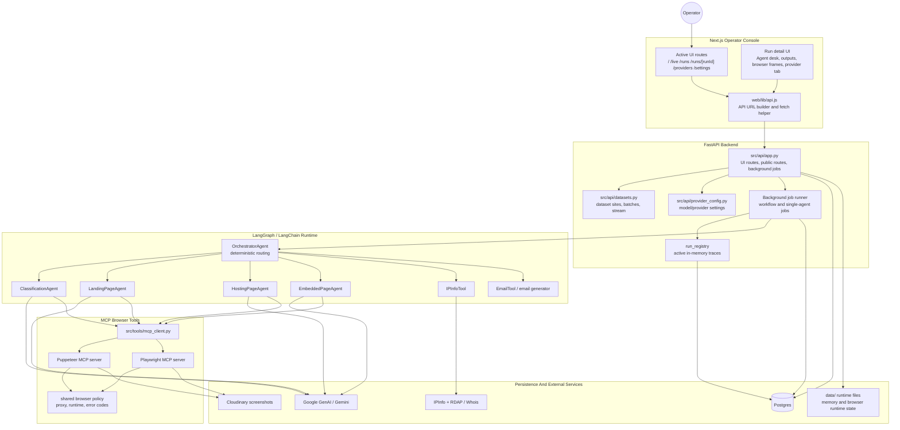

- **What it shows:** the full logical system: operator console, FastAPI backend, agent runtime, browser tooling, database, and external services.
- **How to read it:** the operator uses the Next.js console, the console calls FastAPI, FastAPI starts jobs, jobs run the orchestrator, and the orchestrator delegates to specialist agents and tools.
- **Why it matters:** the project is not a single scraper. It is a controlled runtime where routing, browser evidence, model calls, provider lookup, and persistence are separated so failures can be inspected.
- **Source grounding:** `web/lib/api.js`, `src/api/app.py`, `src/agents/orchestrator.py`, `src/tools/mcp_client.py`, `src/storage/models.py`, and `docker-compose.yml`.

## 2. Deployment Diagram

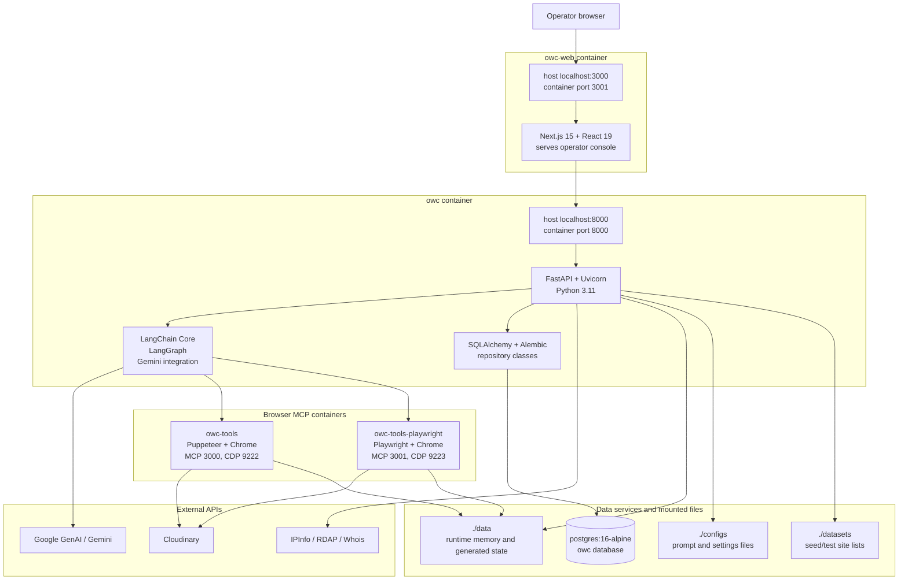

- **What it shows:** the local Docker Compose deployment and how each container contributes to the runtime.
- **How to read it:** traffic starts in the operator browser, enters the `owc-web` container, moves to the `owc` API container, then reaches Postgres, browser MCP containers, or external APIs.
- **Why it matters:** browser automation is isolated from the API process. This avoids mixing heavy Chrome/Playwright dependencies with the FastAPI application and makes tool health easier to diagnose.
- **Source grounding:** `docker-compose.yml`, `Dockerfile`, `Dockerfile.web`, `Dockerfile.tools`, and `Dockerfile.tools.playwright`.

## 3. Use Case Diagram

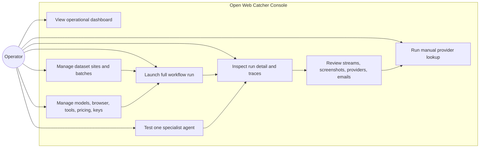

- **What it shows:** the main actions a human operator performs through the UI.
- **How to read it:** the operator can start new work from `/live`, manage batches from `/runs`, inspect results in `/runs/[runId]`, and adjust configuration through `/settings`.
- **Why it matters:** the system is designed for investigation and review, not automatic takedown sending. The operator remains responsible for interpreting evidence and reviewing generated emails.
- **Source grounding:** `web/components/console/layout/navigation-config.js`, `web/components/console/live/live-page.js`, `web/components/console/runs/runs-page.js`, and `web/components/console/run-detail/run-detail-page.js`.

## 4. Frontend Route And Data Flow Diagram

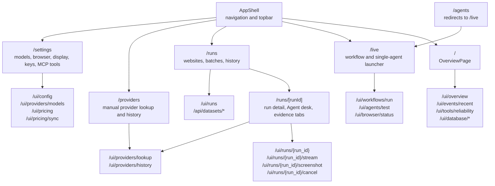

- **What it shows:** the active frontend routes and the backend endpoints each route depends on.
- **How to read it:** page nodes are UI screens; API nodes are the FastAPI route groups they call. `/agents` is included only to show that it redirects to `/live`.
- **Why it matters:** this avoids overstating unused frontend screens. For the report, the active console is Dashboard, Live Pipeline, View Results, Provider Results, Settings, and Run Detail.
- **Source grounding:** `web/app/page.js`, `web/app/live/page.js`, `web/app/runs/page.js`, `web/app/runs/[runId]/page.js`, `web/app/providers/page.js`, `web/app/settings/page.js`, `web/app/agents/page.js`, and `src/api/app.py`.

## 5. End-To-End Flowchart

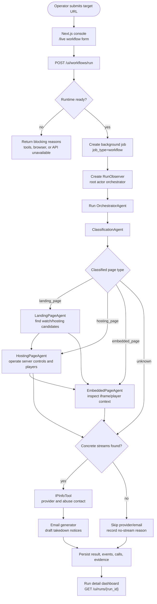

- **What it shows:** the complete investigation path from a URL submission to a persisted dashboard result.
- **How to read it:** diamonds are decisions; rectangular nodes are runtime stages. The path branches based on classification and whether streams are found.
- **Why it matters:** it shows that provider lookup and email drafting are conditional. They run only after concrete stream evidence exists.
- **Source grounding:** `/ui/workflows/run` in `src/api/app.py`, orchestration nodes in `src/agents/orchestrator.py`, schema outputs in `src/models/schemas.py`, and persistence in `src/storage/repositories.py`.

## 6. Orchestrator Activity Diagram

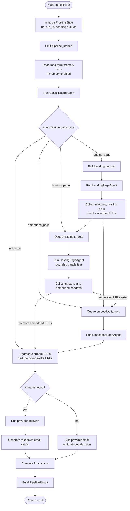

- **What it shows:** the orchestrator's activity from initial state to final `PipelineResult`.
- **How to read it:** classification decides the first specialist stage, but later stages can still hand off to hosting or embedded work when they discover better targets.
- **Why it matters:** routing is deterministic and observable. Prompts do not silently decide the pipeline path; the graph and handoff logic do.
- **Source grounding:** `PipelineState`, `build_graph`, `route_after_classification`, `route_after_landing`, `route_after_hosting`, and `route_after_embedded` in `src/agents/orchestrator.py`.

## 7. Shared Agent Loop Activity Diagram

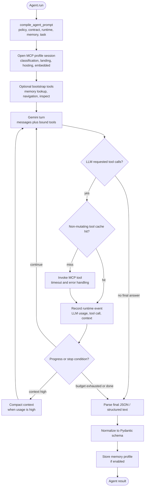

- **What it shows:** the shared browser-facing agent loop used by classification, landing, hosting, and embedded agents.
- **How to read it:** every agent compiles a prompt, connects to its MCP tool profile, lets Gemini request tools, records telemetry, and normalizes the final answer.
- **Why it matters:** the loop makes LLM work inspectable. Model calls, tool calls, cache decisions, context pressure, and stop reasons become dashboard evidence.
- **Source grounding:** `run_agent_loop`, `AgentGraphState`, `AgentLoopResult`, `build_llm`, and tool invocation helpers in `src/agents/base.py`; prompt compilation in `src/agents/prompting.py`.

## 8. Workflow Launch Sequence Diagram

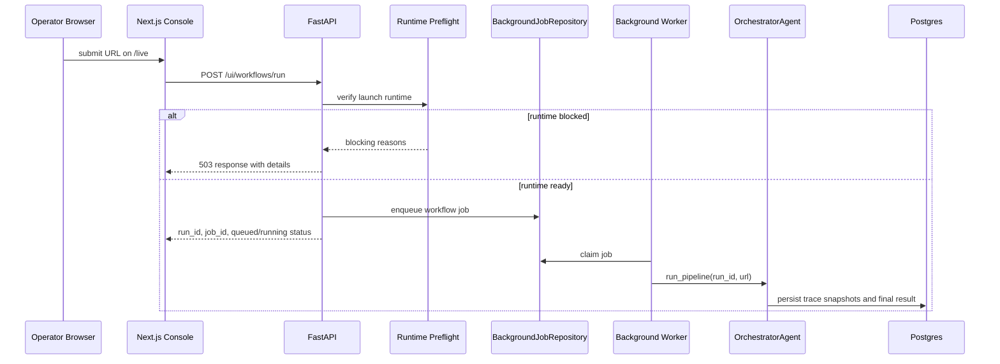

- **What it shows:** how a full workflow run is launched from the frontend.
- **How to read it:** the UI does not run agents directly. It asks FastAPI to create a job, then the backend worker runs the orchestrator.
- **Why it matters:** background jobs make long browser investigations manageable and allow the UI to show queued, running, cancelled, failed, or finished states.
- **Source grounding:** `/ui/workflows/run`, background job helpers, and `_background_workflow` in `src/api/app.py`; job records in `src/storage/models.py`.

## 9. Run Detail Sequence Diagram

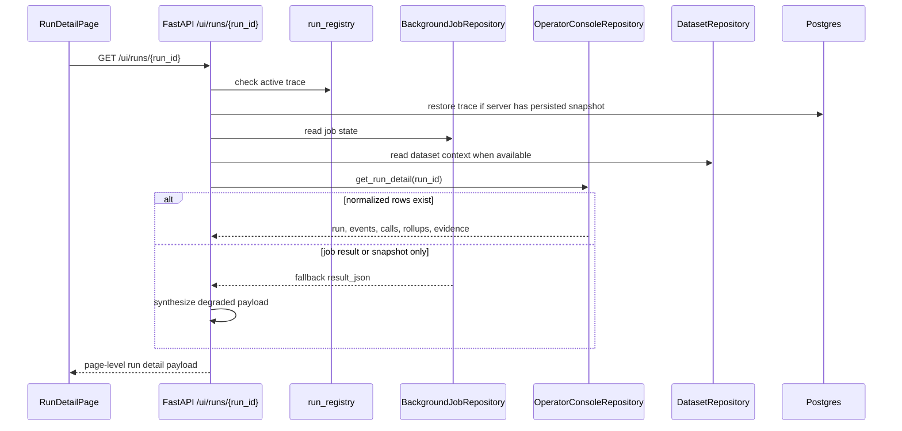

- **What it shows:** how the run detail page loads data for a completed or active run.
- **How to read it:** FastAPI checks active memory, persisted snapshots, job state, normalized rows, and fallbacks before returning one combined payload.
- **Why it matters:** the dashboard can still show useful information even if a run is active, partially persisted, restored after restart, or missing some normalized rows.
- **Source grounding:** `GET /ui/runs/{run_id}` and trace recovery helpers in `src/api/app.py`; read-model assembly in `src/storage/ui_repository.py`.

## 10. SSE Live Trace Sequence Diagram

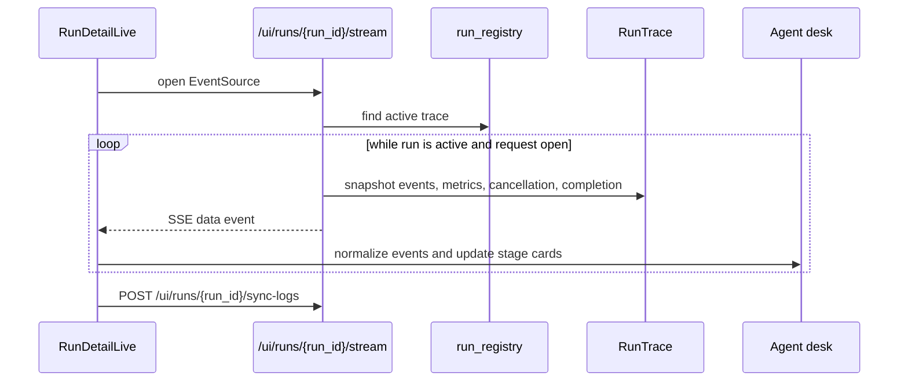

- **What it shows:** how live events reach the run-detail dashboard while a run is still executing.
- **How to read it:** the browser keeps an EventSource connection open; FastAPI repeatedly sends trace snapshots; the frontend normalizes them into Agent Desk cards.
- **Why it matters:** the jury can understand why the dashboard shows live progress before the database has fully persisted the final result.
- **Source grounding:** `/ui/runs/{run_id}/stream` and `_stream_trace` in `src/api/app.py`; `RunDetailLive`, `AgentActivityBoard`, and `web/lib/run-trace.js`.

## 11. Agent Class Diagram

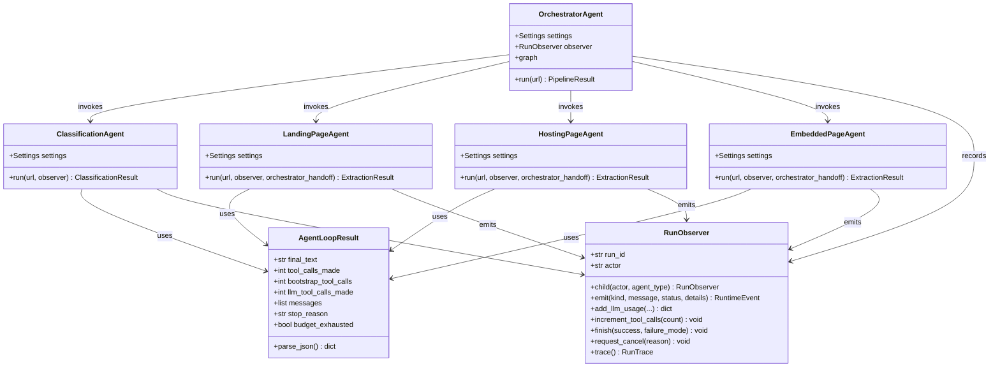

- **What it shows:** the main runtime classes and how the orchestrator coordinates specialist agents.
- **How to read it:** arrows from `OrchestratorAgent` mean it calls that agent. Arrows to `RunObserver` mean the class emits events, usage, and trace information.
- **Why it matters:** the split keeps each agent focused: classification routes, landing discovers watch pages, hosting operates players, and embedded inspects iframe/player contexts.
- **Source grounding:** `src/agents/orchestrator.py`, `src/agents/classification.py`, `src/agents/landing_page.py`, `src/agents/hosting_page.py`, `src/agents/embedded_page.py`, and `src/utils/observability.py`.

## 12. Runtime Schema Class Diagram

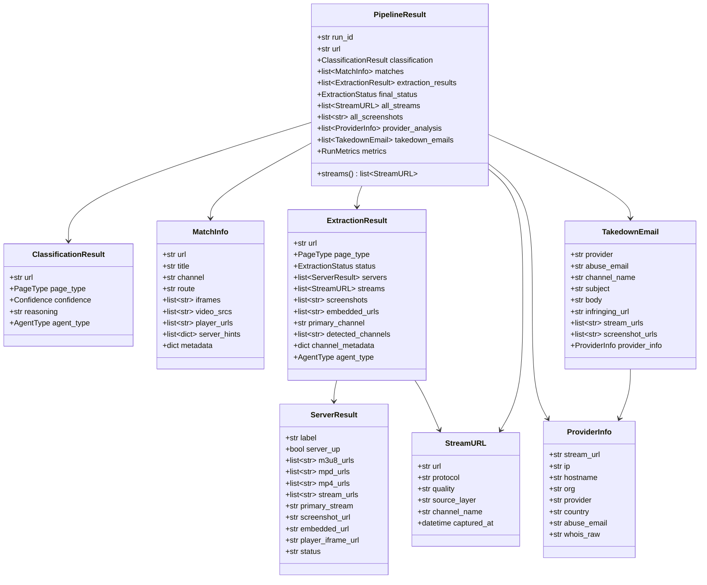

- **What it shows:** the Pydantic objects that define the pipeline result returned by the backend and stored by repositories.
- **How to read it:** `PipelineResult` is the aggregate root. It owns classification, matches, extraction results, streams, screenshots, provider analysis, and email drafts.
- **Why it matters:** these schemas make agent outputs consistent. Even if an agent uses free-form LLM reasoning internally, the final output must fit typed runtime objects.
- **Source grounding:** `src/models/schemas.py` and enum definitions in `src/models/enums.py`.

## 13. Repository Class Diagram

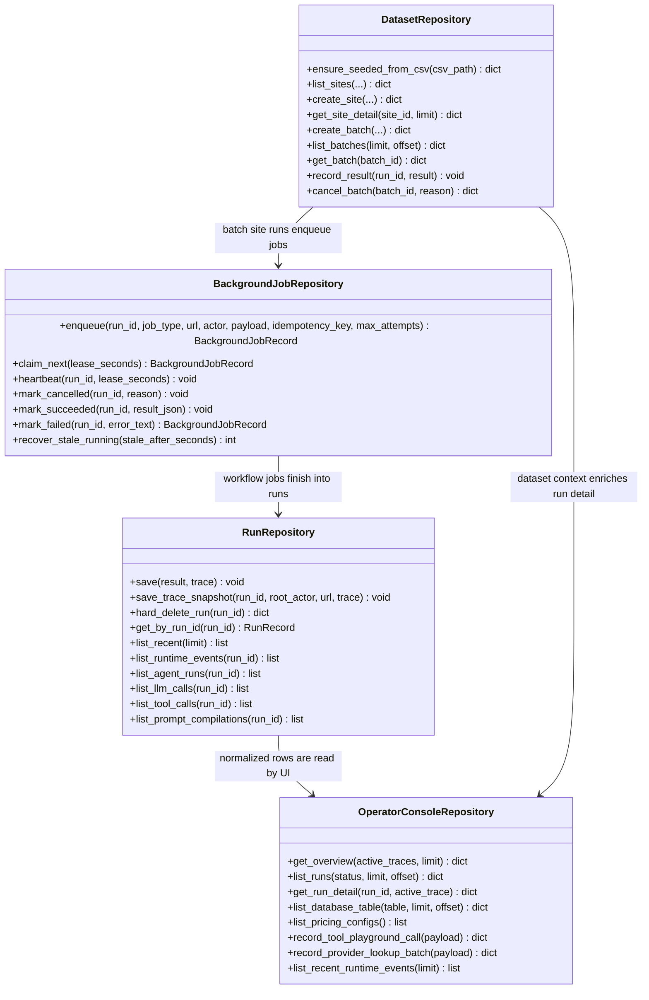

- **What it shows:** the persistence classes that write and read runtime state.
- **How to read it:** `RunRepository` writes results and telemetry, `BackgroundJobRepository` manages durable work, `OperatorConsoleRepository` assembles UI payloads, and `DatasetRepository` manages benchmark/batch site runs.
- **Why it matters:** write paths and read paths are separated. This keeps the agent runtime focused on execution while the console receives dashboard-ready payloads.
- **Source grounding:** `src/storage/repositories.py`, `src/storage/ui_repository.py`, `src/storage/dataset_repository.py`, and `src/api/app.py`.

## 14. Database ER Diagram

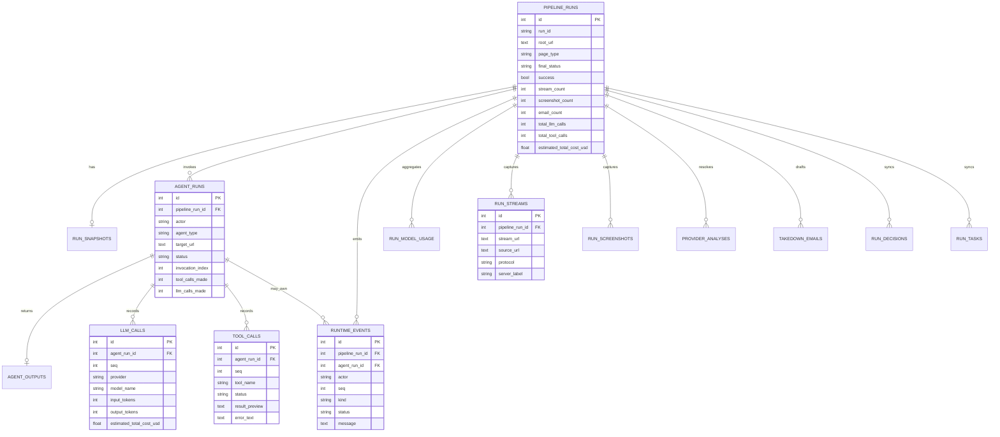

- **What it shows:** the normalized database tables centered on `pipeline_runs`.
- **How to read it:** one pipeline run can have many agent runs, events, model calls, tool calls, streams, screenshots, provider rows, and email rows.
- **Why it matters:** the database stores both final evidence and operational telemetry. This lets the console answer what was found and how the run behaved.
- **Source grounding:** SQLAlchemy records in `src/storage/models.py` and persistence logic in `src/storage/repositories.py`.

## 15. Dataset ER Diagram

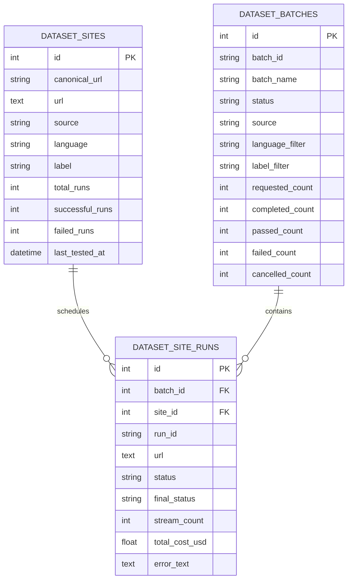

- **What it shows:** how benchmark or evaluation sites are stored and connected to batch runs.
- **How to read it:** a dataset batch contains many site-run rows, and each site-run can point back to a known dataset site.
- **Why it matters:** the project can evaluate multiple target URLs consistently instead of relying only on one manual run.
- **Source grounding:** `DatasetSiteRecord`, `DatasetBatchRecord`, and `DatasetSiteRunRecord` in `src/storage/models.py`; dataset APIs in `src/api/datasets.py`.

## 16. Prompt And Memory ER Diagram

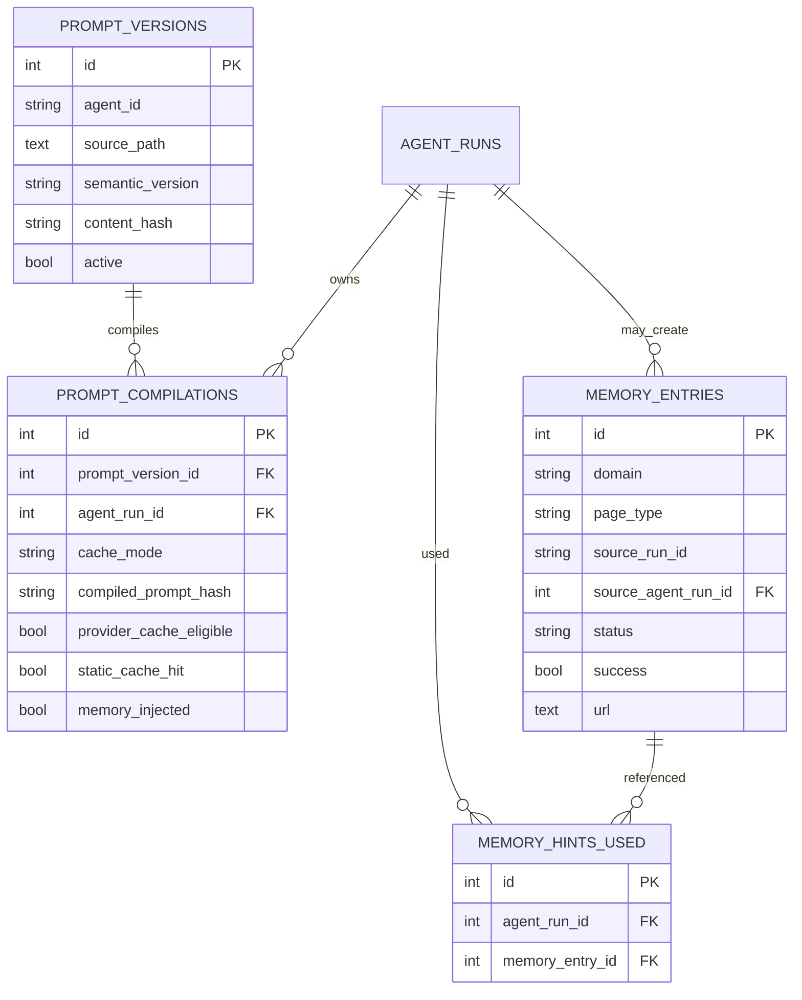

- **What it shows:** the relationship between prompt versions, compiled prompts, stored memory, and memory hints used by an agent run.
- **How to read it:** prompt source files become prompt versions, each agent run can record a prompt compilation, and memory entries can be referenced as hints.
- **Why it matters:** prompt and memory telemetry makes agent behavior explainable. The report can show whether a run used cached prompts or prior domain knowledge.
- **Source grounding:** `PromptVersionRecord`, `PromptCompilationRecord`, `MemoryEntryRecord`, and `MemoryHintUsedRecord` in `src/storage/models.py`; prompt compilation in `src/agents/prompting.py`; memory helpers in `src/agents/memory.py`.

## 17. Final Status State Diagram

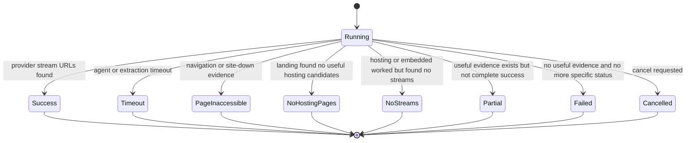

- **What it shows:** the terminal states a workflow can end in.
- **How to read it:** all runs start as running, then finish in exactly one meaningful final status.
- **Why it matters:** different failures mean different things. A page-inaccessible run, a no-hosting-pages run, and a no-streams run require different follow-up actions.
- **Source grounding:** `ExtractionStatus` in `src/models/enums.py` and final status construction in `_build_pipeline_result` inside `src/agents/orchestrator.py`.

## 18. Agent Desk State Diagram

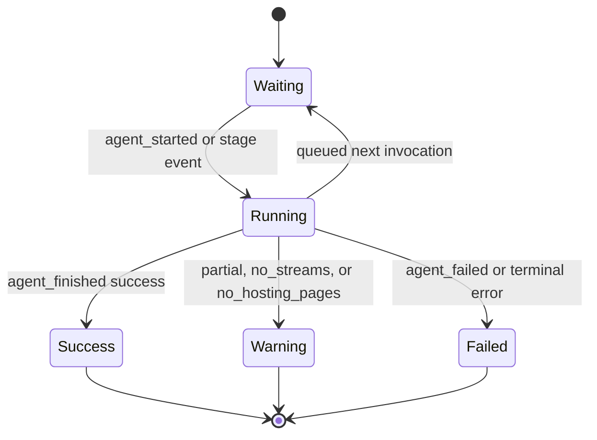

- **What it shows:** how the frontend Agent Desk interprets stage status.
- **How to read it:** a card starts waiting, becomes running when events arrive, then ends as success, warning, or failed depending on events and persisted rollups.
- **Why it matters:** the Agent Desk is a live execution board. It summarizes multiple backend signals into a readable stage status for the operator and jury.
- **Source grounding:** `web/components/console/run-detail/agent-activity-board.js`, `web/components/orchestrator-graph.js`, and `web/lib/run-trace.js`.

## 19. Evidence Flow Diagram

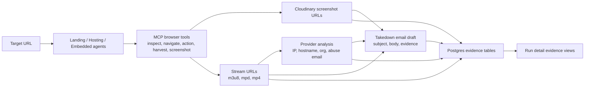

- **What it shows:** how raw browser observations become reviewable evidence.
- **How to read it:** browser agents use tools to capture screenshots and stream URLs; streams feed provider analysis; streams, screenshots, and provider facts feed the email draft.
- **Why it matters:** takedown emails are not generated from guesses. They are generated only from persisted evidence that the operator can review.
- **Source grounding:** extraction schemas in `src/models/schemas.py`, provider lookup in `src/tools/ipinfo_tool.py`, email generation in `src/agents/email_generator.py`, and evidence tables in `src/storage/models.py`.

## Documentation Index

### System

- [System Index](./system/README.md)
- [Architecture](./system/architecture.md)
- [LangChain And LangGraph Runtime](./system/langchain-langgraph.md)
- [Runtime Classes And Function Map](./system/runtime-classes-functions.md)
- [Deployment](./system/deployment.md)
- [Data Model](./system/data-model.md)
- [Caching And Observability](./system/caching-observability.md)

### Workflow

- [Workflow Index](./workflow/README.md)
- [Run Lifecycle](./workflow/run-lifecycle.md)
- [Dashboard Logging And Run Telemetry](./workflow/dashboard-logging.md)
- [Agent Desk](./workflow/agent-desk.md)
- [Example Run: db970f27](./workflow/run-db970f27.md)

### Agents

- [Agents Index](./agents/README.md)
- [Orchestrator](./agents/orchestrator.md)
- [Classification](./agents/classification.md)
- [Landing](./agents/landing.md)
- [Hosting](./agents/hosting.md)
- [Embedded](./agents/embedded.md)
- [Provider Analysis](./agents/provider-analysis.md)
- [Email Generator](./agents/email-generator.md)

### APIs And Tools

- [API Index](./api/README.md)
- [FastAPI Contracts](./api/fastapi.md)
- [Operator Console API](./api/operator-console.md)
- [Tools Index](./tools/README.md)
- [MCP Browser Tools](./tools/mcp-browser-tools.md)

### Operations

- [Operations Index](./operations/README.md)
- [Docker And Ports](./operations/docker.md)
- [Configuration](./operations/configuration.md)
- [Validation](./operations/validation.md)
- [Troubleshooting](./operations/troubleshooting.md)
- [Azure Container Apps Job With Service Bus](./operations/azure-container-app-job-service-bus.md)

## Active Implementation Sources

| Area | Source |
| --- | --- |
| FastAPI routes and background jobs | `src/api/app.py`, `src/api/datasets.py`, `src/api/provider_config.py` |
| Agent runtime | `src/agents/orchestrator.py`, `src/agents/base.py`, `src/agents/classification.py`, `src/agents/landing_page.py`, `src/agents/hosting_page.py`, `src/agents/embedded_page.py` |
| Runtime schemas and enums | `src/models/schemas.py`, `src/models/enums.py` |
| Persistence | `src/storage/models.py`, `src/storage/repositories.py`, `src/storage/ui_repository.py`, `src/storage/dataset_repository.py` |
| MCP and provider tools | `src/tools/mcp_client.py`, `src/tools/ipinfo_tool.py`, `src/tools/email_tool.py`, `tools/puppeteer/`, `tools/playwright/` |
| Active frontend routes | `web/app/page.js`, `web/app/live/page.js`, `web/app/runs/page.js`, `web/app/runs/[runId]/page.js`, `web/app/providers/page.js`, `web/app/settings/page.js`, `web/app/agents/page.js` |
| Frontend navigation and run detail | `web/components/console/layout/navigation-config.js`, `web/components/console/run-detail/`, `web/lib/run-trace.js`, `web/lib/api.js` |
| Docker stack | `docker-compose.yml`, `Dockerfile`, `Dockerfile.web`, `Dockerfile.tools`, `Dockerfile.tools.playwright` |
