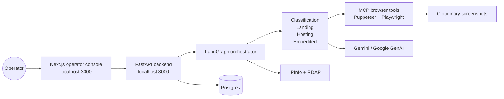

# Open Web Catcher Documentation

> **Navigation:** [Docs Home](./README.md) | [Section Index](#documentation-index) | Previous: [Docs Home](./README.md) | Next: [System Index](./system/README.md)

> **Start here:** follow the [Reading Order](#reading-order) for the report-style path, or jump directly through the [Documentation Index](#documentation-index). Every active doc has a navigation strip back to this page, its section index, the previous page, and the next page.

This documentation describes the current implementation: a LangGraph/LangChain agent runtime, a FastAPI execution backend, a Next.js operator console, Postgres persistence, Gemini model execution, and profile-scoped Puppeteer/Playwright MCP browser tools.

Old implementation notes are not part of the active reading path. Historical material is listed in [Archive](./archive/README.md).

## Reading Order

1. [System](./system/README.md) - general structure, runtime components, deployment, and diagrams.
2. [LangChain And LangGraph Runtime](./system/langchain-langgraph.md) - concepts, why the graph is used, agent loop mechanics, and prompt layering.
3. [Runtime Classes And Function Map](./system/runtime-classes-functions.md) - source-grounded class/function diagrams for agents, APIs, repositories, and DB models.
4. [Workflow](./workflow/README.md) - how a run starts, routes through agents, records telemetry, and finishes.
5. [Dashboard Logging And Run Telemetry](./workflow/dashboard-logging.md) - how events, LLM calls, tool calls, costs, and evidence reach the dashboard.
6. [Agent Desk](./workflow/agent-desk.md) - how the run-detail UI presents orchestration, stages, tools, model attempts, and evidence.
7. [Example Run: db970f27](./workflow/run-db970f27.md) - concrete backend and frontend walkthrough for the provided run.
8. [Agents](./agents/README.md) - individual pages for orchestrator, classification, landing, hosting, embedded, provider analysis, and email generation.
9. [API Contracts](./api/README.md) - route groups, payloads, SSE, settings, provider, dataset, and run-detail contracts.
10. [MCP And Browser Tools](./tools/README.md) - profile-scoped tools, Puppeteer/Playwright split, memory tools, context tools, and media capture.
11. [Operations](./operations/README.md) - Docker services, ports, config, validation, and troubleshooting.
12. [Azure Container Apps Job With Service Bus](./operations/azure-container-app-job-service-bus.md) - queue-triggered deployment shape and required worker adapter.

## Current Product Map

## Documentation Index

### System

- [System Index](./system/README.md)
- [Architecture](./system/architecture.md)
- [LangChain And LangGraph Runtime](./system/langchain-langgraph.md)
- [Runtime Classes And Function Map](./system/runtime-classes-functions.md)
- [Deployment](./system/deployment.md)
- [Data Model](./system/data-model.md)
- [Caching And Observability](./system/caching-observability.md)

### Workflow

- [Workflow Index](./workflow/README.md)
- [Run Lifecycle](./workflow/run-lifecycle.md)
- [Dashboard Logging And Run Telemetry](./workflow/dashboard-logging.md)
- [Agent Desk](./workflow/agent-desk.md)
- [Example Run: db970f27](./workflow/run-db970f27.md)

### Agents

- [Agents Index](./agents/README.md)
- [Orchestrator](./agents/orchestrator.md)
- [Classification](./agents/classification.md)
- [Landing](./agents/landing.md)
- [Hosting](./agents/hosting.md)
- [Embedded](./agents/embedded.md)
- [Provider Analysis](./agents/provider-analysis.md)
- [Email Generator](./agents/email-generator.md)

### APIs And Tools

- [API Index](./api/README.md)
- [FastAPI Contracts](./api/fastapi.md)
- [Operator Console API](./api/operator-console.md)
- [Tools Index](./tools/README.md)
- [MCP Browser Tools](./tools/mcp-browser-tools.md)

### Operations

- [Operations Index](./operations/README.md)
- [Docker And Ports](./operations/docker.md)
- [Configuration](./operations/configuration.md)
- [Validation](./operations/validation.md)
- [Troubleshooting](./operations/troubleshooting.md)
- [Azure Container Apps Job With Service Bus](./operations/azure-container-app-job-service-bus.md)

## Active Implementation Sources

| Area | Source |
| --- | --- |
| FastAPI routes | `src/api/app.py`, `src/api/datasets.py`, `src/api/provider_config.py` |
| Agents | `src/agents/` |
| Runtime schemas | `src/models/schemas.py`, `src/models/enums.py` |
| Persistence | `src/storage/models.py`, `src/storage/repositories.py`, `src/storage/ui_repository.py` |
| MCP client | `src/tools/mcp_client.py` |
| Browser tools | `tools/puppeteer/`, `tools/playwright/`, `tools/shared/` |
| Run detail UI | `web/app/runs/[runId]/page.js`, `web/components/console/run-detail/`, `web/components/run-detail-live.js`, `web/components/orchestrator-graph.js` |
| Docker stack | `docker-compose.yml`, `Dockerfile`, `Dockerfile.web`, `Dockerfile.tools`, `Dockerfile.tools.playwright` |
