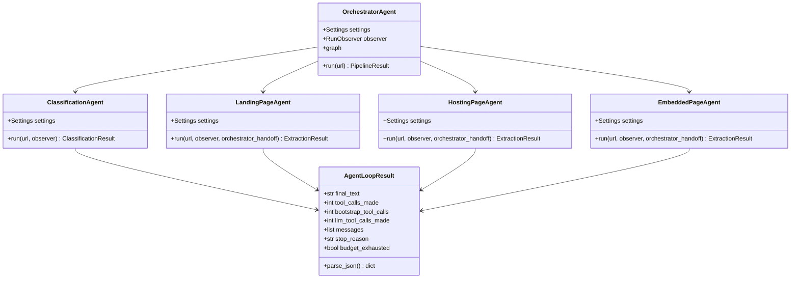
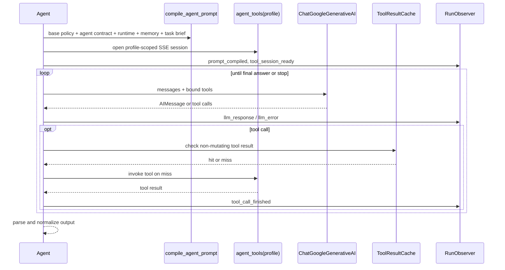
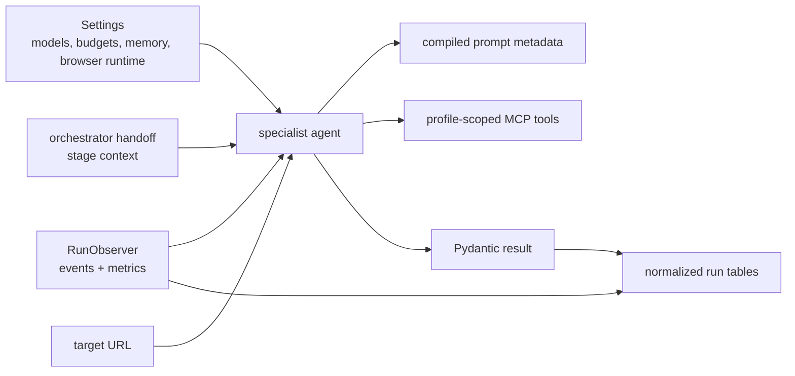

# Agents

> **Navigation:** [Docs Home](../README.md) | [Section Index](./README.md) | Previous: [Example Run db970f27](../workflow/run-db970f27.md) | Next: [Orchestrator](./orchestrator.md)

The runtime has one orchestrator and four browser-facing specialist agents. Provider analysis and email generation are implemented as LangChain `BaseTool` integrations called by the orchestrator after extraction.

The design is intentionally split by responsibility. Classification should decide what kind of page is in front of the browser. Landing should find useful downstream watch pages. Hosting should operate the page that owns server/source controls. Embedded should stay inside player/iframe contexts. Provider analysis and email generation should run only after stream evidence exists.

This separation makes prompts shorter and failures easier to interpret. A classification timeout is not the same as a hosting extraction failure. A provider lookup skip is not an IPInfo failure if no streams were found. The dashboard can show those differences because each stage emits its own events and persists its own rows.

## Agent Inventory

| Agent / tool | Source | Main input | Main output | MCP profile |
| --- | --- | --- | --- | --- |
| Orchestrator | `src/agents/orchestrator.py` | URL, settings, observer | `PipelineResult` | none |
| Classification | `src/agents/classification.py` | URL | `ClassificationResult` | `classification` |
| Landing | `src/agents/landing_page.py` | URL + orchestrator handoff | `ExtractionResult` with `hosting_pages` | `landing` |
| Hosting | `src/agents/hosting_page.py` | target hosting URL + handoff | `ExtractionResult` with streams / embedded URLs | `hosting` |
| Embedded | `src/agents/embedded_page.py` | target embedded URL + handoff | `ExtractionResult` with streams | `embedded` |
| Provider analysis | `src/tools/ipinfo_tool.py` | stream URLs | `ProviderInfo[]` | none |
| Email generator | `src/tools/email_tool.py`, `src/agents/email_generator.py` | providers + extractions | `TakedownEmail[]` | none |

## Responsibility Boundaries

| Stage | It should do | It should not do | Why |
| --- | --- | --- | --- |
| Orchestrator | route, prepare handoffs, aggregate, decide final status | inspect the page directly | keeps routing deterministic and observable |
| Classification | inspect enough evidence to classify page type | extract streams or provider data | prevents early extraction from polluting routing |
| Landing | discover hosting/watch candidates and preserve iframe/player hints | fabricate downstream URLs | landing pages often contain many low-value links |
| Hosting | operate server/source controls and extract streams or explicit embedded handoffs | drift to unrelated redirects or homepages | hostile pages often force ads and off-target navigation |
| Embedded | work on direct player/iframe URLs and harvest streams | crawl general site navigation | embedded pages usually need frame-local actions |
| Provider analysis | resolve stream hosts to provider and abuse-contact facts | run without stream URLs | provider lookup needs concrete stream evidence |
| Email generator | draft reviewable takedown notices from evidence | send email automatically | the output is for human review |

## Runtime Class Diagram

## Shared Agent Loop

## Runtime Inputs And Outputs

Every browser-facing agent receives a URL, settings, an optional `RunObserver`, and stage-specific handoff text. Each agent compiles its own prompt and opens its own MCP profile. The output is converted into one of the Pydantic schema objects in `src/models/schemas.py`.

## Why LangChain Tools Are Used Here

LangChain tools give the model a typed list of operations it is allowed to request. In this project, those operations are not arbitrary Python functions; most are MCP browser tools exposed by profile. This gives a practical control boundary:

- the classification prompt can be paired with classification tools;
- hosting and embedded can receive media and player tools;
- the backend can time out each tool call and record it;
- repeated read-only observations can use `ToolResultCache`;
- mutating browser actions invalidate cached observations.

That tool boundary is the main reason the agents can be inspected in the dashboard. Tool calls become events and persisted rows instead of disappearing inside a model transcript.

## Agent Pages

- [Orchestrator](./orchestrator.md)
- [Classification](./classification.md)
- [Landing](./landing.md)
- [Hosting](./hosting.md)
- [Embedded](./embedded.md)
- [Provider Analysis](./provider-analysis.md)
- [Email Generator](./email-generator.md)
- [PlantUML Sequence And Activity Diagrams Without Storage](./plantuml-no-storage.md)
