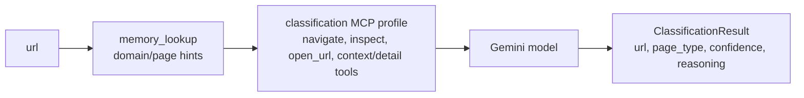
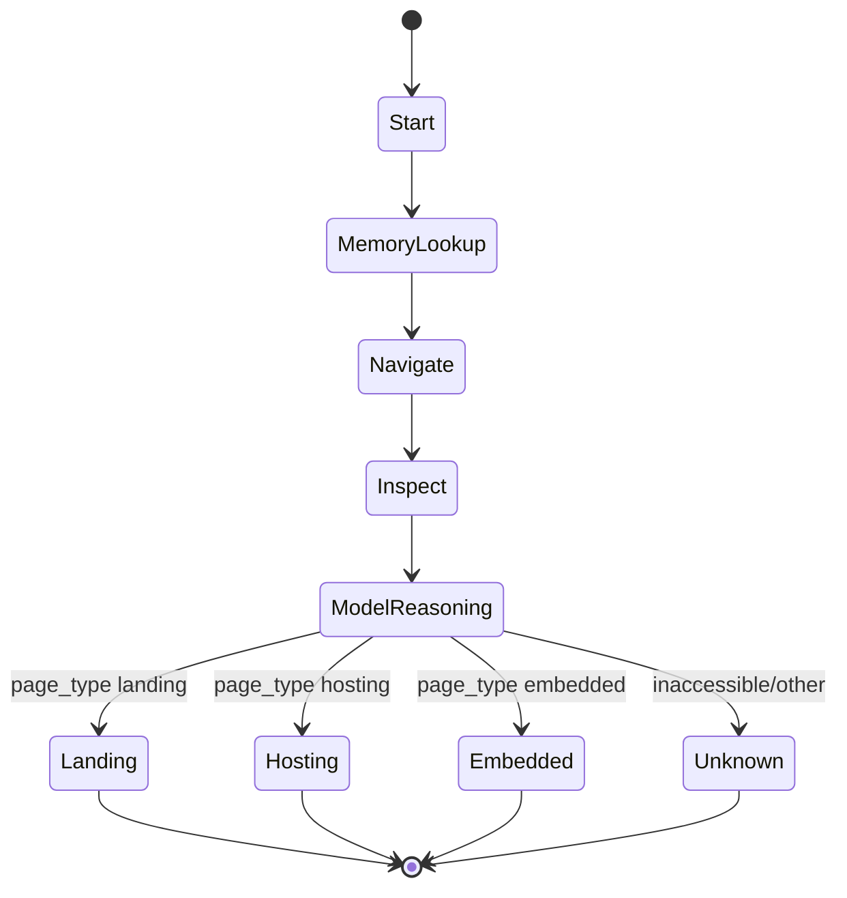
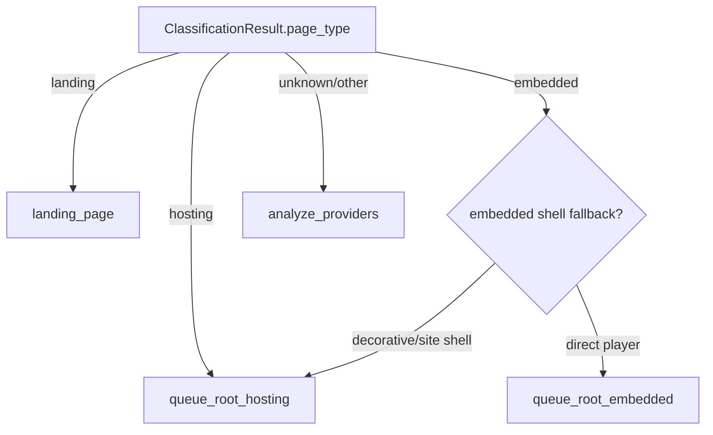

# Classification Agent

> **Navigation:** [Docs Home](../README.md) | [Section Index](./README.md) | Previous: [Orchestrator](./orchestrator.md) | Next: [Landing](./landing.md)

Source: `src/agents/classification.py`

The classification agent determines whether a URL is a landing page, hosting page, embedded player page, or unknown/other. Its answer drives the first orchestrator route.

## Input And Output

## Classification State Flow

## Tool Profile

The `classification` MCP profile exposes broad navigation/context tools but not stream harvesting:

- `memory_lookup`, `memory_update`
- `navigate`, `open_url`, `inspect`
- `get_page_context`, `get_frame_tree`, `query_elements`, `get_element_detail`
- `interact`, `screenshot`, scrolling and wait helpers

## Route Contract

