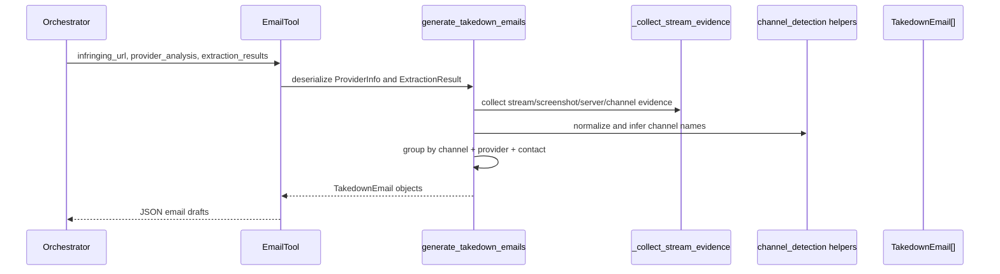
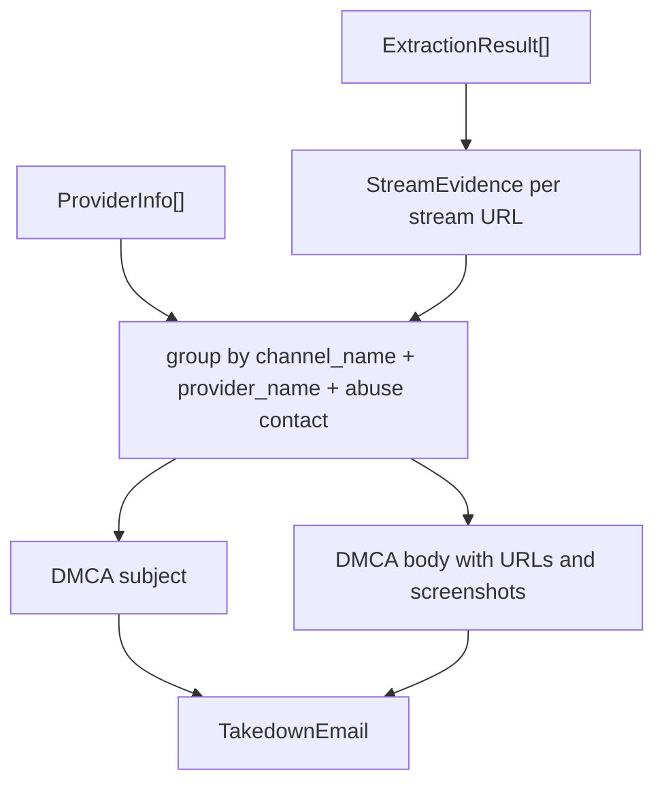
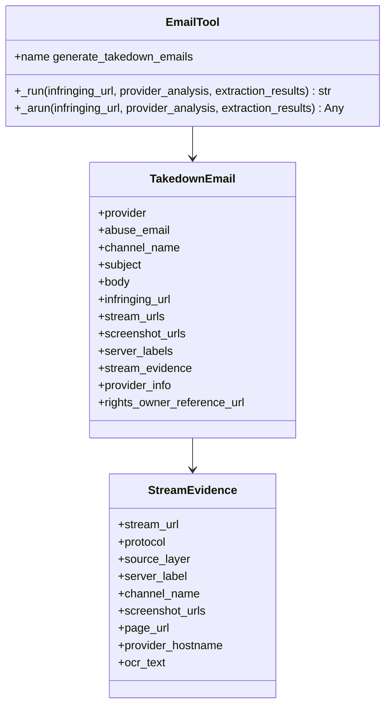

# Email Generator

> **Navigation:** [Docs Home](../README.md) | [Section Index](./README.md) | Previous: [Provider Analysis](./provider-analysis.md) | Next: [API Index](../api/README.md)

Sources: `src/tools/email_tool.py`, `src/agents/email_generator.py`

Email generation is a draft-only evidence packaging stage. Emails are not sent. The generator groups provider rows by channel, provider, and abuse contact, then attaches stream URLs, screenshots, server labels, provider info, and per-stream evidence.

## Email Generation Sequence

## Evidence Packaging

## Email Class Diagram

