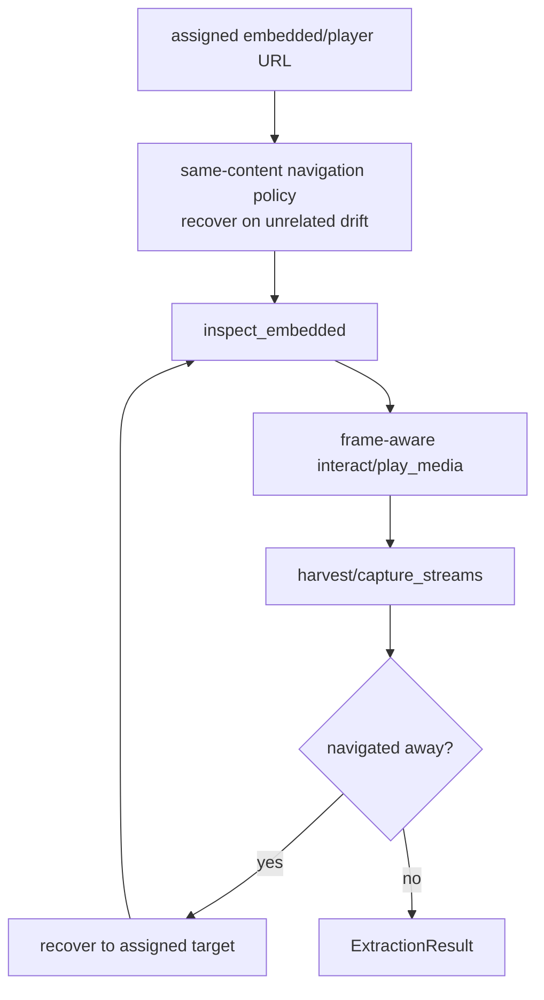
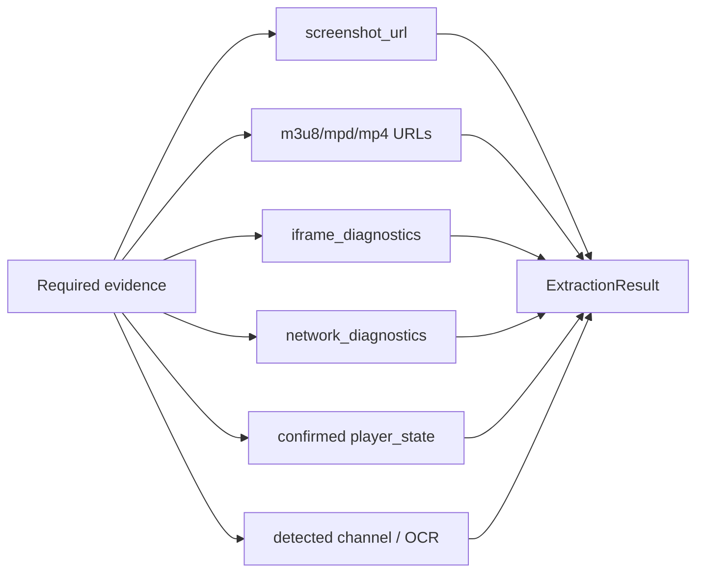

# Embedded Page Agent

> **Navigation:** [Docs Home](../README.md) | [Section Index](./README.md) | Previous: [Hosting](./hosting.md) | Next: [Provider Analysis](./provider-analysis.md)

Source: `src/agents/embedded_page.py`

The embedded agent works only on direct embedded/player URLs. It should not drift back into general host-page exploration. Its job is to activate iframe-local players, switch embedded sources when available, harvest streams, and return evidence.

## Embedded Route Discipline

## Embedded Evidence Contract

