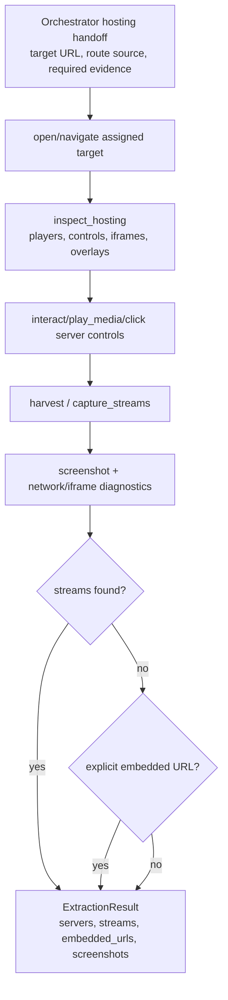
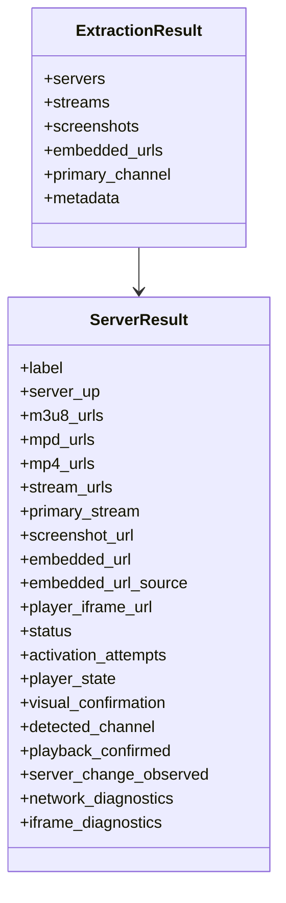
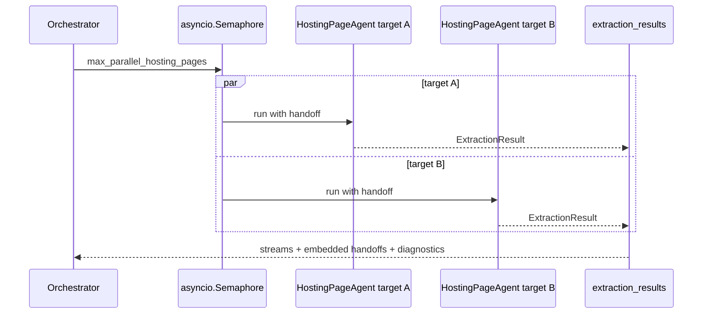

# Hosting Page Agent

> **Navigation:** [Docs Home](../README.md) | [Section Index](./README.md) | Previous: [Landing](./landing.md) | Next: [Embedded](./embedded.md)

Source: `src/agents/hosting_page.py`

The hosting agent works on watch/host pages. It activates players, handles blockers and server/source switching, harvests streams, records screenshots, and returns explicit embedded/player handoffs only when required.

## Hosting Activity

## Server Result Class Focus

## Parallel Hosting Targets

