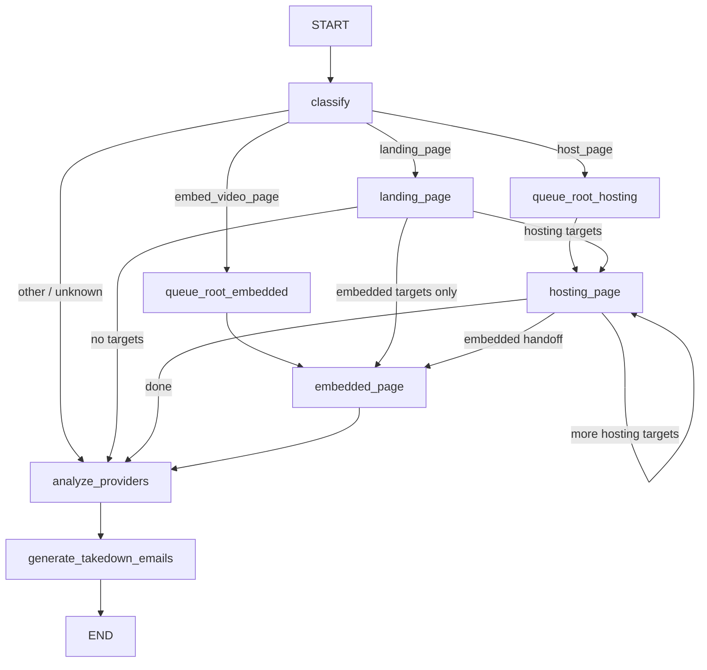
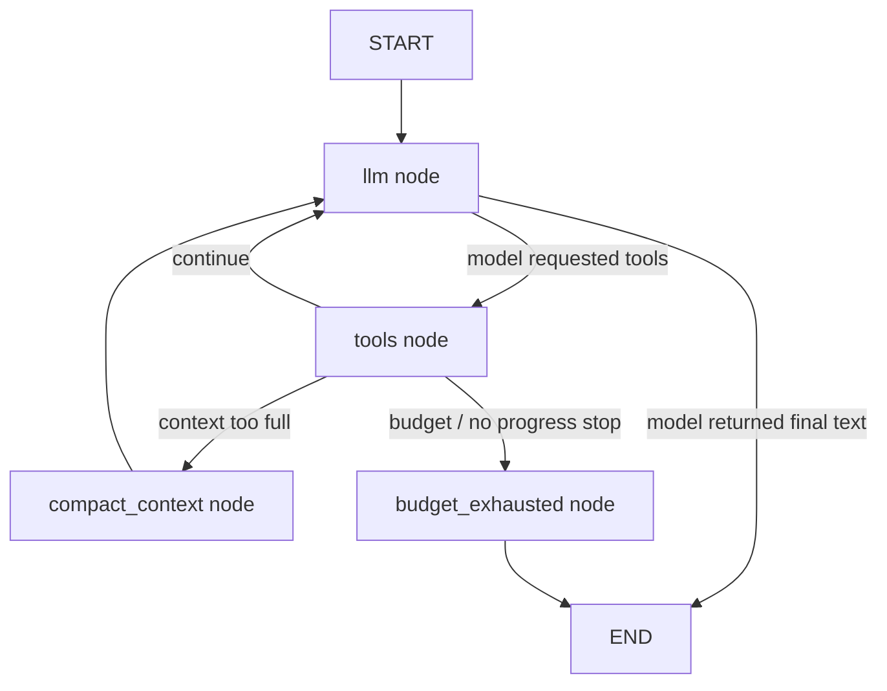
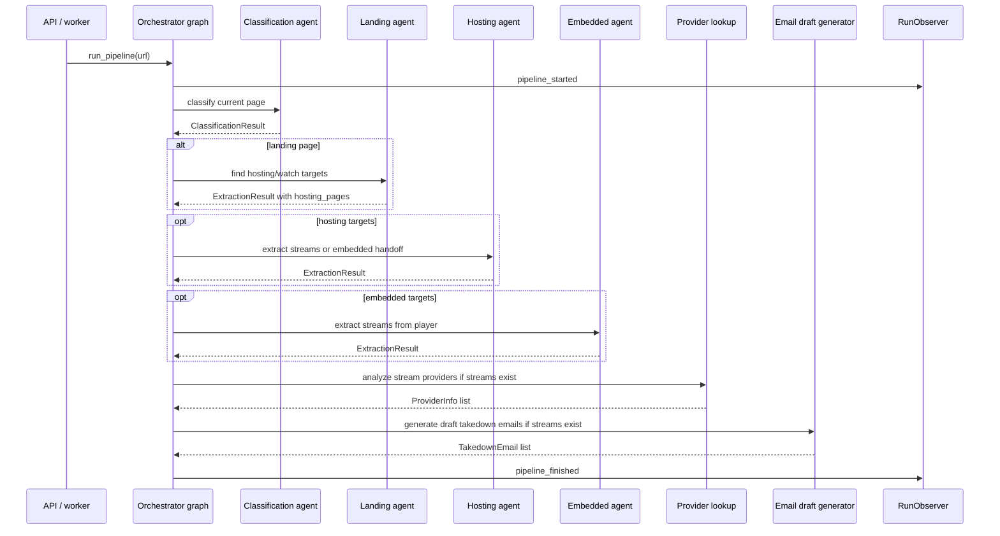
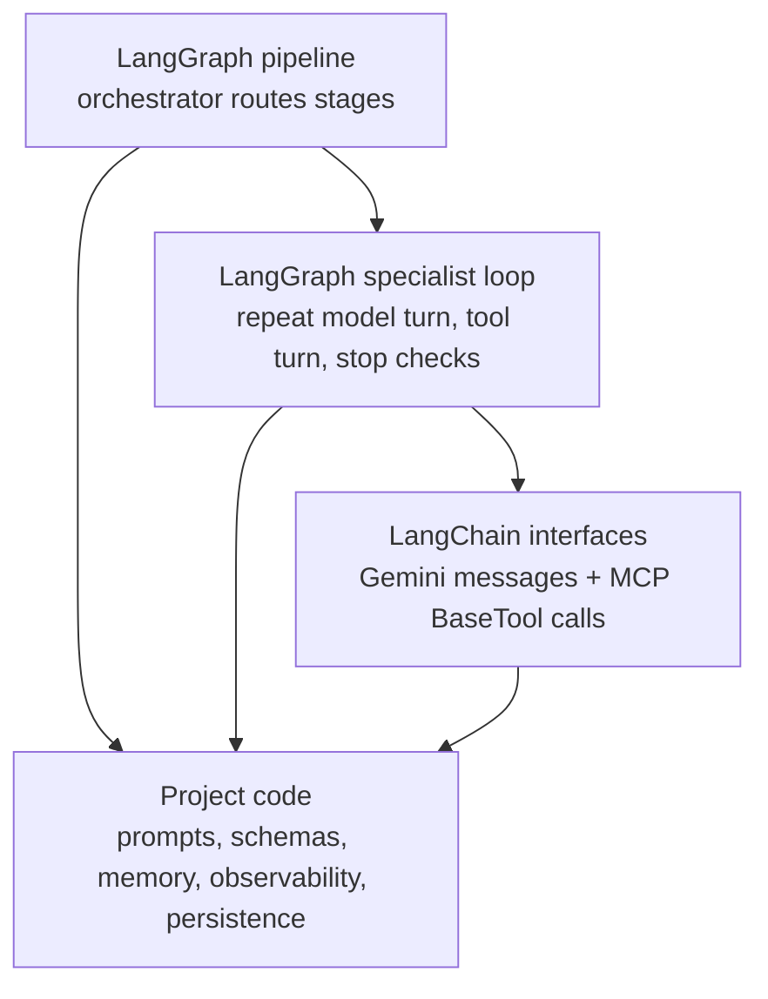

# How Agents Use LangChain And LangGraph

> **Navigation:** [Docs Home](../README.md) | [Agents Index](./README.md) | Related: [LangChain And LangGraph Runtime](../system/langchain-langgraph.md)

This is the short mental model for the runtime.

- **LangChain is the model and tool interface.** It gives the code message classes, the Gemini chat wrapper, and `BaseTool` objects.
- **LangGraph is the control-flow engine.** It gives the code explicit state machines for routing the pipeline and for repeating model/tool turns.
- **The project code owns the agent policy.** Prompts, route functions, output normalization, memory, events, and persistence are all local application code.

The system is not using one giant chatbot. It is a deterministic pipeline that calls smaller LLM-driven browser specialists when a stage needs page understanding.

## What Uses What

| Runtime piece | Uses LangChain | Uses LangGraph | Why |
| --- | --- | --- | --- |
| `src/agents/base.py` | Yes | Yes | Builds Gemini via `ChatGoogleGenerativeAI`, binds LangChain tools, and runs the shared specialist-agent `StateGraph`. |
| `src/agents/orchestrator.py` | Not for its own model loop | Yes | Builds the pipeline `StateGraph`: classify, route, extract, analyze providers, generate email drafts. |
| `src/agents/classification.py` | Indirectly through `base.py` and `agent_tools()` | Indirectly through `run_agent_loop()` | Compiles the classification prompt, opens the `classification` MCP profile, and runs the shared loop. |
| `src/agents/landing_page.py` | Indirectly through `base.py` and `agent_tools()` | Indirectly through `run_agent_loop()` | Finds hosting/watch candidates from landing pages. |
| `src/agents/hosting_page.py` | Indirectly through `base.py` and `agent_tools()` | Indirectly through `run_agent_loop()` | Operates hosting pages, server/source controls, players, and explicit embedded handoffs. |
| `src/agents/embedded_page.py` | Indirectly through `base.py` and `agent_tools()` | Indirectly through `run_agent_loop()` | Works inside direct embedded/player pages and recovers streams. |
| `src/tools/mcp_client.py` | Yes | No | Converts profile-scoped MCP browser tools into LangChain `BaseTool` objects. |
| `src/tools/ipinfo_tool.py` | Yes | No | Wraps provider lookup as a `BaseTool`; the orchestrator calls it after streams exist. |
| `src/tools/email_tool.py` | Yes | No | Wraps deterministic email draft generation as a `BaseTool`; emails are not sent automatically. |
| `scripts/mcp_probe.py` and `data/tmp_schema_probe.py` | Yes | No | Development probes for MCP tool loading and Gemini function-schema compatibility. |

The dependencies are declared in `pyproject.toml`:

- `langchain-core`
- `langchain-google-genai`
- `langchain-mcp-adapters`
- `langgraph`

There is no direct import of the old monolithic `langchain` package in the runtime. The code uses the smaller packages above.

## The Two Graphs

There are two LangGraph layers.

### 1. Orchestrator Pipeline Graph

`src/agents/orchestrator.py::build_graph()` controls the whole run. It does not browse the page itself. It calls specialist agents and routes based on their structured results.

The orchestrator's state is `PipelineState`. It carries the original URL, classification, landing matches, extraction results, pending hosting URLs, pending embedded URLs, provider analysis, email drafts, and errors.

### 2. Shared Specialist Agent Loop

`src/agents/base.py::run_agent_loop()` controls one browser-facing specialist run. Classification, landing, hosting, and embedded all use this same loop.

The specialist-loop state is `AgentGraphState`. It tracks the message list, tool-call budget, repeated/no-progress guards, context pressure, and continuation capsules.

## Where LangChain Fits In The Specialist Loop

Inside `run_agent_loop()`:

1. The specialist passes in a compiled system prompt and an initial human message.
2. `build_llm()` creates `ChatGoogleGenerativeAI`.
3. `agent_tools(profile, settings)` opens a profile-specific MCP session and returns LangChain `BaseTool` objects.
4. The loop calls `llm.bind_tools(tools)`.
5. The `llm` node sends LangChain `SystemMessage`, `HumanMessage`, `AIMessage`, and `ToolMessage` objects to Gemini.
6. If Gemini requests tool calls, the `tools` node looks up each tool by name and calls `tool.ainvoke(args)`.
7. Tool results are serialized back into `ToolMessage` objects.
8. When Gemini returns final text instead of tool calls, the specialist parses that text as JSON and normalizes it into Pydantic schemas.

LangChain is the interface layer. It does not decide the pipeline route.

## Where LangGraph Fits In The Specialist Loop

LangGraph decides what node runs next:

- after `llm`, route to `tools` if the model requested tools;
- after `llm`, end if the model returned final text;
- after `tools`, continue to `llm` if there is budget and progress;
- after `tools`, compact context if the context threshold is reached;
- after `tools`, force final JSON if budget/no-progress guards trip.

LangGraph is the loop controller. It does not decide which button to click; the model proposes tool calls and the local tools execute them.

## End-To-End Run

## What Each Agent Actually Does

### Orchestrator

Source: `src/agents/orchestrator.py`

The orchestrator owns the outer `StateGraph`. It starts every run with classification, routes to the right specialist, prepares handoff text, aggregates results, skips provider/email work when no streams exist, and builds the final `PipelineResult`.

It is deterministic control code, not an LLM chat loop.

### Classification

Source: `src/agents/classification.py`

Classification compiles `configs/prompts/classification_v1.md`, opens the `classification` MCP tool profile, uses live page evidence, and returns a `ClassificationResult` with one page type:

- `landing_page`
- `host_page`
- `embed_video_page`
- `other`

It should not extract streams.

### Landing

Source: `src/agents/landing_page.py`

Landing compiles `configs/prompts/landing_page_v1.md`, opens the `landing` MCP profile, explores body content and continuation controls, and returns hosting/watch candidates under `hosting_pages`.

It may also preserve direct player hints, but its main job is downstream target discovery.

### Hosting

Source: `src/agents/hosting_page.py`

Hosting compiles `configs/prompts/hosting_page_v1.md`, opens the `hosting` MCP profile, operates server/source controls, dismisses blockers, activates the assigned player, captures streams, and returns explicit embedded/player handoff URLs when it cannot finish locally.

It should stay on the same event/player and avoid drifting to unrelated pages.

### Embedded

Source: `src/agents/embedded_page.py`

Embedded compiles `configs/prompts/embedded_page_v1.md`, opens the `embedded` MCP profile, works on direct player or iframe pages, activates the player, switches same-player sources when needed, and harvests streams.

It should not crawl general site navigation.

### Provider Analysis

Source: `src/tools/ipinfo_tool.py`

Provider analysis is not a browser agent. It is a LangChain `BaseTool` wrapper around deterministic provider lookup. The orchestrator only calls it when extracted stream URLs exist.

### Email Generator

Source: `src/tools/email_tool.py` and `src/agents/email_generator.py`

Email generation is not an autonomous agent. It is a `BaseTool` wrapper around deterministic Python that creates reviewable draft emails from stream evidence, provider facts, screenshots, and extraction results.

## The Simplest Mental Model

Think of the runtime as three layers:

- If you are debugging **which stage runs next**, read `src/agents/orchestrator.py`.
- If you are debugging **model/tool turn behavior**, read `src/agents/base.py`.
- If you are debugging **which tools an agent can see**, read `src/tools/mcp_client.py` and the browser tool registry.
- If you are debugging **what the model is told to do**, read `configs/prompts/*_v1.md` and `src/agents/prompting.py`.
- If you are debugging **JSON shape or extraction cleanup**, read the specialist file: classification, landing, hosting, or embedded.

The agents are therefore not separate black boxes. They are role-specific wrappers around one shared loop, coordinated by one outer graph.
