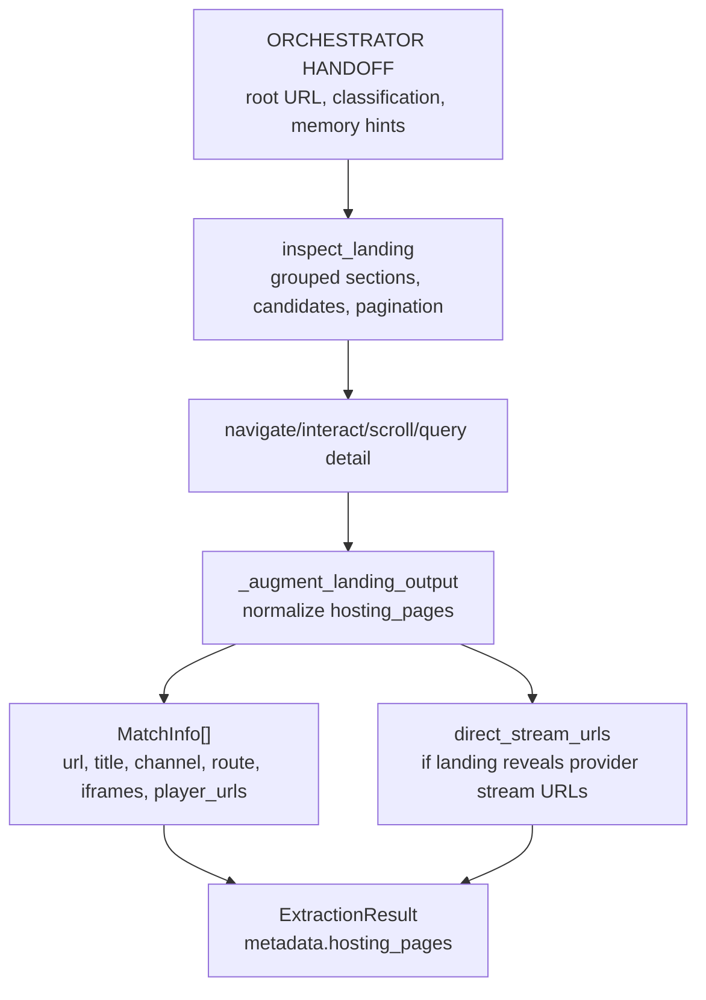
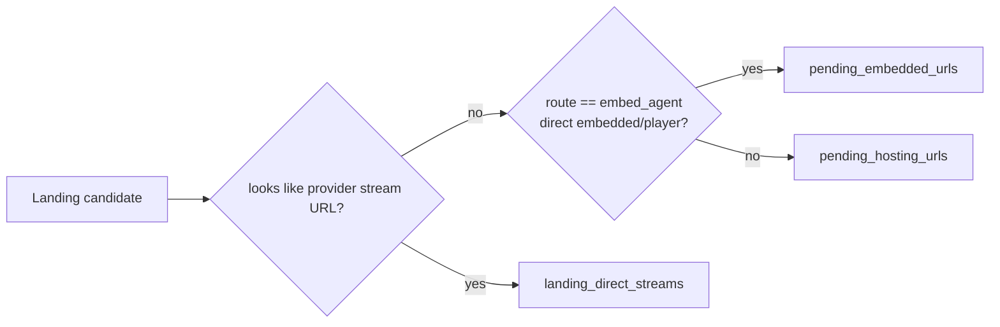
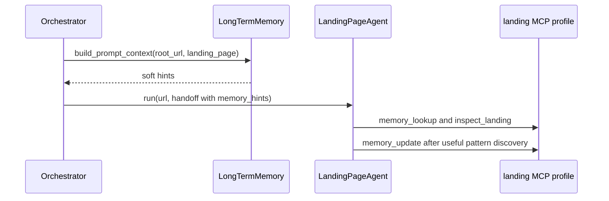

# Landing Page Agent

> **Navigation:** [Docs Home](../README.md) | [Section Index](./README.md) | Previous: [Classification](./classification.md) | Next: [Hosting](./hosting.md)

Source: `src/agents/landing_page.py`

The landing agent explores listing/home/schedule surfaces and returns hosting candidates. It must preserve iframe, video, player, redirect, route-source, channel, and pattern evidence so hosting and embedded agents receive useful context.

## Landing Output Flow

## Candidate Routing

## Memory Use

## Pagination And Playbook Memory

Pagination is now part of the landing contract instead of a side effect of DOM scraping. The prompt in `configs/prompts/landing_page_v1.md` tells the agent to detect query, path, cursor, and load-more patterns, then keep pagination passes focused on collecting candidate hosting URLs. `_augment_landing_output()` preserves `extraction_summary.pagination_*` fields when short memory saw pagination patterns and fills `site_patterns.pagination` when the model omitted it but tool evidence exposed stable pagination URLs.

Useful landing evidence is persisted as a reusable long-memory playbook by `src/memory/long_term.py::build_site_memory_entry`. New entries keep:

- `playbook_steps`: tool sequence plus the selector, URL, frame, or action used.
- `pagination_rules` and `pagination_patterns`: URL rules and observed page/cursor behavior.
- `landing_match_urls`: hosting URLs found on the landing page.
- `rejected_patterns` and `failure_cues`: patterns that looked wrong, drifted, or caused dead ends.
- `continuation_notes`: where an agent compacted context and what it planned to do next.

`memory_lookup` and `memory_update` in both Puppeteer and Playwright profiles still accept the older selector/pattern fields, but also accept the new playbook fields. Agents should use remembered concrete URLs only as evidence for patterns; they still need live verification before queueing hosting or embedded work.

To reset the legacy store before rebuilding clean profiles, run `scripts/memory/reset-site-memory.ps1`. It moves `data/site_memory.db` and `data/site_memory_profiles.json` into `data/memory-backups/<timestamp>/` and recreates an empty profile JSON file.
