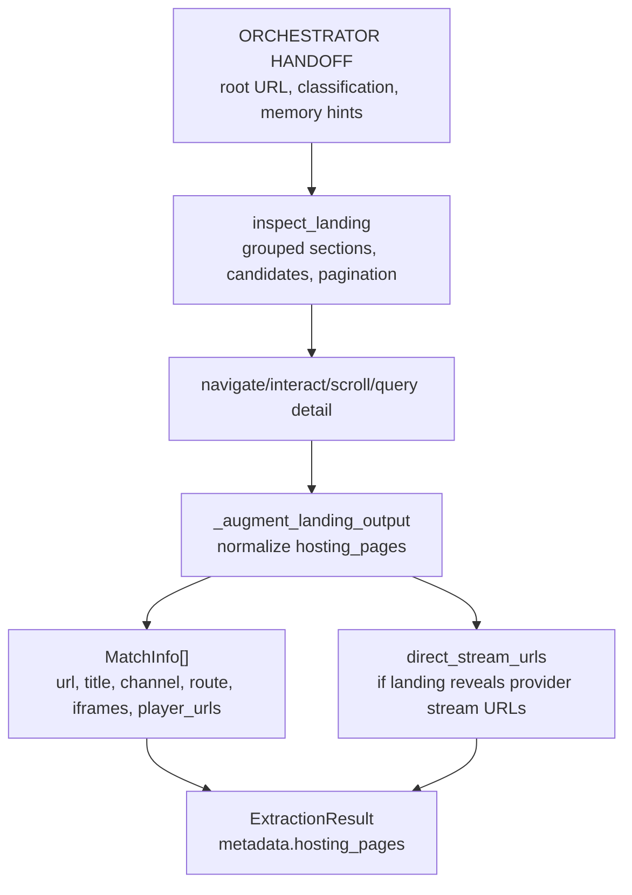
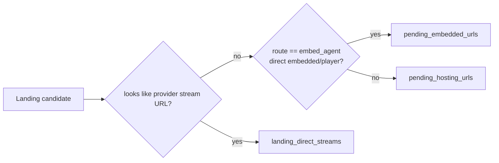
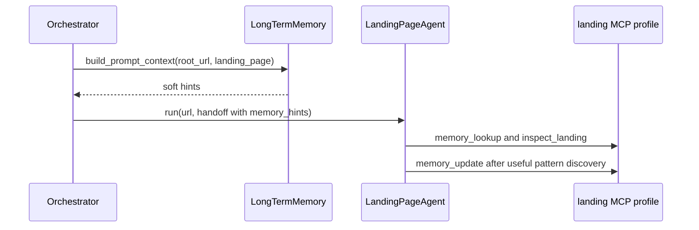

# Landing Page Agent

> **Navigation:** [Docs Home](../README.md) | [Section Index](./README.md) | Previous: [Classification](./classification.md) | Next: [Hosting](./hosting.md)

Source: `src/agents/landing_page.py`

The landing agent explores listing/home/schedule surfaces and returns hosting candidates. It must preserve iframe, video, player, redirect, route-source, channel, and pattern evidence so hosting and embedded agents receive useful context.

## Landing Output Flow

## Candidate Routing

## Memory Use

