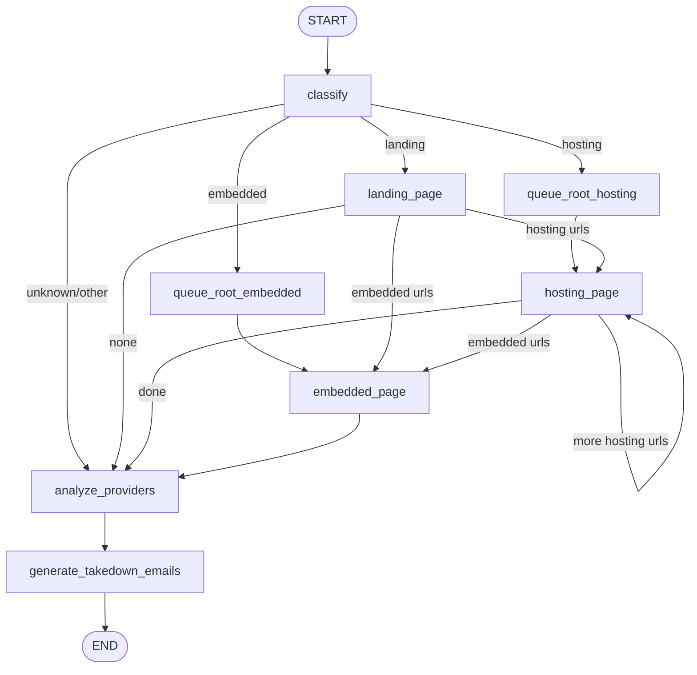
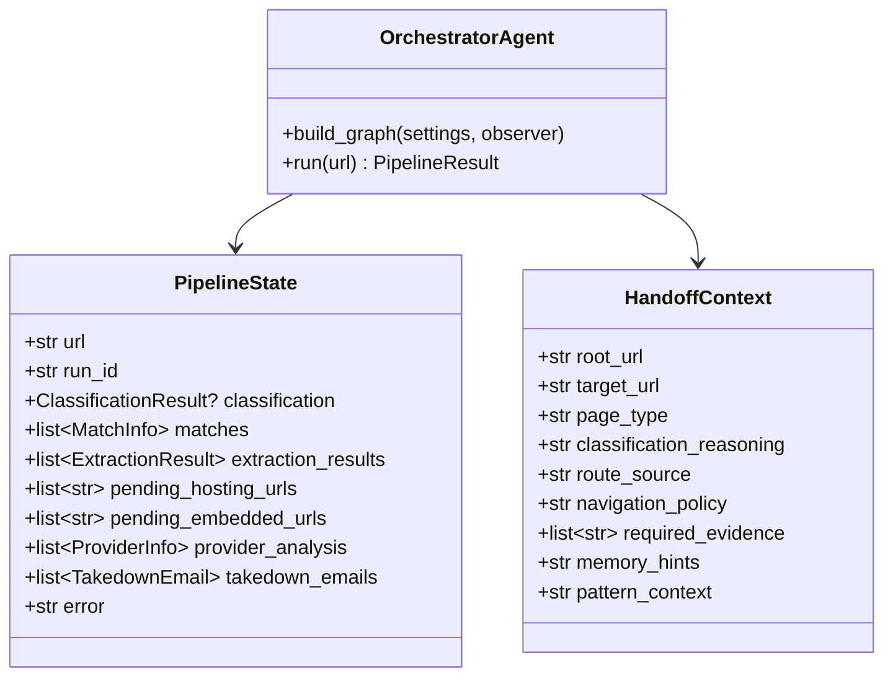
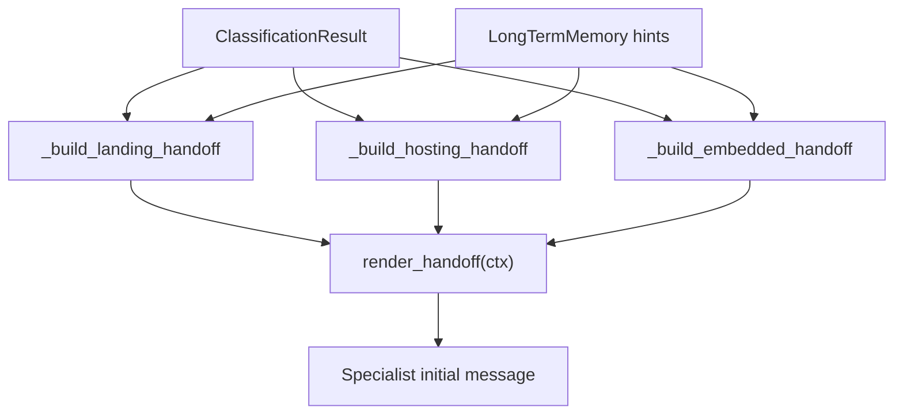
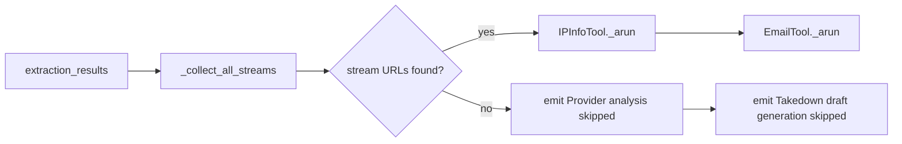
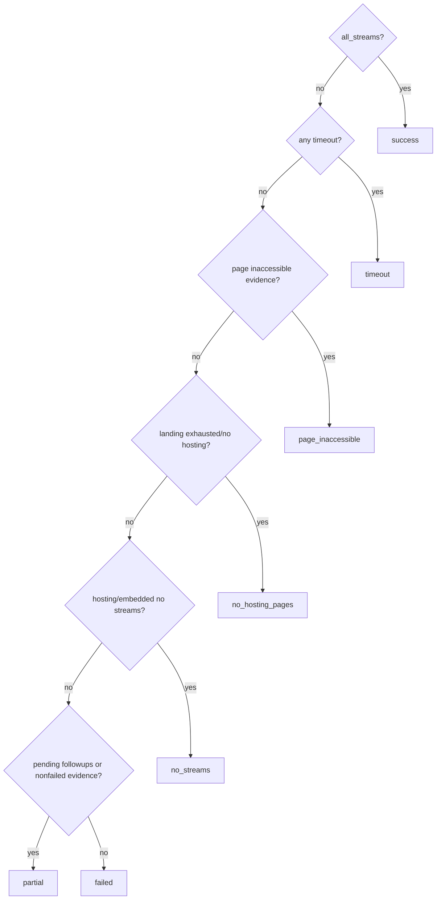

# Orchestrator Agent

> **Navigation:** [Docs Home](../README.md) | [Section Index](./README.md) | Previous: [Agents Index](./README.md) | Next: [Classification](./classification.md)

Source: `src/agents/orchestrator.py`

The orchestrator is the routing authority. It builds the LangGraph state machine, checks memory, calls classification, prepares handoffs, executes landing/hosting/embedded stages, runs provider analysis, generates takedown drafts, computes final status, and returns a `PipelineResult`.

## LangGraph Route

## State Class Diagram

## Handoff Preparation

## Provider And Email Skip Logic

## Final Status Calculation

