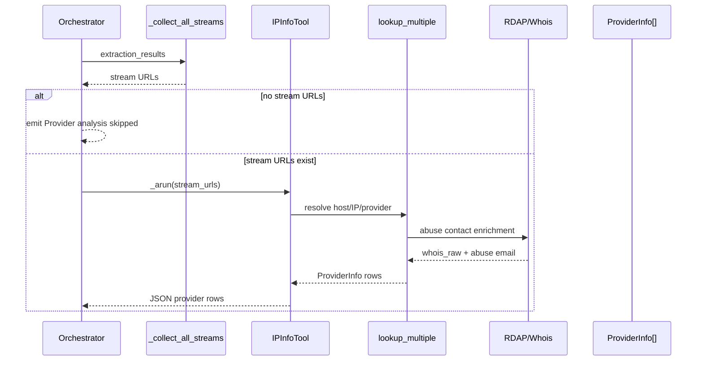
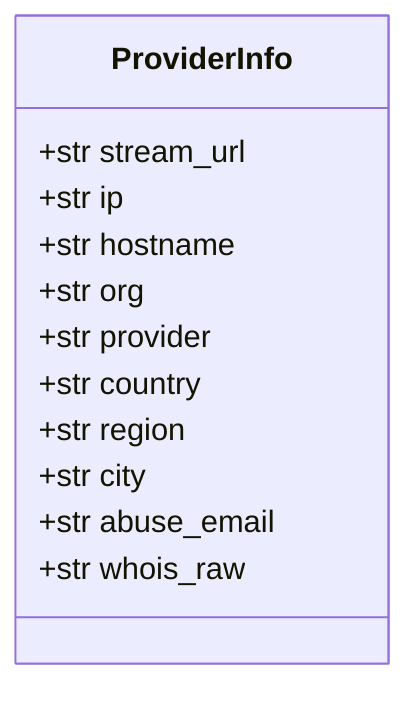
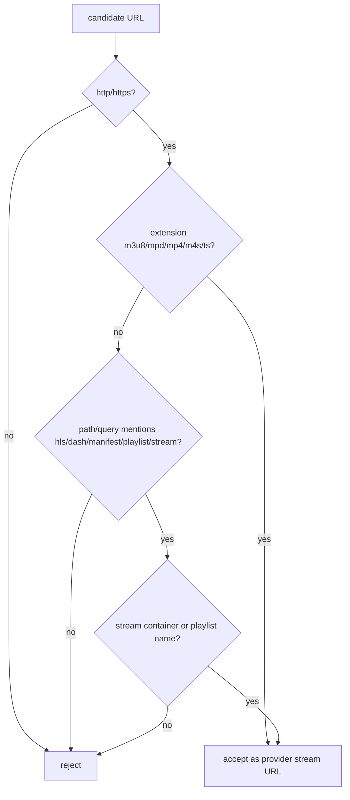

# Provider Analysis

> **Navigation:** [Docs Home](../README.md) | [Section Index](./README.md) | Previous: [Embedded](./embedded.md) | Next: [Email Generator](./email-generator.md)

Sources: `src/tools/ipinfo_tool.py`, `src/utils/ipinfo.py`

Provider analysis runs after the orchestrator has collected provider-like stream URLs. It resolves IP, hostname, organization, cleaned provider name, country/region/city, abuse email, and RDAP/Whois evidence.

## Provider Flow

## ProviderInfo Class

## Stream Filtering

