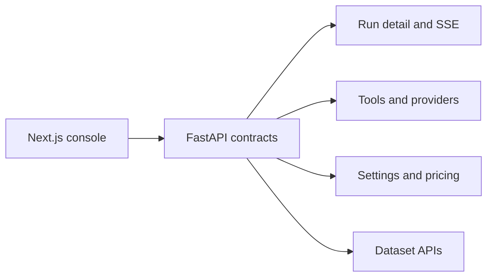

# API Documentation

> **Navigation:** [Docs Home](../README.md) | Section Index: APIs | Previous: [Email Generator](../agents/email-generator.md) | Next: [FastAPI Contracts](./fastapi.md)

Read this section when you want the backend and frontend contracts. It explains the FastAPI route groups first, then the operator console's API usage.

## Reading Order

1. [FastAPI Contracts](./fastapi.md)
2. [Operator Console API](./operator-console.md)
3. [Provider directory contract](../operations/provider-directory.md)

## API Map

Use [Tools](../tools/README.md) after this section when you want the browser/MCP side of the contracts.

