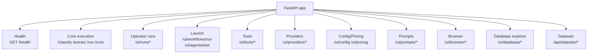
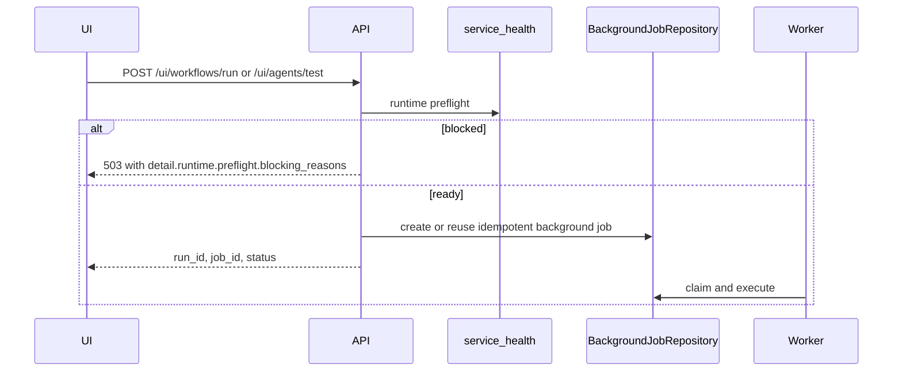
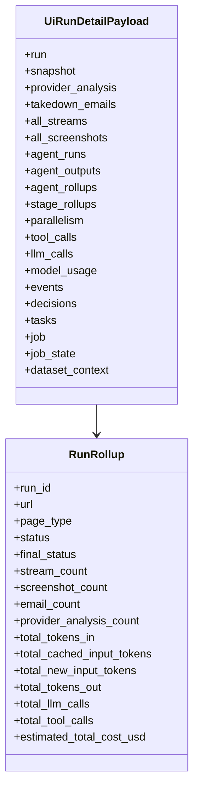
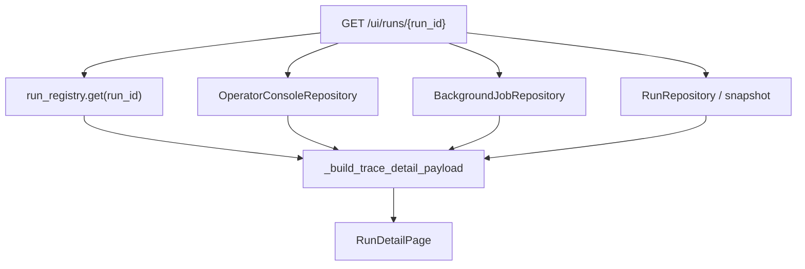
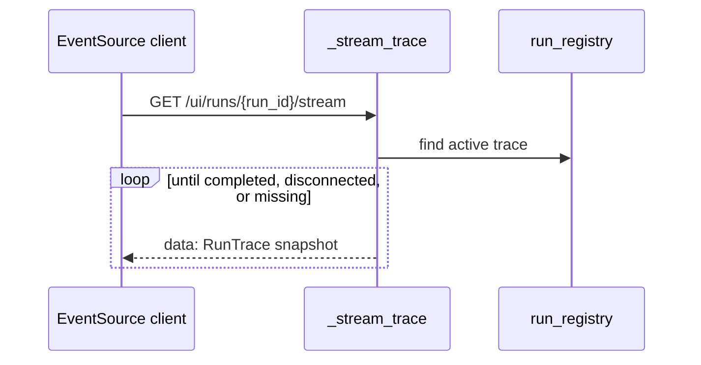
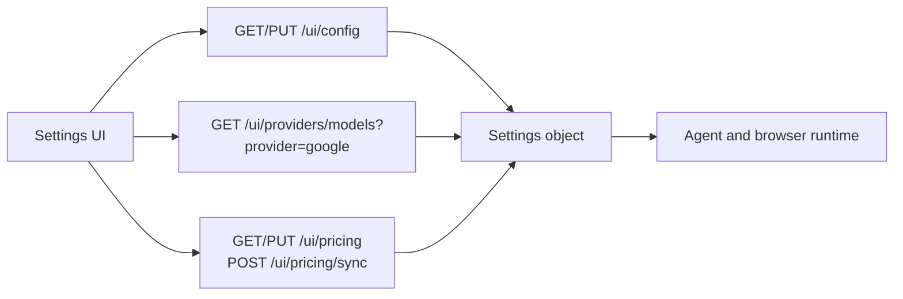

# FastAPI Contracts

> **Navigation:** [Docs Home](../README.md) | [Section Index](./README.md) | Previous: [API Index](./README.md) | Next: [Operator Console API](./operator-console.md)

Backend entry points:

- `src/api/app.py` - runtime, run-detail, tools, providers, pricing, prompts, browser status, database explorer.
- `src/api/datasets.py` - dataset sites, batches, and dataset SSE.
- `src/api/provider_config.py` - model/provider settings payloads and updates.

## Route Group Diagram



## Run Launch Routes

| Method | Route | Purpose |
| --- | --- | --- |
| `POST` | `/ui/workflows/run` | enqueue a full orchestrator workflow |
| `POST` | `/ui/agents/test` | enqueue a single-agent test run |
| `POST` | `/ui/runs/{run_id}/cancel` | cancel an active run |
| `POST` | `/ui/runs/cancel-active` | cancel all active runs |
| `DELETE` | `/ui/runs/{run_id}` | delete a run from the console history |



### Launch Request Shapes

`POST /ui/workflows/run` accepts `WorkflowRunRequest`:

```json
{
  "url": "https://example.test/live",
  "idempotency_key": "optional-stable-key"
}
```

`POST /ui/agents/test` accepts `AgentTestRequest`:

```json
{
  "agent": "classification",
  "url": "https://example.test/live",
  "prompt_override": "",
  "idempotency_key": "optional-stable-key"
}
```

The backend maps `agent` to `_run_selected_agent`. Current valid values are `classification`, `landing`, `hosting`, and `embedded`.

### Launch Response Meaning

The launch response is a job/run handle, not the final result. The run detail page then follows `run_id`. If the database-backed job table is available, the row is persisted in `background_jobs`. If it is not available, the backend can fall back to an in-memory task path, but that is less durable.

## Run Detail Routes

| Method | Route | Purpose |
| --- | --- | --- |
| `GET` | `/ui/runs` | paged run history for the console |
| `GET` | `/ui/runs/{run_id}` | page-level run detail payload |
| `GET` | `/ui/runs/{run_id}/stream` | SSE active trace stream |
| `GET` | `/ui/runs/{run_id}/screenshot` | latest run screenshot or placeholder |
| `GET` | `/ui/runs/{run_id}/decisions` | persisted run decisions |
| `POST` | `/ui/runs/{run_id}/decisions` | create decision |
| `PATCH` | `/ui/runs/{run_id}/decisions/{decision_id}` | update decision |
| `DELETE` | `/ui/runs/{run_id}/decisions/{decision_id}` | delete decision |
| `GET` | `/ui/runs/{run_id}/tasks` | persisted run tasks |
| `POST` | `/ui/runs/{run_id}/tasks` | create task |
| `PATCH` | `/ui/runs/{run_id}/tasks/{task_id}` | update task |
| `DELETE` | `/ui/runs/{run_id}/tasks/{task_id}` | delete task |
| `POST` | `/ui/runs/{run_id}/sync-logs` | sync event-derived decisions/tasks |

## Run Detail Payload



### Payload Assembly

`GET /ui/runs/{run_id}` is the page-level contract used by the frontend. It is intentionally broader than the core `GET /runs/{run_id}` endpoint because the run detail UI needs operational state, not only the final `PipelineResult`.

The backend assembles:

- final or partial run summary;
- active trace events when the run is still in `run_registry`;
- persisted `runtime_events`;
- `agent_runs`, `agent_outputs`, and computed rollups;
- `llm_calls`, `tool_calls`, and `run_model_usage`;
- streams, screenshots, provider analyses, and emails;
- `background_jobs` state;
- dataset context when the run belongs to a dataset batch;
- decisions and tasks used by the run-detail side panels.



## SSE Contract

`GET /ui/runs/{run_id}/stream` sends Server-Sent Events for active traces.



Expected snapshot fields include `run_id`, `root_actor`, `events`, `metrics`, `completed`, `cancel_requested`, and `cancel_reason`.

The SSE stream is a live enhancement. The stable reload contract remains `GET /ui/runs/{run_id}`. The frontend should merge SSE events into local state while active and then rely on a fresh payload after terminal status.

## Tools And Providers

| Method | Route | Purpose |
| --- | --- | --- |
| `GET` | `/ui/tools/list?profile=...` | list MCP tools for a profile |
| `POST` | `/ui/tools/call` | call one MCP tool from the playground |
| `GET` | `/ui/tools/history` | persisted tool playground calls |
| `GET` | `/ui/tools/reliability` | aggregate tool reliability |
| `POST` | `/ui/providers/lookup` | resolve stream URLs to provider/abuse contacts |
| `GET` | `/ui/providers/history` | persisted provider lookup history |
| `GET` | `/ui/providers/models?provider=google` | Gemini model catalog and runtime metadata |

## Settings And Pricing

| Method | Route | Purpose |
| --- | --- | --- |
| `GET` | `/ui/config` | current runtime config, model details, warnings, browser runtime |
| `PUT` | `/ui/config` | partial settings update |
| `GET` | `/ui/pricing` | active model pricing rows |
| `PUT` | `/ui/pricing` | update pricing rows |
| `POST` | `/ui/pricing/sync` | sync provider pricing |
| `GET` | `/ui/settings/estimate-costs` | estimate input/output/cache costs |



The current provider/model configuration is Gemini-oriented. `/ui/providers/models?provider=google` pulls Google model metadata for the settings UI. `/ui/pricing` stores and returns pricing rows, including input, output, cached input, cache write, and context-window fields. `/ui/settings/estimate-costs` uses those rows to estimate cost before or after a run.

The backend still has compatibility fields for older provider names in settings, but `build_llm` only instantiates Gemini through `ChatGoogleGenerativeAI`. If a non-Google provider is configured, the runtime logs a warning and falls back to a Gemini-compatible model selection.

## Dataset API

| Method | Route | Purpose |
| --- | --- | --- |
| `GET` | `/api/datasets/stream` | dataset SSE changes |
| `GET` | `/api/datasets/meta` | dataset metadata |
| `GET` | `/api/datasets/sites` | list sites |
| `POST` | `/api/datasets/sites` | create site |
| `GET` | `/api/datasets/sites/stats` | aggregate site stats |
| `POST` | `/api/datasets/sites/bulk-update` | bulk update sites |
| `GET` | `/api/datasets/sites/{site_id}` | site detail |
| `PUT/PATCH/DELETE` | `/api/datasets/sites/{site_id}` | mutate site |
| `GET` | `/api/datasets/batches` | list batches |
| `GET` | `/api/datasets/batches/{batch_id}` | batch detail |
| `POST` | `/api/datasets/batches` | create batch run |
| `POST` | `/api/datasets/batches/{batch_id}/cancel` | cancel batch |

## Core Execution Routes

These routes exist below the UI API and are still useful for direct backend tests:

- `GET /health`
- `POST /classify`
- `POST /extract`
- `POST /run`
- `GET /runs`
- `GET /runs/{run_id}`
- `GET /runs/{run_id}/emails`
- `GET /runs/{run_id}/agents`
- `GET /runs/{run_id}/llm-calls`
- `GET /runs/{run_id}/tool-calls`
- `GET /runs/{run_id}/prompts`
- `GET /runs/{run_id}/events`
- `GET /memory`
- `GET /observability`
