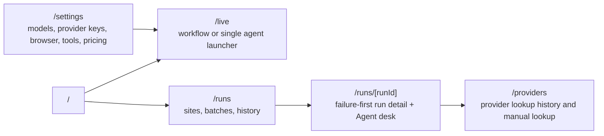
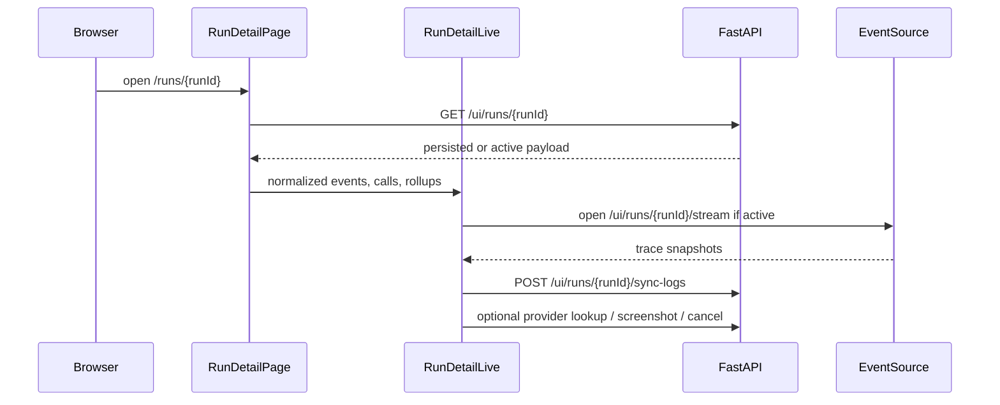
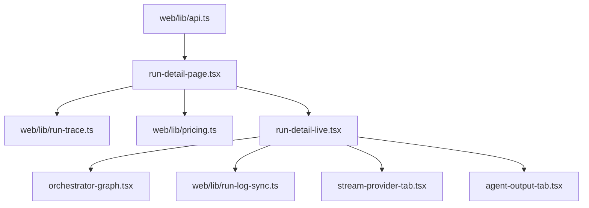

# Operator Console

> **Navigation:** [Docs Home](../README.md) | [Section Index](./README.md) | Previous: [FastAPI Contracts](./fastapi.md) | Next: [Tools Index](../tools/README.md)

The console is the primary user interface for launching runs, inspecting results, checking provider evidence, and configuring the runtime.

## Route Map



## Run Detail UI Sequence



## Agent Desk Surface

The Agent desk is generated by `web/components/orchestrator-graph.js`. It displays:

- run request and runtime status
- latest orchestrator decision and reason
- classification, landing, hosting, and embedded stage cards
- model attempts
- tool counts
- attributed screenshot/frame counts under Summary
- recent milestones per stage

`GET /ui/runs/{run_id}` returns legacy `all_screenshots` plus richer `screenshots[]` rows when normalized storage has attribution. The run detail page uses those rows to label browser frames by actor, invocation, tool, and target URL. The old Decisions tab has been renamed to Traces; it reads runtime events instead of showing the manual decision editor.

## Run Detail Outputs

The run detail Outputs tab is evidence-first. `web/components/agent-output-panel.js` groups persisted stage rollups and exact agent invocations, then shows summary metrics for stages, agent runs, evidence rows, streams, tokens, and cost before raw structured payloads. Landing agents surface hosting URL evidence when present. Hosting and embedded agents surface server/player states and stream counts when their output payloads contain those fields. Raw payload inspection uses `StructuredDataCard`, so nested output remains searchable and copyable without replacing the summary evidence.

## Runs History

`/runs?tab=history` reads paged rows from `GET /ui/runs` with `limit`, `offset`, optional `status`, and optional `query`. The history tab keeps the active search in `run_query` and the 1-based page number in `page`, so filtered history URLs can be reopened directly. The surface includes top-level persisted-run KPIs, visible-row token and cost totals, per-page success/failure/active KPIs, row selection checkboxes, select-all for the current page, and bulk delete. Bulk deletion only submits persisted runs that are safe to delete; active runs are skipped by the same `canDeleteRun` guard used by single-row deletion.

## Main API Dependencies

| Console surface | Backend routes |
| --- | --- |
| Dashboard | `/ui/overview`, `/ui/events/recent`, `/ui/tools/reliability`, `/ui/database/*` |
| Live launcher | `/ui/workflows/run`, `/ui/agents/test`, `/ui/browser/status` |
| Run history | `/ui/runs`, `/api/datasets/*` |
| Run detail | `/ui/runs/{run_id}`, `/ui/runs/{run_id}/stream`, `/ui/runs/{run_id}/sync-logs`, `/ui/runs/{run_id}/screenshot` |
| Provider results | `/ui/providers/lookup`, `/ui/providers/history` |
| Settings | `/ui/config`, `/ui/providers/models`, `/ui/pricing`, `/ui/pricing/sync` |

## Settings And Provider UX

The Settings surface is grouped as **AI Configuration**, **Runtime**, **Preferences**, and
**Security**. The AI Configuration group contains:

- **Models**, where each pipeline agent receives its own provider/model assignment;
- **Provider Keys**, where the operator searches and configures the 110-provider directory.

Provider Keys never renders a stored credential. It receives `api_keys` boolean status values,
provider names, default endpoints, and masked source metadata. New credentials and endpoint
overrides are sent as partial `PUT /ui/config` fields:

```json
{
  "provider_api_keys": { "opencode": "<operator-entered-value>" },
  "provider_base_urls": { "custom-openai": "https://gateway.example/v1" }
}
```

The UI supports search, category/status filters, grouped rows, masked inputs, Clear/Undo, and a
Test action. Test saves draft values before requesting the provider catalog. The Models provider
selector is searchable so the expanded directory does not become an unmanageable native list.

Both dark and light themes use semantic surface/text tokens. Settings must not introduce dark-only
foreground colors or white-alpha borders; accent foregrounds use the readable theme variables in
`web/app/globals.css`.

## Frontend Data Flow


