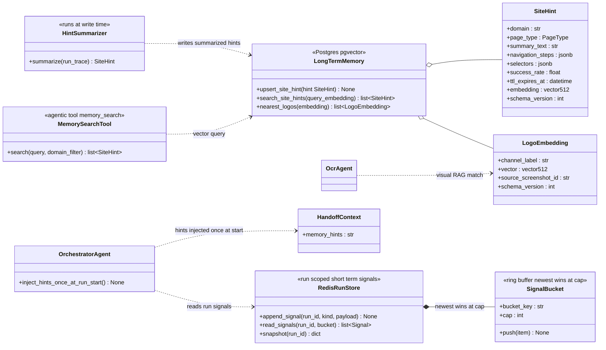
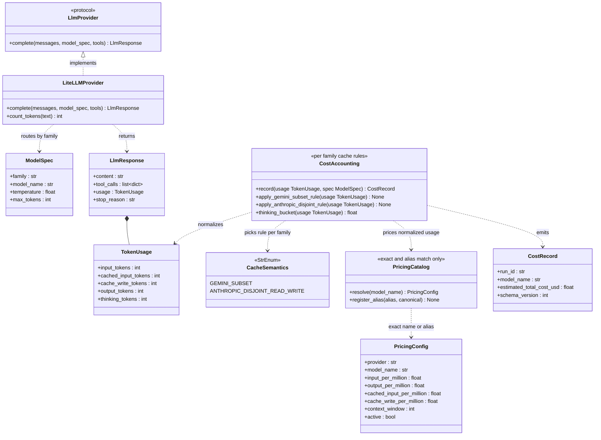
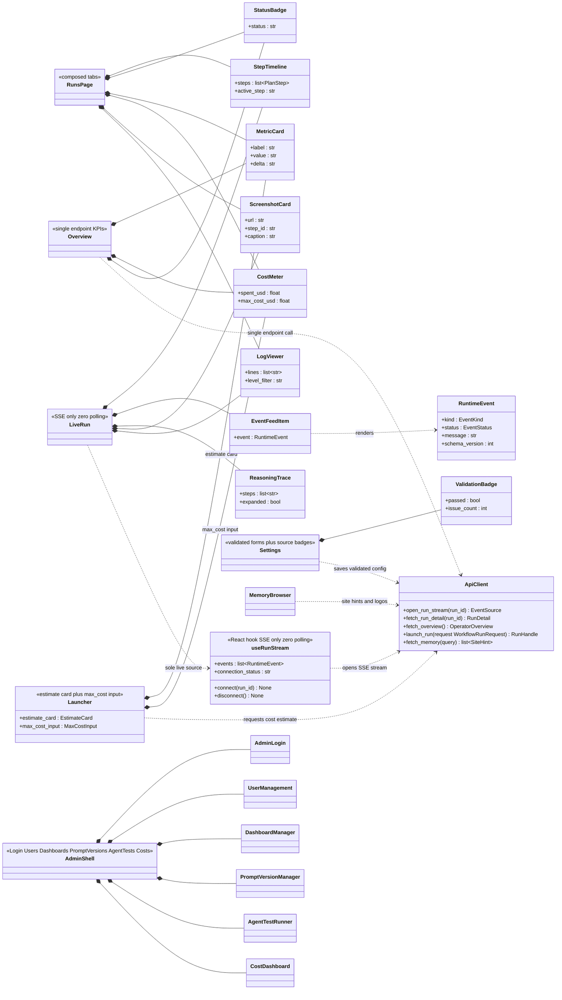

# Target Architecture: open_web_catcher Re-architecture

Status: target design. Plan Task 1 of `.omo/plans/full-audit.md`.

This document is the naming authority for the re-architecture. Every class, enum, hook, and page that later implementation tasks introduce must appear here first. Contracts that already exist in `src/models/schemas.py` and `src/agents/orchestrator.py` are carried over with their real field names, including `PipelineState`, `ClassificationResult`, `MatchInfo`, `ExtractionResult`, `ServerResult`, `ProviderInfo`, `TakedownEmail`, and `HandoffContext`. New contracts defined below: `JudgeVerdict`, `ValidationReport`, `ReplanRequest`, `RunPlan`, `DispatchQueue`, `ChannelDetection`, `RedisRunStore`, `SiteHint`, `LogoEmbedding`, `MemorySearchTool`, `HintSummarizer`, `RuntimeEvent`, `EventKind`, `EventStatus`, `SchemaVersioned`, `LlmProvider`, `LiteLLMProvider`, `ModelSpec`, `TokenUsage`, `CacheSemantics`, `CostAccounting`, `PricingCatalog`, `useRunStream`, and the frontend component and page set.

## 1. Agent Modules

The runtime keeps eight typed agent modules behind one LangGraph spine. The stage chain is fixed:

1. `ClassificationAgent` returns a `ClassificationResult`.
2. The orchestrator derives typed handoff hints (`HandoffContext`) from it plus memory.
3. `LandingPageAgent` discovers candidates as `MatchInfo`; `HostingPageAgent` extracts each candidate into an `ExtractionResult`. `EmbeddedPageAgent` is demoted to a backup extractor and player-context validator; it never owns the primary path.
4. `JudgeAgent` scores evidence with LLM-as-judge into a `JudgeVerdict`.
5. `ValidatorAgent` runs the `validate_evidence` node with bounded replan (max 1 per stage) and reachability probes. Only a passing validation releases `ProviderInfo` and `TakedownEmail` artifacts.
6. `OcrAgent` detects channel names and logos from screenshots and feeds the visual RAG index (`LogoEmbedding`, section 2).

`OrchestratorAgent` owns graph routing, emits a `RunPlan` artifact per run, and pushes events through a streaming `DispatchQueue` consumed by SSE.

```mermaid
classDiagram
    direction TB

    class OrchestratorAgent {
        <<LangGraph spine>>
        +state : PipelineState
        +dispatch_queue : DispatchQueue
        +build_graph() StateGraph
        +emit_run_plan() RunPlan
        +drain_dispatch_queue() None
    }

    class ClassificationAgent {
        <<routing stage>>
        +classify(target_url) ClassificationResult
    }

    class LandingPageAgent {
        <<discovery stage>>
        +discover(handoff HandoffContext) list~MatchInfo~
    }

    class HostingPageAgent {
        <<primary extraction stage>>
        +extract(handoff HandoffContext) ExtractionResult
    }

    class EmbeddedPageAgent {
        <<backup and validator role only>>
        +extract_backup(handoff HandoffContext) ExtractionResult
        +verify_player_context(target_url) bool
    }

    class JudgeAgent {
        <<LLM as judge scoring>>
        +score(extraction ExtractionResult) JudgeVerdict
    }

    class ValidatorAgent {
        <<gate before provider stages>>
        <<bounded replan max 1 per stage>>
        +validate_evidence(verdict JudgeVerdict, extraction ExtractionResult) ValidationReport
        +request_replan(stage str) ReplanRequest
        +probe_reachability(urls) list~ReachabilityProbe~
    }

    class OcrAgent {
        <<channel and logo detection>>
        +detect_from_screenshot(image_url) ChannelDetection
    }

    class PipelineState {
        <<LangGraph TypedDict state>>
        +url : str
        +run_id : str
        +classification : ClassificationResult
        +matches : list~MatchInfo~
        +extraction_results : list~ExtractionResult~
        +pending_hosting_urls : list~str~
        +pending_embedded_urls : list~str~
        +provider_analysis : list~ProviderInfo~
        +takedown_emails : list~TakedownEmail~
        +error : str
    }

    class ClassificationResult {
        +url : str
        +page_type : PageType
        +confidence : Confidence
        +reasoning : str
        +agent_type : AgentType
    }

    class MatchInfo {
        +url : str
        +title : str
        +channel : str
        +channel_candidates : list~str~
        +route : str
        +iframes : list~str~
        +player_urls : list~str~
        +server_hints : list~dict~
        +confidence : int
        +status : str
    }

    class HandoffContext {
        <<typed handoff hints>>
        +root_url : str
        +target_url : str
        +page_type : str
        +candidate_channel : str
        +landing_route : str
        +landing_server_hints : list~dict~
        +navigation_policy : str
        +required_evidence : list~str~
        +memory_hints : str
    }

    class ServerResult {
        +label : str
        +server_up : bool
        +primary_stream : str
        +screenshot_url : str
        +embedded_url : str
        +player_iframe_url : str
        +status : str
        +detected_channel : str
        +ocr_text : str
        +playback_confirmed : bool
    }

    class ExtractionResult {
        +url : str
        +page_type : PageType
        +status : ExtractionStatus
        +servers : list~ServerResult~
        +streams : list~StreamURL~
        +screenshots : list~str~
        +embedded_urls : list~str~
        +primary_channel : str
        +tool_calls_used : int
        +duration_seconds : float
    }

    class JudgeVerdict {
        +evidence_score : float
        +playback_confidence : float
        +channel_match : bool
        +verdict : str
        +reasoning : str
        +required_fixes : list~str~
    }

    class ValidationReport {
        +passed : bool
        +issues : list~str~
        +schema_version : int
    }

    class ReplanRequest {
        +stage : str
        +reason : str
        +attempt : int
    }

    class ReachabilityProbe {
        +url : str
        +reachable : bool
        +latency_ms : float
        +checked_at : datetime
    }

    class ChannelDetection {
        +channel_label : str
        +candidates : list~str~
        +confidence : float
        +method : str
        +source_screenshot_id : str
    }

    class ProviderInfo {
        +stream_url : str
        +ip : str
        +org : str
        +provider : str
        +country : str
        +abuse_email : str
    }

    class TakedownEmail {
        +provider : str
        +abuse_email : str
        +subject : str
        +body : str
        +infringing_url : str
        +stream_evidence : list~StreamEvidence~
        +generated_at : datetime
    }

    class StreamEvidence {
        +stream_url : str
        +protocol : str
        +server_label : str
        +channel_name : str
        +screenshot_urls : list~str~
        +ocr_text : str
    }

    class RunPlan {
        +run_id : str
        +steps : list~str~
        +max_cost_usd : float
        +created_at : datetime
        +schema_version : int
    }

    class DispatchQueue {
        <<streaming dispatch queue>>
        +subscribe(run_id) AsyncIterator~RuntimeEvent~
        +publish(event RuntimeEvent) None
    }

    OrchestratorAgent --> ClassificationAgent : stage 1 routing
    OrchestratorAgent --> LandingPageAgent : stage 2 discovery
    OrchestratorAgent --> HostingPageAgent : stage 3 extraction
    OrchestratorAgent --> EmbeddedPageAgent : backup pass only
    OrchestratorAgent --> JudgeAgent : stage 4 scoring
    OrchestratorAgent --> ValidatorAgent : stage 5 gating
    OrchestratorAgent *-- PipelineState : owns graph state
    OrchestratorAgent ..> RunPlan : emits artifact per run
    OrchestratorAgent *-- DispatchQueue : streams events to SSE

    ClassificationAgent ..> ClassificationResult : returns
    LandingPageAgent ..> MatchInfo : returns candidates
    HostingPageAgent ..> ExtractionResult : returns
    EmbeddedPageAgent ..> ExtractionResult : backup returns
    HostingPageAgent --> OcrAgent : screenshot channel detection
    EmbeddedPageAgent --> OcrAgent : screenshot channel detection
    OcrAgent ..> ChannelDetection : feeds visual RAG

    HandoffContext ..> ClassificationResult : carries hints downstream
    ExtractionResult *-- ServerResult
    ExtractionResult ..> MatchInfo : one per candidate URL

    JudgeAgent ..> ExtractionResult : consumes
    JudgeAgent ..> JudgeVerdict : returns
    ValidatorAgent ..> JudgeVerdict : consumes
    ValidatorAgent ..> ReachabilityProbe : runs probes
    ValidatorAgent ..> ValidationReport : returns
    ValidatorAgent ..> ReplanRequest : at most one per stage

    ValidatorAgent ..> ProviderInfo : releases when passed
    ValidatorAgent ..> TakedownEmail : releases when passed
    TakedownEmail *-- StreamEvidence
    TakedownEmail ..> ProviderInfo : attaches provider record
```

## 2. Memory

Two tiers. Short-term signals live in `RedisRunStore`, scoped by run id, held in ring-buffer buckets with newest-wins-at-cap eviction and a 24h TTL. Long-term knowledge lives in Postgres with pgvector: `SiteHint` rows store per-domain navigation knowledge and `LogoEmbedding` rows store channel logo vectors for visual RAG lookup.

`memory_search` is exposed to agents as an agentic tool backed by vector similarity. A summarizer runs at write time so stored hints stay compact instead of dumping raw transcripts. Hints are injected exactly once at run start into `HandoffContext.memory_hints`; mid-run re-injection is forbidden so prompts stay stable across stages.

## 3. Storage and Event Schema

One repository per aggregate. Writes go through repositories only; nothing else touches sessions. Every persisted JSON blob carries a stamped `schema_version:int` via the `SchemaVersioned` mixin so old rows stay readable across migrations.

The observability spine is an append-only `RuntimeEvent` stream typed by two StrEnums. `EventKind` covers the lifecycle: `pipeline_started`, `agent_started`, `agent_finished`, `llm_response`, `tool_call_started`, `tool_call_finished`, `server_activated`, `stream_extracted`, `hosting_page_discovered`, `player_failed`, `cost_threshold_exceeded`, `plan_step_update`, `cancel_requested`, and more as stages grow. `DispatchQueue` tails this stream for SSE consumers, which keeps persistence and live viewing on one event source.

```mermaid
classDiagram
    direction TB

    class SchemaVersioned {
        <<mixin on all persisted JSON blobs>>
        +schema_version : int
    }

    class BaseRepository {
        <<one repository per aggregate>>
        +add(entity) Entity
        +commit() None
    }

    class RunRepository {
        +save_snapshot(result PipelineResult) None
        +get_run(run_id) PipelineResult
    }

    class EventRepository {
        <<append only>>
        +append(event RuntimeEvent) None
        +tail(run_id, after_id) list~RuntimeEvent~
    }

    class AgentRunRepository {
        +record_agent_output(agent_type, output) None
    }

    class LlmCallRepository {
        +record_call(response LlmResponse) None
    }

    class ToolCallRepository {
        +record_tool_call(name, args_hash, duration) None
    }

    class StreamRepository {
        +save_streams(streams list~StreamURL~) None
    }

    class ScreenshotRepository {
        +save_screenshot(url, step_id) None
    }

    class ProviderAnalysisRepository {
        +save_analysis(info ProviderInfo) None
    }

    class TakedownEmailRepository {
        +save_draft(email TakedownEmail) None
    }

    class PromptVersionRepository {
        +get_active_version(agent str) PromptVersion
        +publish_version(agent str, body str) PromptVersion
    }

    class CostLedgerRepository {
        +record_cost(entry CostRecord) None
    }

    class RuntimeEvent {
        +id : int
        +run_id : str
        +kind : EventKind
        +status : EventStatus
        +message : str
        +details : jsonb
        +schema_version : int
        +created_at : datetime
    }

    class EventKind {
        <<StrEnum>>
        PIPELINE_STARTED
        AGENT_STARTED
        AGENT_FINISHED
        LLM_RESPONSE
        TOOL_CALL_STARTED
        TOOL_CALL_FINISHED
        SERVER_ACTIVATED
        STREAM_EXTRACTED
        HOSTING_PAGE_DISCOVERED
        PLAYER_FAILED
        COST_THRESHOLD_EXCEEDED
        PLAN_STEP_UPDATE
        CANCEL_REQUESTED
    }

    class EventStatus {
        <<StrEnum>>
        INFO
        WARNING
        ERROR
        SUCCESS
        SKIPPED
    }

    BaseRepository <|-- RunRepository
    BaseRepository <|-- EventRepository
    BaseRepository <|-- AgentRunRepository
    BaseRepository <|-- LlmCallRepository
    BaseRepository <|-- ToolCallRepository
    BaseRepository <|-- StreamRepository
    BaseRepository <|-- ScreenshotRepository
    BaseRepository <|-- ProviderAnalysisRepository
    BaseRepository <|-- TakedownEmailRepository
    BaseRepository <|-- PromptVersionRepository
    BaseRepository <|-- CostLedgerRepository

    SchemaVersioned <|.. RuntimeEvent
    RuntimeEvent --> EventKind
    RuntimeEvent --> EventStatus
    EventRepository ..> RuntimeEvent : persists append only
    DispatchQueue ..> EventRepository : tails for SSE
```

## 4. LLM Provider Layer

All model traffic goes through one protocol. `LlmProvider` declares `async complete(messages, model_spec, tools)`; `LiteLLMProvider` implements it so family-specific SDKs stay behind one seam.

`CostAccounting` normalizes usage with per-family cache semantics:

- Gemini: `cached_content_token_count` is subset-style. Cached tokens are counted inside the input total, so cached input cost applies to that slice and the remainder bills at the fresh-input rate.
- Anthropic: cache read and cache write are disjoint buckets. Read tokens sit outside billed input, write tokens bill at the cache-write rate.
- Thinking tokens land in their own bucket regardless of family and price at the output rate unless a catalog entry says otherwise.

`PricingCatalog` resolves prices by exact model name or a registered alias. No fuzzy matching, no prefix guessing. An unknown name is a hard error, not a default price.

## 5. Frontend Module Map

The console is SSE-first. One hook, `useRunStream`, owns the live connection; pages render from its event list. Zero polling anywhere: no interval fetches, no refetch timers on live views. Persisted views read the run detail endpoint once and let SSE carry everything after.

Component library first, then pages composed from them.

## Conformance rules

1. **Naming authority.** This document speaks first. Any new class, enum, protocol, hook, page, or repository that an implementation task needs must be added to the relevant Mermaid block here before its code lands. Code review rejects names that appear in source but not here.
2. **Diagram-update-on-change.** Renaming, retyping, moving, or removing anything shown in these diagrams requires editing the matching block in the same change set. A diff that changes behavior but not the diagram is incomplete.
3. **Field fidelity.** Contract fields mirror `src/models/schemas.py` and `PipelineState` in `src/agents/orchestrator.py` wherever those exist today. New fields are additive; changing an existing field's meaning requires a `schema_version` bump on the affected persisted blob.
4. **Mermaid hygiene.** No parentheses inside class names, generics written with tildes, plain edge labels without special characters. Diagrams must render before merge.
