# Implementation Deep Dive (2026-04-09)

> **See also:** [Overview](./overview.md) · [Agents](./agents.md) · [Data Flow](./data-flow.md) · [Issues, Fixes, and Roadmap](../changelog/2026-04-09-issues-fixes-future-improvements.md) · [Docs Home](../README.md)

---

## Document Purpose

This dossier is a complete technical architecture and implementation record for the major platform work delivered up to 2026-04-09, with a focus on:

- end-to-end multi-agent execution architecture
- orchestrator routing and handoff behavior
- hosting/embedded normalization contracts
- provider analysis and takedown generation flow
- automatic Gemini explicit cache lifecycle (create/reuse/refresh)
- operational debugging lessons and hardening outcomes

This document is intentionally detailed so engineering, QA, and operations can use it as a reference, runbook, and onboarding source.

---

## Scope: What Was Built

### Platform surfaces

- FastAPI backend orchestration and APIs under [src/api/app.py](../../src/api/app.py)
- Agent runtime loop and provider/cache behavior under [src/agents/base.py](../../src/agents/base.py)
- Deterministic orchestrator graph under [src/agents/orchestrator.py](../../src/agents/orchestrator.py)
- Specialized extraction agents under [src/agents/](../../src/agents)
- Browser MCP tool execution under [tools_js/](../../tools_js)
- Operator console and run streaming under [web/](../../web)

### Notable implementation tracks documented here

- Agent/runtime reliability hardening (timeouts, explicit failure events, MCP lifecycle visibility)
- Orchestrator behavior enforcement (landing once, hosting candidates, embedded fallback, contextual handoff)
- Clean extraction evidence contracts (servers, m3u8/mpd/mp4, screenshots, embedded links)
- Gemini explicit cache automation with TTL lifecycle management

---

## 1) End-to-End Runtime Architecture

### 1.1 Component architecture

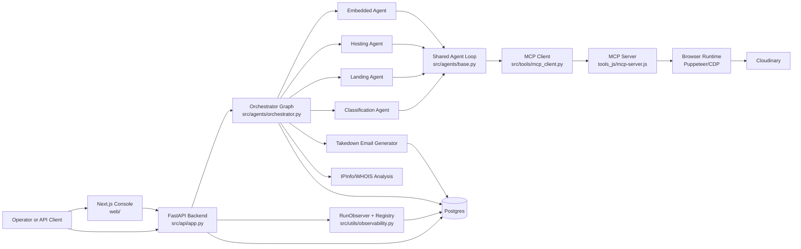

### 1.2 Service topology (Docker)

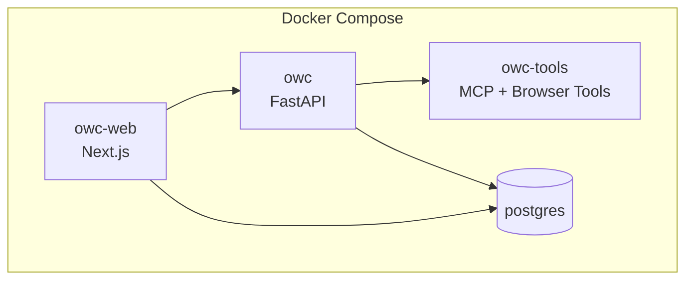

Operational note: runtime code changes are reflected in containers only after rebuild/restart.

---

## 2) Orchestrator Architecture and Routing Model

### 2.1 Deterministic graph design

The orchestrator uses a deterministic LangGraph state machine in [src/agents/orchestrator.py](../../src/agents/orchestrator.py). The graph is not free-form; routes are explicit and testable.

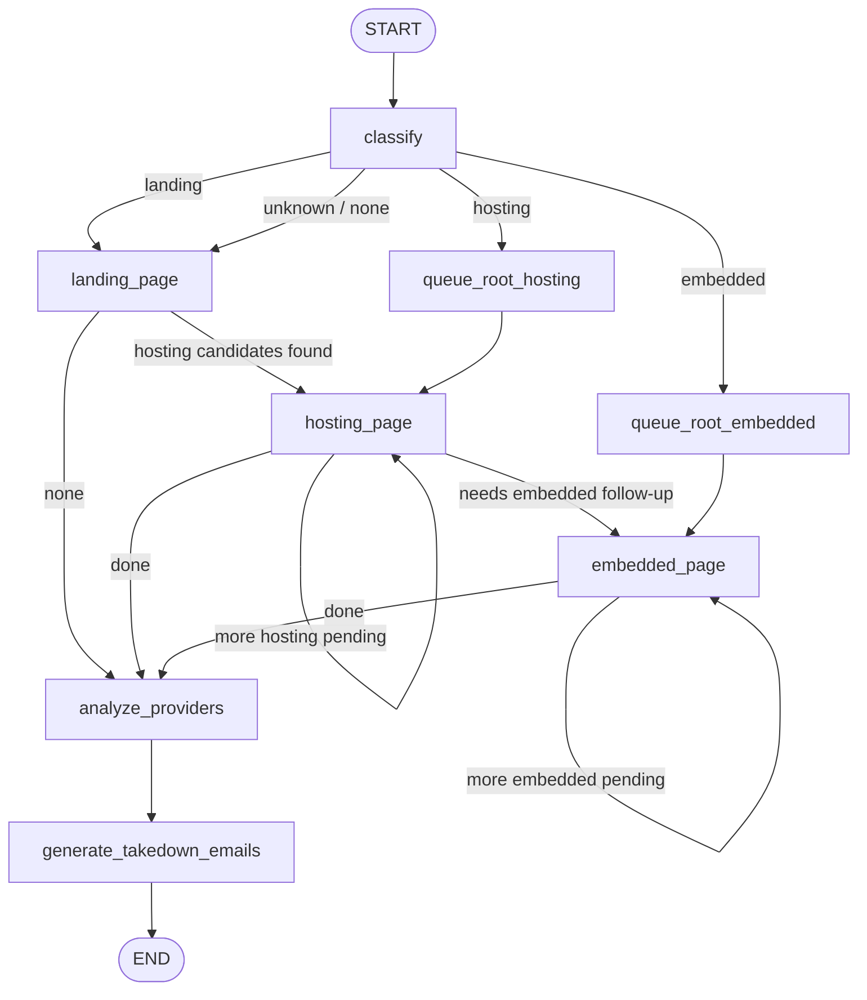

### 2.2 State model

Core orchestrator state includes:

- `url`
- `classification`
- `matches`
- `pending_hosting_urls`
- `pending_embedded_urls`
- `extraction_results`
- `provider_analysis`
- `takedown_emails`
- `error`

### 2.3 Behavior guarantees implemented

- Unknown classification now falls back to landing discovery, not immediate provider analysis.
- Landing executes once per root URL and produces hosting candidates.
- If landing returns zero candidates, root URL is queued once for hosting fallback probing.
- Hosting route prioritizes embedded follow-up when latest hosting result indicates failure/needs-embed.
- Pipeline always converges to provider analysis and takedown generation when extraction queues drain.

---

## 3) Agent-to-Agent Context Handoff Architecture

### 3.1 Handoff objective

Orchestrator creates structured handoff context so each specialist agent receives:

- upstream classification context
- URL-target specific context
- landing match metadata (when available)
- memory hints (soft guidance)
- extraction focus/checklist notes

### 3.2 Handoff builders

Handoff builders in [src/agents/orchestrator.py](../../src/agents/orchestrator.py):

- `_build_landing_handoff`
- `_build_hosting_handoff`
- `_build_embedded_handoff`

### 3.3 Handoff sequence

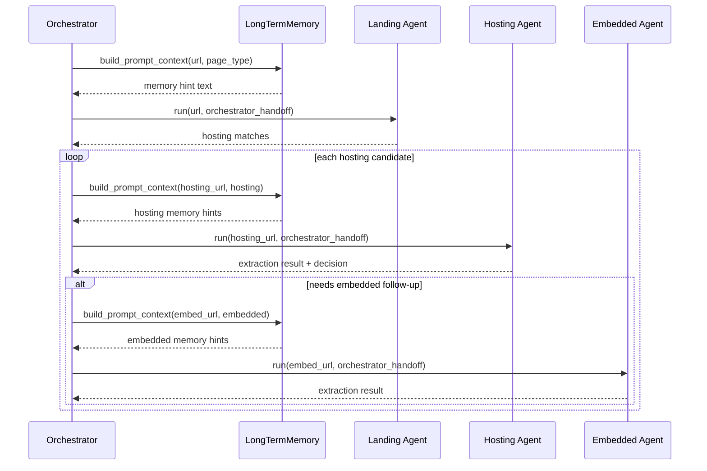

### 3.4 Specialist-agent integration

Each specialist agent now accepts `orchestrator_handoff` and injects it into:

- task brief extras (prompt compilation layer)
- initial message context
- observer event stream (`orchestrator_handoff_received`)

Impacted files:

- [src/agents/landing_page.py](../../src/agents/landing_page.py)
- [src/agents/hosting_page.py](../../src/agents/hosting_page.py)
- [src/agents/embedded_page.py](../../src/agents/embedded_page.py)

---

## 4) Extraction Evidence Contract and Normalization

### 4.1 Why normalization was required

Before hardening, downstream stages could receive incomplete or inconsistent server evidence, often spread between dynamic metadata and partial stream arrays. This made provider analysis and takedown evidence less deterministic.

### 4.2 Normalized evidence model

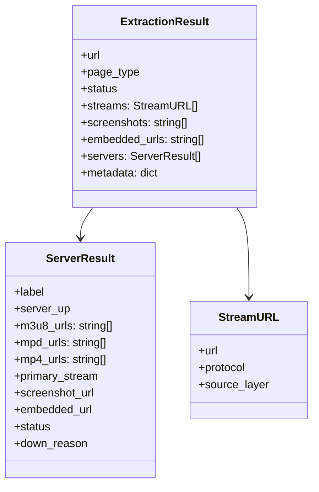

### 4.3 Hosting normalization pipeline

Implemented in [src/agents/hosting_page.py](../../src/agents/hosting_page.py):

- `_normalize_hosting_output`
- `_normalize_servers`
- `_normalize_server_entry`
- `_normalize_streaming_urls`
- `_build_server_results`
- `_collect_streams`
- `_safe_int` for robust numeric conversion

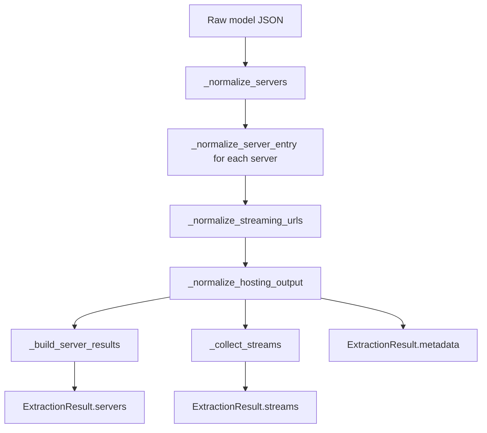

### 4.4 Embedded normalization pipeline

Implemented in [src/agents/embedded_page.py](../../src/agents/embedded_page.py):

- `_normalize_embedded_output`
- `_normalize_servers`
- `_normalize_server_entry`
- `_normalize_all_stream_urls`
- `_build_server_results`
- `_collect_streams`
- `_safe_int` for robust numeric conversion

### 4.5 Aggregation behavior in orchestrator

Final stream and screenshot aggregation in [src/agents/orchestrator.py](../../src/agents/orchestrator.py) now prioritizes normalized fields:

- `ExtractionResult.streams`
- `ExtractionResult.servers[*].{m3u8_urls, mpd_urls, mp4_urls, screenshot_url}`

with backward-compatible fallback to legacy `metadata["servers"]` entries.

---

## 5) Provider Analysis and Takedown Architecture

### 5.1 Provider stage

After extraction queues complete, orchestrator runs provider analysis against collected stream URLs.

- Node: `analyze_providers_node`
- Tool: `IPInfoTool`
- Output: normalized `ProviderInfo[]`

### 5.2 Email stage

Takedown drafting consumes:

- infringing root URL
- provider analysis data
- extraction evidence (including clean server/screenshot artifacts)

- Node: `generate_takedown_emails_node`
- Tool: `EmailTool`
- Output: `TakedownEmail[]`

### 5.3 Sequence diagram

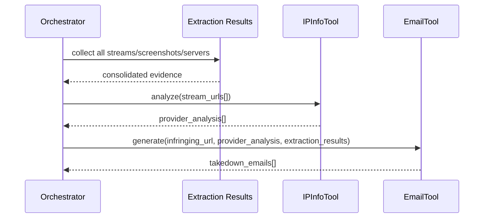

---

## 6) Gemini Explicit Cache Lifecycle Architecture

### 6.1 Problem statement

Manual `gemini_cached_content` passing is fragile:

- cache resource names must exist and be valid
- manual wiring is repetitive and error-prone
- stale cache references can silently degrade behavior

### 6.2 Delivered architecture

Automatic cache lifecycle manager in [src/agents/base.py](../../src/agents/base.py) now:

- derives stable cache seed from static prompt prefix
- computes deterministic cache registry key by model + provider cache key/hash
- creates cachedContents resource when needed
- reuses active resource before refresh window
- refreshes resource near expiry
- injects `cached_content` into provider invoke kwargs automatically
- falls back safely if create/refresh fails

### 6.3 Cache lifecycle state machine

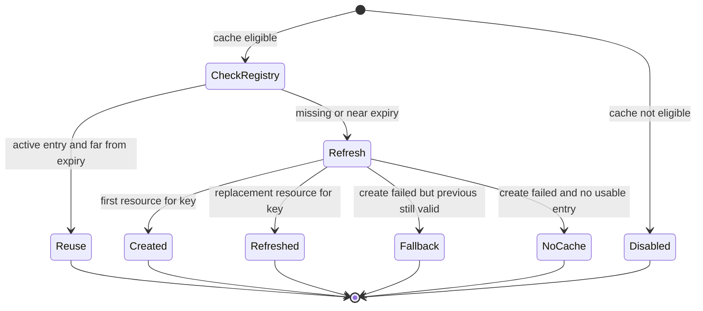

### 6.4 Refresh policy

Let:

- `t_expire` = cache expiry time
- `t_now` = current time
- `lead` = refresh lead seconds

Refresh condition:

`refresh if (t_expire - t_now) <= lead`

### 6.5 Cache lifecycle sequence

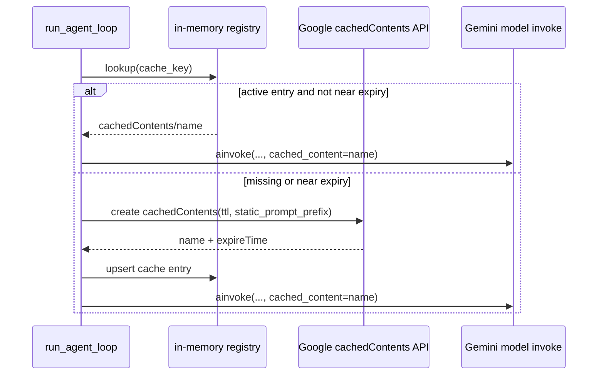

### 6.6 Settings controls

Config fields (in [src/utils/config.py](../../src/utils/config.py)):

- `gemini_explicit_cache_enabled`
- `gemini_explicit_cache_ttl_seconds`
- `gemini_explicit_cache_refresh_lead_seconds`

Exposed in UI config API (in [src/api/app.py](../../src/api/app.py)):

- GET `/ui/config`
- PUT `/ui/config`

---

## 7) Observability Architecture

### 7.1 Event flow

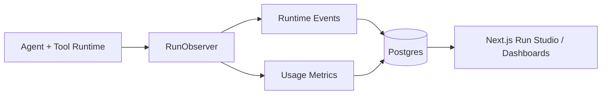

### 7.2 Why this matters

The event model is what made postmortems practical. It enabled precise diagnosis of:

- timeouts
- quota failures
- MCP session establishment failures
- tool schema incompatibilities
- cache behavior visibility at turn level

### 7.3 Key events added/hardened over recent iterations

- `llm_turn_started`
- `llm_timeout`
- `llm_rate_limited`
- `llm_error`
- `tool_session_connecting`
- `tool_session_ready`
- `tool_session_failed`
- `tool_session_closed`
- `orchestrator_handoff_received`

---

## 8) Configuration Architecture

### 8.1 Configuration layers

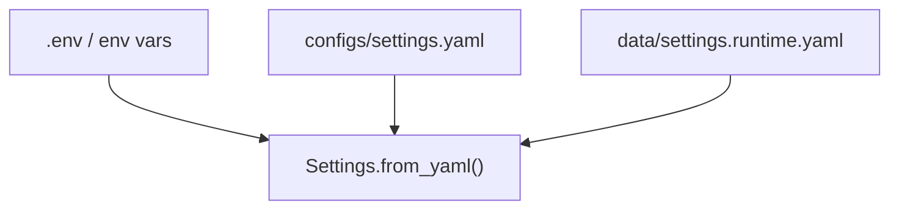

Runtime writes prioritize `configs/settings.yaml`; if read-only, fallback persists to `data/settings.runtime.yaml`.

### 8.2 Runtime knobs relevant to this deep dive

- `llm_provider`
- `agent_model`
- `orchestrator_model`
- `provider_cache_enabled`
- `prompt_cache_enabled`
- `prompt_cache_mode`
- `prompt_cache_min_chars`
- `gemini_explicit_cache_enabled`
- `gemini_explicit_cache_ttl_seconds`
- `gemini_explicit_cache_refresh_lead_seconds`
- `tool_result_cache_enabled`

---

## 9) Verification Architecture and Coverage

### 9.1 Targeted tests for orchestrator and extraction contract hardening

- [tests/test_orchestrator.py](../../tests/test_orchestrator.py)
- [tests/test_agents.py](../../tests/test_agents.py)

Coverage includes:

- unknown classification fallback to landing
- hosting-to-embedded prioritization on failed hosting result
- preserving hosting path when latest hosting extraction is successful
- contextual handoff propagation to hosting agent
- hosting normalization of server artifacts
- embedded normalization of server artifacts

### 9.2 Targeted tests for Gemini cache lifecycle

- [tests/test_agent_loop.py](../../tests/test_agent_loop.py)
- [tests/test_api.py](../../tests/test_api.py)

Coverage includes:

- managed cached content injection into Google provider invoke
- create and registry reuse behavior
- refresh behavior near expiry boundary
- API-level config payload/update handling for new cache controls

---

## 10) Architecture Decisions and Tradeoffs

### 10.1 Deterministic orchestrator vs free-form planner

Decision: deterministic graph.

Benefits:

- predictable pathing
- easier tests
- stable production behavior
- explicit fallback semantics

Tradeoff:

- less flexibility than free-form planning

### 10.2 In-memory Gemini cache registry

Decision: local process in-memory registry for managed cachedContents.

Benefits:

- simple rollout
- no DB migration required
- low latency key lookup

Tradeoff:

- registry is process-local (not shared across multiple workers)
- entries reset on process restart

### 10.3 Backward-compatible metadata fallback

Decision: aggregator still reads legacy metadata server payloads.

Benefits:

- safe transition
- lower regression risk

Tradeoff:

- temporary complexity until full legacy retirement

---

## 11) End-to-End Reference Sequence (Happy Path)

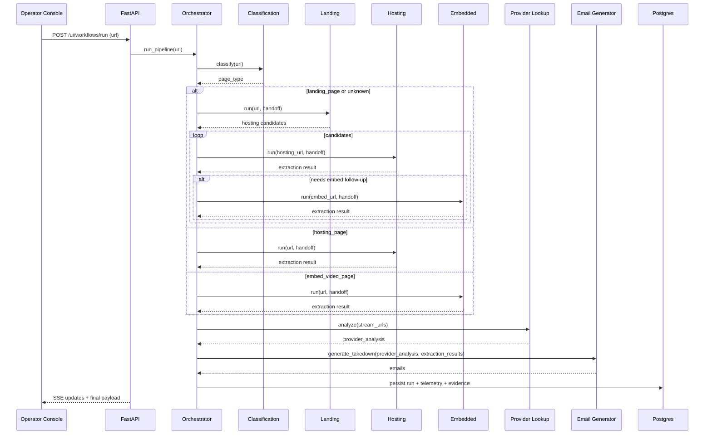

---

## 12) Operational Notes for Future Engineers

### 12.1 Rebuild requirement

If running in Docker, source edits are not reflected until images are rebuilt/restarted.

### 12.2 Quota and external dependency behavior

Provider quota exhaustion surfaces as explicit runtime events and may appear as healthy internal logic with external denial.

### 12.3 Schema and tool compatibility risks

Tool schema shape changes can break model-tool conversion in provider adapters; integration tests and minimal schemas are required before rollout.

### 12.4 Practical debugging order

1. verify run graph route events
2. verify MCP session lifecycle (`ready`)
3. inspect LLM turn events and quota signals
4. inspect extraction normalization payloads
5. inspect provider/email stages

---

## 13) What This Architecture Enables Now

- Stronger determinism and reproducibility in extraction workflows
- Better handoff quality between orchestrator and specialist agents
- Better quality of legal/provider evidence in final outputs
- Lower operational overhead for Gemini cache usage
- Better postmortem quality due to richer runtime telemetry

---

## 14) Cross-Reference Map

- Orchestrator graph and routing: [src/agents/orchestrator.py](../../src/agents/orchestrator.py)
- Shared loop and cache lifecycle: [src/agents/base.py](../../src/agents/base.py)
- Landing handoff integration: [src/agents/landing_page.py](../../src/agents/landing_page.py)
- Hosting normalization/handoff: [src/agents/hosting_page.py](../../src/agents/hosting_page.py)
- Embedded normalization/handoff: [src/agents/embedded_page.py](../../src/agents/embedded_page.py)
- Runtime settings: [src/utils/config.py](../../src/utils/config.py)
- Config API exposure: [src/api/app.py](../../src/api/app.py)
- Agent loop tests: [tests/test_agent_loop.py](../../tests/test_agent_loop.py)
- Orchestrator tests: [tests/test_orchestrator.py](../../tests/test_orchestrator.py)
- Agent normalization tests: [tests/test_agents.py](../../tests/test_agents.py)

---

## 15) Related Documents

- [Issues, Fixes, and Future Improvements (2026-04-09)](../changelog/2026-04-09-issues-fixes-future-improvements.md)
- [Agent Debugging and Fixes (2026-04-08)](../changelog/2026-04-08-agent-debugging-and-fixes.md)
- [Known Cleanup Notes](../changelog/issues.md)

---

End of deep dive.
