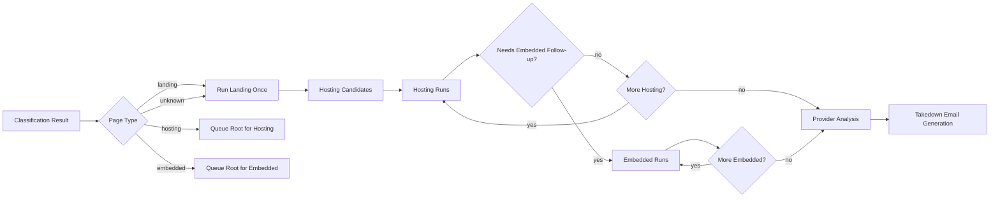
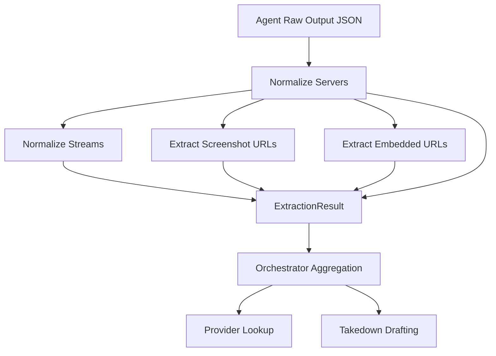
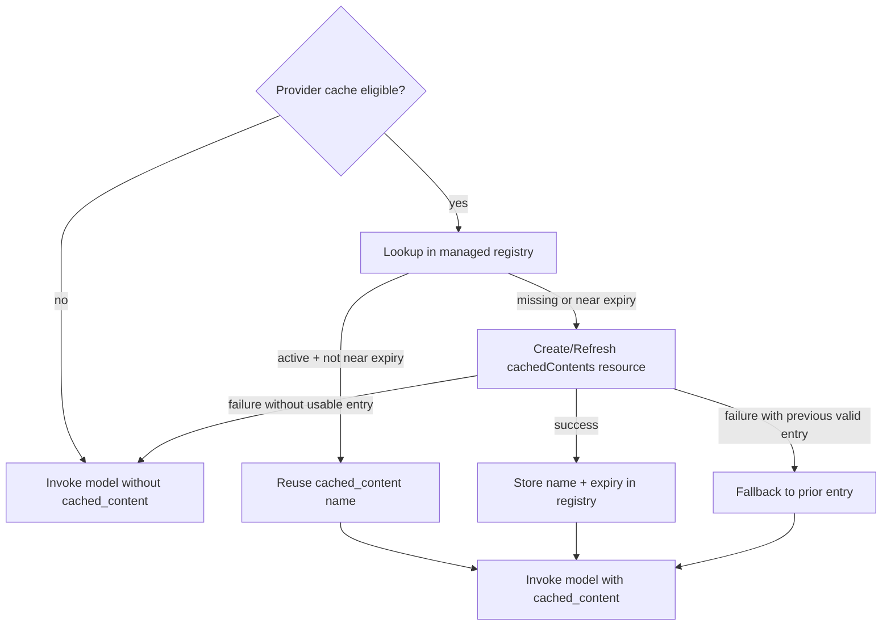

# 2026-04-09 Issues, Fixes, and Future Improvements

> **See also:** [Implementation Deep Dive](../architecture/implementation-deep-dive-2026-04-09.md) · [Agent Debugging and Fixes (2026-04-08)](./2026-04-08-agent-debugging-and-fixes.md) · [Docs Home](../README.md)

---

## Executive Summary

This report captures the major problems encountered across recent implementation tracks, how each issue was diagnosed, what was changed, how fixes were validated, and where we should improve next.

Primary outcomes delivered:

- deterministic orchestrator behavior aligned with intended investigation flow
- stronger agent handoff context and memory-informed guidance
- normalized extraction artifacts (servers/streams/screenshots/embedded URLs)
- automated Gemini explicit cache lifecycle with TTL refresh
- improved test coverage for routing, normalization, and cache lifecycle

---

## 1) Timeline of Work

### Phase A: Runtime reliability and visibility hardening

Focus:

- prevent silent hangs
- improve run-stage observability
- fix MCP transport handling and schema compatibility

Key outputs:

- timeout boundaries around tools and LLM calls
- explicit lifecycle events for model and tool sessions
- MCP message handling fixes
- schema compatibility adjustments

Reference: [2026-04-08-agent-debugging-and-fixes.md](./2026-04-08-agent-debugging-and-fixes.md)

### Phase B: Orchestrator behavior enforcement and extraction contract cleanup

Focus:

- enforce landing -> hosting -> embedded follow-up behavior
- ensure orchestrator can provide rich context to specialists
- make downstream evidence deterministic and clean

Key outputs:

- route hardening
- handoff builder architecture
- hosting/embedded normalization pipelines

### Phase C: Gemini cache lifecycle automation

Focus:

- remove manual `cached_content` dependency
- create/reuse/refresh cache resources automatically
- expose controls in runtime settings/API

Key outputs:

- managed explicit cache lifecycle in shared loop
- new configuration knobs and API exposure
- dedicated tests for cache reuse/refresh behavior

---

## 2) Issue Register (Symptoms -> Root Cause -> Fix)

| ID | Symptom | Root Cause | Fix Implemented | Validation |
|---|---|---|---|---|
| I-01 | Unknown classification route skipped discovery and could end too early | `unknown` path did not re-enter landing discovery | Updated classification route fallback to landing path | Added route test in `tests/test_orchestrator.py` |
| I-02 | Hosting flow delayed embedded follow-up when hosting had pending URLs | Route priority did not prefer embedded when latest hosting run required follow-up | Updated post-hosting router to prioritize embedded when latest hosting extraction requires it | Added route tests for failed/successful hosting precedence |
| I-03 | Specialist agents lacked explicit orchestrator context | No structured cross-agent handoff channel | Added orchestrator handoff builders and per-agent `orchestrator_handoff` input wiring | Added test asserting handoff propagation to hosting node |
| I-04 | Evidence quality inconsistent for downstream provider/email stages | Mixed ad-hoc payload fields and legacy metadata-only server artifacts | Added normalization pipelines for hosting and embedded outputs; populated strongly typed fields | Added normalization tests in `tests/test_agents.py` |
| I-05 | `activation_attempts` values could be malformed and break normalization | direct int casting without safe fallback | Added safe integer parsing helper in hosting and embedded normalizers | Targeted tests still passing after hardening |
| I-06 | Manual Gemini `cached_content` wiring was operationally brittle | cache resource names had to be passed manually and kept fresh by caller | Added automatic create/reuse/refresh lifecycle in shared loop | Added managed cache tests in `tests/test_agent_loop.py` |
| I-07 | Gemini cache controls were not centrally manageable | missing runtime settings/API fields for explicit cache policy | Added settings and `/ui/config` exposure for enable/TTL/refresh lead | API and loop tests passed |
| I-08 | Runtime confusion when edits appeared not to apply in Docker | container images use copied code at build time, not live bind mount for backend/web code paths | operational practice: rebuild/restart containers after code edits | Documented and repeatedly verified during debugging |
| I-09 | Earlier run sessions appeared stuck with limited diagnostics | insufficient event granularity for LLM/tool/session lifecycle | enriched observability event model for model/tool session lifecycle and failures | validated via run stream/debug passes |
| I-10 | MCP session bootstrap failures in earlier cycle | transport message handling mismatch in tools service | fixed MCP message handling path in Node server | validated by API and MCP tests |

---

## 3) Root-Cause Narratives

### 3.1 Routing correctness vs extraction efficiency

The original route behavior allowed technically valid but operationally weak outcomes:

- unknown classifications did not attempt enough recovery
- embedded-follow-up urgency could be delayed by remaining hosting queue entries

These are subtle because the pipeline still "runs" but with reduced recall and poor evidence coverage.

Fix strategy:

- codify routing intent directly in deterministic route functions
- add focused tests for edge-case route ordering

### 3.2 Data contract drift in extraction payloads

Problem pattern:

- agents returned useful information, but fields were spread and inconsistent
- downstream nodes had to infer structure from mixed metadata forms

Fix strategy:

- normalize server records explicitly
- dedupe stream URLs and classify by protocol
- populate extraction contract fields (`servers`, `streams`, `screenshots`, `embedded_urls`) deterministically
- keep legacy fallback for backward compatibility

### 3.3 Cache lifecycle ownership ambiguity

Manual `cached_content` introduces ownership ambiguity:

- who creates it
- who refreshes it
- who ensures it has not expired

Fix strategy:

- centralize ownership in `run_agent_loop`
- derive deterministic keys
- manage lifecycle in one place
- keep fallback to no-cache mode if remote cache API fails

---

## 4) Detailed Fix Ledger by File

### 4.1 Orchestrator and routing

Primary file:

- [src/agents/orchestrator.py](../../src/agents/orchestrator.py)

Notable additions/changes:

- memory-aware handoff builders for landing/hosting/embedded
- helper to detect embedded follow-up requirement from hosting extraction
- unknown classification fallback to landing
- hosting route prioritization for embedded follow-up on latest failed/partial host result
- improved stream/screenshot aggregation with normalized server-first strategy

### 4.2 Specialist agent integration

Primary files:

- [src/agents/landing_page.py](../../src/agents/landing_page.py)
- [src/agents/hosting_page.py](../../src/agents/hosting_page.py)
- [src/agents/embedded_page.py](../../src/agents/embedded_page.py)

Notable additions/changes:

- `orchestrator_handoff` parameter support
- handoff injection into prompt layers and initial message context
- hosting/embedded normalization helpers and clean `ExtractionResult` population

### 4.3 Shared loop and cache lifecycle

Primary file:

- [src/agents/base.py](../../src/agents/base.py)

Notable additions/changes:

- managed Gemini explicit cache lifecycle helpers
- deterministic keying and seed extraction
- TTL and refresh-lead policy
- resource create/reuse/refresh behavior
- observer details for cache source tracking in run events

### 4.4 Settings and API exposure

Primary files:

- [src/utils/config.py](../../src/utils/config.py)
- [src/api/app.py](../../src/api/app.py)

Notable additions/changes:

- new runtime controls:
  - `gemini_explicit_cache_enabled`
  - `gemini_explicit_cache_ttl_seconds`
  - `gemini_explicit_cache_refresh_lead_seconds`
- surfaced through `GET /ui/config` and `PUT /ui/config`

---

## 5) Architecture Diagrams for Fix Paths

### 5.1 Routing correction map

### 5.2 Evidence normalization correction map

### 5.3 Gemini cache lifecycle correction map

---

## 6) Validation and Regression Control

### 6.1 Test suites used

- orchestrator and agent behavior: `tests/test_orchestrator.py`, `tests/test_agents.py`
- loop/cache/API behavior: `tests/test_agent_loop.py`, `tests/test_api.py`

### 6.2 Validation outcomes

- targeted orchestrator/agent tests: passing
- targeted loop/API tests for cache lifecycle and config: passing

### 6.3 Regression strategy

- add tests for every route edge introduced
- add tests for contract shaping when introducing new extraction fields
- ensure cache lifecycle logic has deterministic unit coverage for create/reuse/refresh

---

## 7) Operational Runbook: When Something Breaks

### 7.1 If route behavior looks wrong

1. inspect orchestrator events and latest extraction statuses
2. verify `pending_hosting_urls` and `pending_embedded_urls` transitions
3. verify route helper behavior with targeted tests

### 7.2 If provider/email output is missing evidence

1. inspect `ExtractionResult.servers` in hosting/embedded outputs
2. verify stream/screenshot aggregation stage in orchestrator
3. verify normalization helper outputs in tests

### 7.3 If Gemini cache behavior is not as expected

1. verify provider cache eligibility metadata
2. verify cache controls in `/ui/config`
3. inspect lifecycle source markers in run events (`gemini_cached_content_source`)
4. verify create/refresh conditions around TTL and refresh lead

### 7.4 If local edits do not show in runtime

1. rebuild/restart docker services
2. confirm active container image has updated source

---

## 8) Future Improvements

### 8.1 Short-term (next sprint)

- persist managed Gemini cache registry in shared storage to support multi-worker deployments
- add metrics dashboard cards for cache lifecycle outcomes (`created`, `refreshed`, `registry_hit`, `create_failed`)
- add explicit regression tests for concurrent cache refresh races
- add richer fallback extraction behavior when both hosting and embedded fail with partial artifacts

### 8.2 Medium-term

- move cache lifecycle manager to dedicated module/service with clear contract and unit boundaries
- add DB-backed orchestrator queue snapshots for deeper replay/debug capabilities
- add route simulation tests (table-driven) for all known branching combinations
- expand provider analysis to include confidence scoring and evidence completeness grading

### 8.3 Long-term

- distributed lock for cache refresh in multi-instance deployments
- adaptive routing policy driven by per-domain historical performance
- full artifact lineage graph from tool call -> server artifact -> provider row -> drafted email
- policy-as-code for legal/takedown templates by region/provider type

---

## 9) Risks That Still Exist

| Risk | Impact | Mitigation |
|---|---|---|
| Provider quota throttling/outage | run failures despite healthy code | keep explicit quota events and retry guidance |
| Process-local cache registry | inconsistent cache reuse across replicas | move registry to shared persistence |
| Legacy metadata fallback complexity | hidden contract divergence over time | retire legacy fallback after migration window |
| Browser-side anti-bot drift | extraction variability by domain | maintain tool hardening and browser fingerprint updates |
| UI/operator misconfiguration of cache TTL | unnecessary refresh churn or stale usage | sensible defaults + bounds + config validation |

---

## 10) Practical Improvement Backlog (Actionable)

1. Add a dedicated `src/agents/gemini_cache.py` module with interface-based provider clients and deterministic test fakes.
2. Add cache lifecycle analytics table (`cache_events`) and surface in operator console.
3. Add one-click run export bundle (trace + artifacts + provider + email) for incident review.
4. Add stricter schema validation for agent output payloads before normalization.
5. Add end-to-end scenario tests for:
   - unknown classification -> landing fallback
   - host partial success + embed continuation
   - cache refresh boundary behavior with concurrent run starts

---

## 11) Final Takeaways

- deterministic routing and explicit contracts reduced ambiguity significantly
- handoff context and memory hints increased specialist-agent alignment
- clean evidence contracts improved downstream provider/email quality
- automatic cache lifecycle removed repetitive/manual integration burden
- telemetry improvements made incidents diagnosable and fixes verifiable

---

End of report.