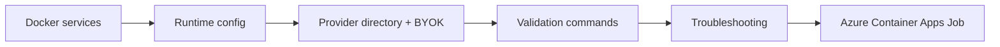

# Operations Documentation

> **Navigation:** [Docs Home](../README.md) | Section Index: Operations | Previous: [MCP Browser Tools](../tools/mcp-browser-tools.md) | Next: [Docker And Ports](./docker.md)

Read this section when you need to run, configure, validate, troubleshoot, or deploy the system. It starts with the local Docker stack and ends with the Azure Container Apps Job plus Service Bus deployment shape.

## Reading Order

1. [Docker And Ports](./docker.md)
2. [Configuration](./configuration.md)
3. [Provider Directory](./provider-directory.md)
4. [Validation](./validation.md)
5. [Troubleshooting](./troubleshooting.md)
6. [Azure Container Apps Job With Service Bus](./azure-container-app-job-service-bus.md)

## Operations Map

Use [Archive](../archive/README.md) only when you need historical notes.

