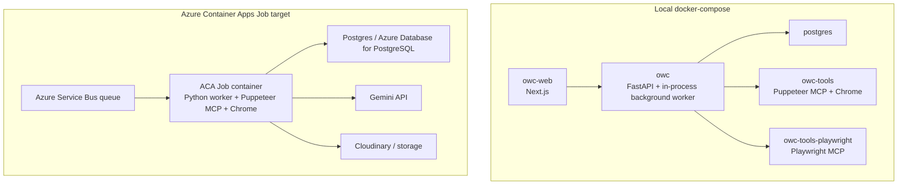
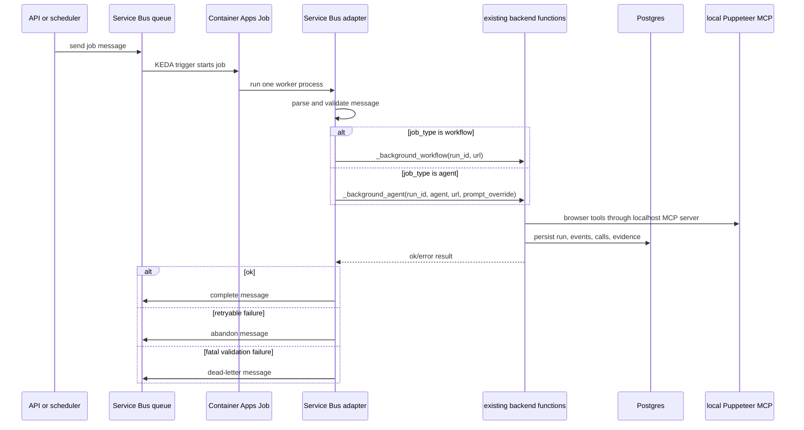
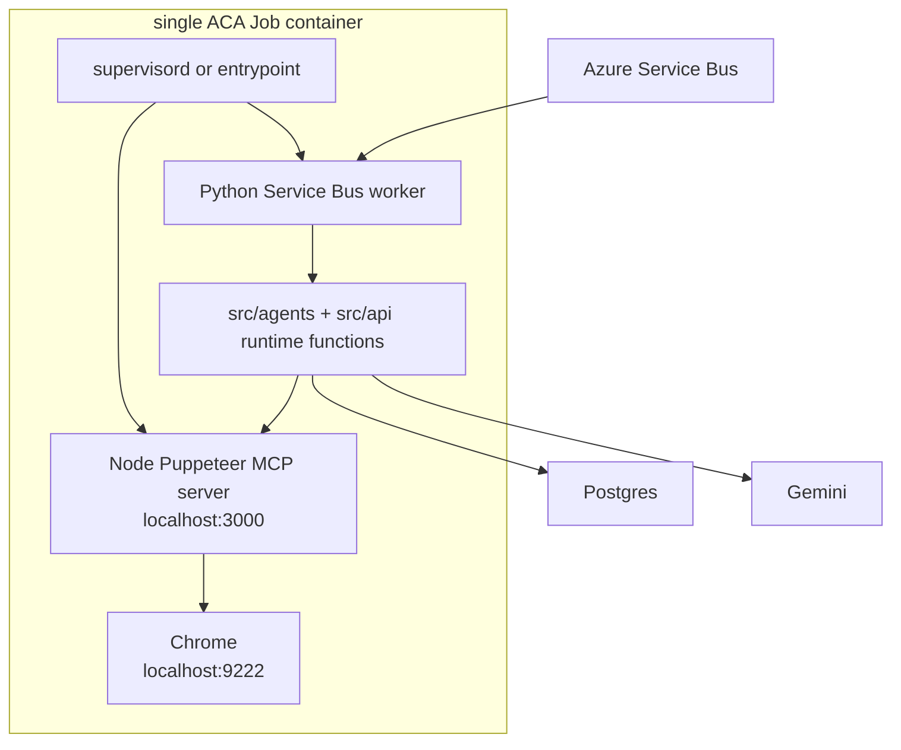

# Azure Container Apps Job With Service Bus

> **Navigation:** [Docs Home](../README.md) | [Section Index](./README.md) | Previous: [Troubleshooting](./troubleshooting.md) | Next: [Archive](../archive/README.md)

This page describes how to deploy the backend execution path as an Azure Container Apps Job triggered by Azure Service Bus.

Important current-state note: this repository currently implements durable background jobs with the `background_jobs` Postgres table and an in-process FastAPI worker loop. It does not currently contain an Azure Service Bus consumer module or an `azure-servicebus` dependency. A Service Bus deployment should therefore add a thin worker adapter that maps a queue message onto the existing workflow or selected-agent execution functions.

## Goal

The cloud shape is:

- the operator or another service sends a job message to Azure Service Bus;
- Azure Container Apps Job starts a container when a message is available;
- the container runs the specific workflow or agent requested by the message;
- Puppeteer MCP and Chrome run inside the same container for this job shape;
- the backend code persists the same run records to Postgres;
- the dashboard can read the result through the normal API.

This is different from local Docker Compose, where the API, web console, Puppeteer MCP, Playwright MCP, and Postgres are separate services.

## Current Local Shape Versus ACA Job Shape



## Queue Message Contract

Use one message format for both full workflows and specific agent runs. The fields map directly to current backend concepts:

```json
{
  "run_id": "optional-client-provided-id",
  "job_type": "workflow",
  "agent": "",
  "url": "https://example.test/live",
  "prompt_override": "",
  "idempotency_key": "optional-stable-key",
  "max_attempts": 1
}
```

For a specific agent:

```json
{
  "run_id": "optional-client-provided-id",
  "job_type": "agent",
  "agent": "hosting",
  "url": "https://example.test/watch/123",
  "prompt_override": "",
  "idempotency_key": "hosting-example-123",
  "max_attempts": 1
}
```

Supported `agent` values should mirror `_run_selected_agent`: `classification`, `landing`, `hosting`, and `embedded`.

## Worker Adapter Required

The adapter should not reimplement agent logic. It should receive one Service Bus message, validate `job_type`, `agent`, and `url`, create or reuse a `run_id`, and call the same backend execution path the API uses.

- workflow: `_background_workflow(run_id, url)`;
- selected agent: `_background_agent(run_id, agent, url, prompt_override)`.

Complete the Service Bus message only after persistence succeeds. Dead-letter validation failures and abandon retryable failures according to the retry policy.



## One-Container Dockerfile Strategy

The local repo separates `Dockerfile` and `Dockerfile.tools`. For an ACA Job that runs Puppeteer in the same container as the backend worker, build a combined image:

- start from `python:3.11-slim-bookworm` or a Debian base with Python and Node;
- install Python dependencies from `pyproject.toml`;
- install Node dependencies from `tools/puppeteer/package*.json`;
- install Chrome and browser libraries the same way `Dockerfile.tools` does;
- copy `src/`, `tools/puppeteer/`, `tools/shared/`, `configs/`, `alembic/`, and `scripts/`;
- run Supervisor with two processes: Puppeteer MCP server on `127.0.0.1:3000` and the Service Bus worker process.

The critical runtime environment is:

| Variable | Value for one-container job | Reason |
| --- | --- | --- |
| `MCP_SERVER_URL` | `http://127.0.0.1:3000` | backend tools call the colocated Puppeteer MCP server |
| `MCP_SERVER_URL_PUPPETEER` | `http://127.0.0.1:3000` | explicit Puppeteer profile endpoint |
| `BROWSER_WS_ENDPOINT` | `ws://127.0.0.1:9222` | Chrome debug endpoint inside the same container |
| `DATABASE_URL` | Azure/Postgres connection string | persists normal run records |
| `GOOGLE_API_KEY` | secret reference | Gemini calls |
| `CLOUDINARY_*` | secret references when screenshots are enabled | screenshot artifact storage |
| `SERVICE_BUS_CONNECTION_STRING` | secret reference or managed identity replacement | queue receive |
| `OWC_AGENT_JOB_MODE` | `service_bus` | makes entrypoint run worker instead of FastAPI |

## Combined Container Process Diagram



## Deployment Steps

1. Build and push a combined worker image to Azure Container Registry.
2. Create Azure Service Bus namespace and queue.
3. Create Azure Database for PostgreSQL or point to the existing database.
4. Create Container Apps managed environment.
5. Create an ACA Job with a Service Bus scale rule.
6. Configure secrets for database, Gemini, Cloudinary, and Service Bus.
7. Set `replicaTimeout` high enough for browser work.
8. Set concurrency carefully. Browser work is heavy; start with one message per replica.
9. Run a classification-only message first, then hosting, then full workflow.

## Example ACA Job Shape

The exact CLI changes by Azure CLI version, but the deployment should express these concepts:

```powershell
az containerapp job create `
  --name owc-agent-job `
  --resource-group <resource-group> `
  --environment <container-apps-environment> `
  --trigger-type Event `
  --replica-timeout 3600 `
  --replica-retry-limit 1 `
  --parallelism 1 `
  --replica-completion-count 1 `
  --image <acr>.azurecr.io/owc-agent-job:<tag> `
  --secrets `
      database-url="<postgres-url>" `
      google-api-key="<gemini-key>" `
      service-bus-connection-string="<service-bus-connection-string>" `
  --env-vars `
      DATABASE_URL=secretref:database-url `
      GOOGLE_API_KEY=secretref:google-api-key `
      SERVICE_BUS_CONNECTION_STRING=secretref:service-bus-connection-string `
      MCP_SERVER_URL=http://127.0.0.1:3000 `
      MCP_SERVER_URL_PUPPETEER=http://127.0.0.1:3000 `
      BROWSER_WS_ENDPOINT=ws://127.0.0.1:9222 `
      OWC_AGENT_JOB_MODE=service_bus
```

Add the Service Bus event scale rule with queue name and message count threshold according to the Azure CLI extension version in use.

## Operational Warnings

- Do not run many browser replicas before measuring memory. Puppeteer plus Chrome can need gigabytes under hostile pages.
- The current Gemini explicit cache registry is process-local. It does not become shared across ACA Job replicas unless you add shared cache persistence.
- Postgres is the durable source of dashboard state. A Service Bus worker must write the same run tables as the local backend.
- One-container Puppeteer is good for ACA Jobs because each job gets an isolated browser runtime. It is less efficient for the always-on local console, where a sidecar can be reused.
- Playwright is not included in this one-container guide unless you also copy `tools/playwright` and expose another local MCP process.
