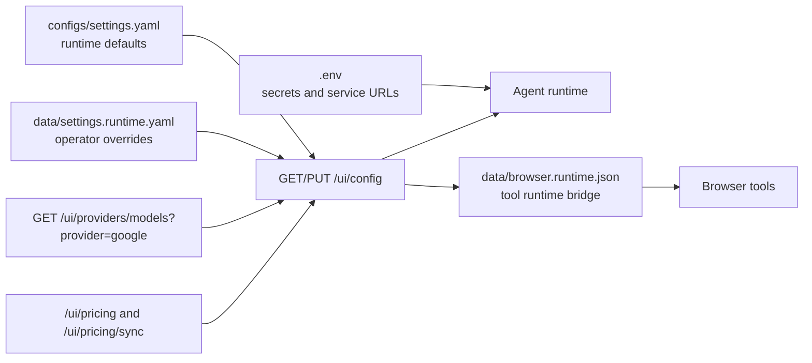

# Configuration

> **Navigation:** [Docs Home](../README.md) | [Section Index](./README.md) | Previous: [Docker And Ports](./docker.md) | Next: [Validation](./validation.md)

Configuration is layered. Secrets belong in `.env`; non-secret defaults live in `configs/settings.yaml`; runtime changes can also be written through `/ui/config` and related runtime files in `data/`.

## Config Flow

## Important Config Areas

| Area | Current behavior |
| --- | --- |
| Provider | Gemini / Google GenAI oriented runtime |
| Models | model assignments exposed in settings and backend config payload |
| Thinking | gated by model compatibility in backend runtime profile |
| Cache | prompt/static cache, provider cache eligibility, tool-result cache |
| Browser | Puppeteer/Playwright runtime bridge, streaming-safe policy, proxy/fingerprint/tool controls |
| Pricing | input, output, cached input, and cache write costs tracked separately |

