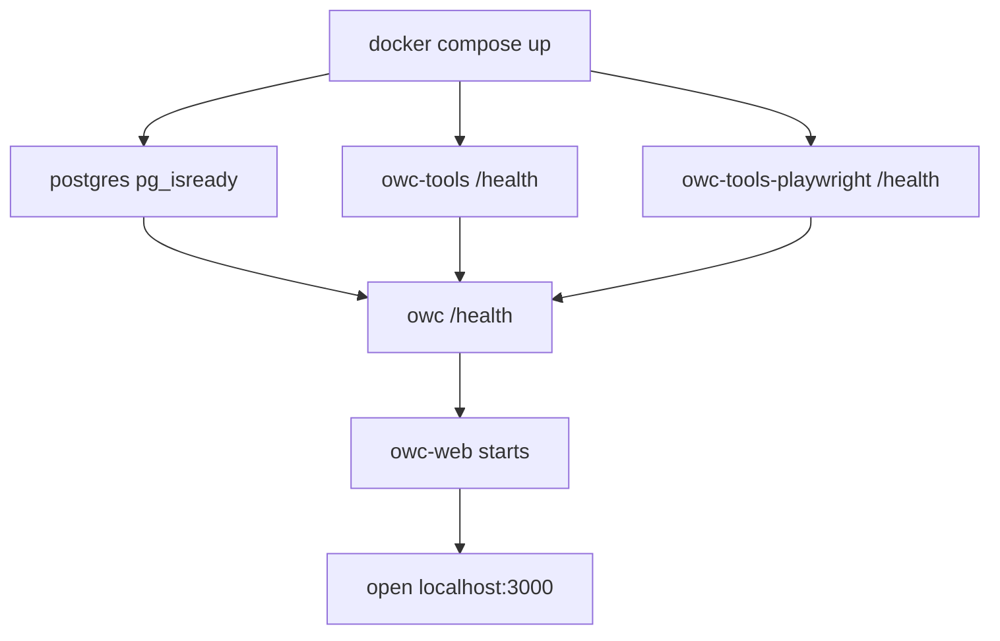

# Docker And Ports

> **Navigation:** [Docs Home](../README.md) | [Section Index](./README.md) | Previous: [Operations Index](./README.md) | Next: [Configuration](./configuration.md)

Use this page for operational orientation. The physical topology is also diagrammed in [Deployment](../system/deployment.md).

## Services

| Service | Role | Host access |
| --- | --- | --- |
| `owc-web` | Next.js console | `http://localhost:3000` |
| `owc` | FastAPI backend | `http://localhost:8000` |
| `postgres` | database | internal |
| `owc-tools` | Puppeteer MCP + Chrome | `http://localhost:3001`, debug `9222` |
| `owc-tools-playwright` | Playwright MCP + browser | `http://localhost:3002`, debug `9223` |

## Health Check Flow



## Useful Commands

```powershell
docker compose ps
docker compose logs --tail=120 owc
docker compose logs --tail=120 owc-web
docker compose logs --tail=120 owc-tools
docker compose logs --tail=120 owc-tools-playwright
curl.exe http://localhost:8000/health
curl.exe http://localhost:8000/ui/browser/status
```

## Rebuild Notes

If backend code changes, rebuild and restart `owc`. If frontend code changes, rebuild and restart `owc-web`. If browser tools change, rebuild the corresponding `owc-tools` or `owc-tools-playwright` image.

