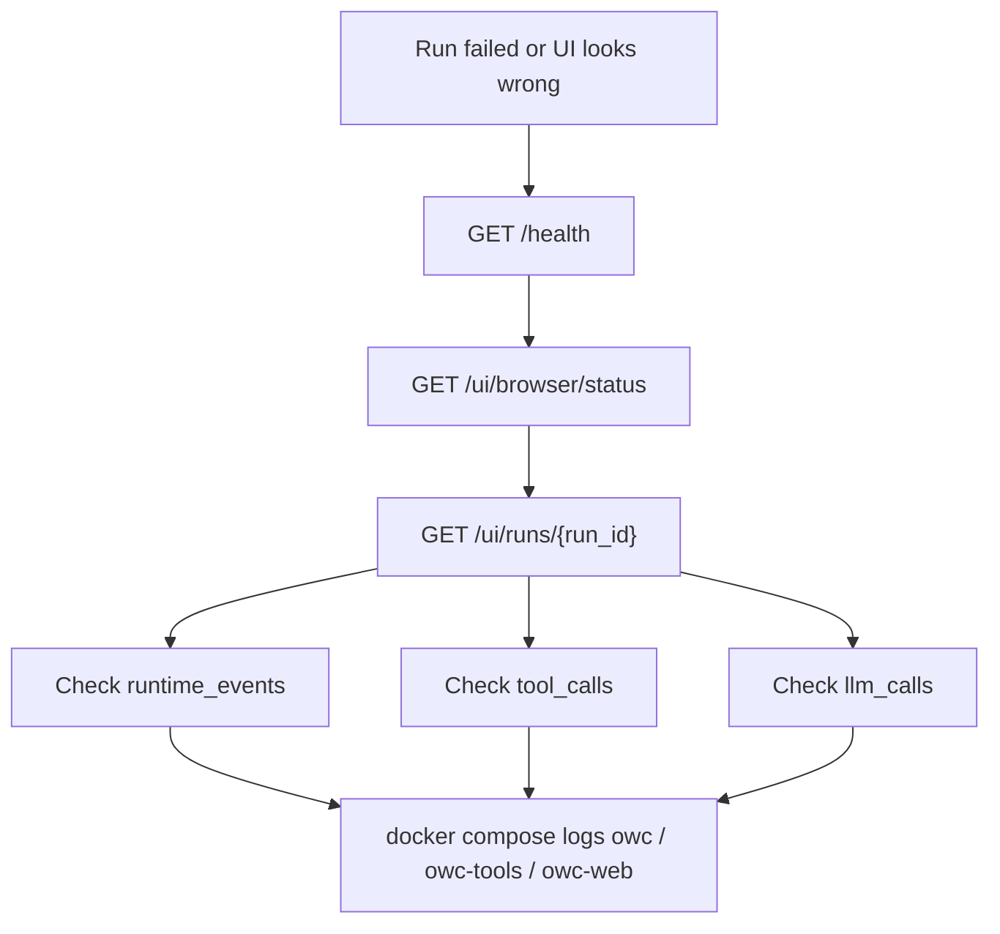
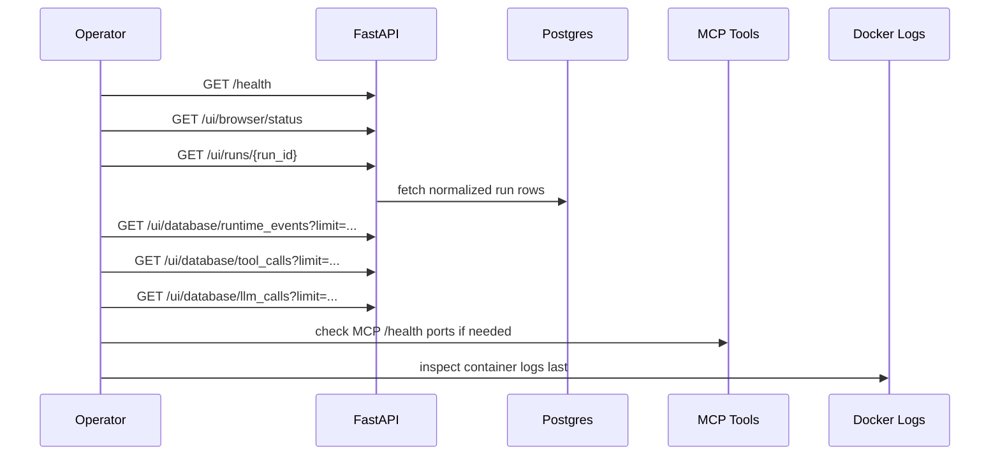

# Troubleshooting

> **Navigation:** [Docs Home](../README.md) | [Section Index](./README.md) | Previous: [Validation](./validation.md) | Next: [Azure Container Apps Job](./azure-container-app-job-service-bus.md)

## Runtime Triage

## Common Cases

| Symptom | First check |
| --- | --- |
| Launch blocked | `/ui/browser/status` and structured `blocking_reasons` |
| Run page blank | browser console/CORS plus `GET /ui/runs/{run_id}` |
| Agent stopped early | runtime events for `agent_stop_requested`, `llm_error`, `llm_timeout`, repeated tool/no-progress |
| No provider rows | verify `all_streams` and stream-like URLs |
| No emails | verify `provider_analysis` and `extraction_results` have stream evidence |
| Model setting ignored | `/ui/config` `model_selection_details` and `model_config_warnings` |
| Browser tools look stale | rebuild/restart `owc-tools` or `owc-tools-playwright` |

## Failure Diagnosis Sequence

