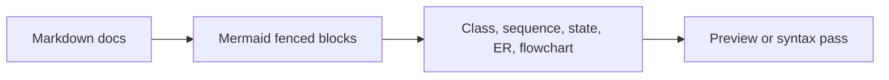

# Validation

> **Navigation:** [Docs Home](../README.md) | [Section Index](./README.md) | Previous: [Configuration](./configuration.md) | Next: [Troubleshooting](./troubleshooting.md)

Use targeted validation for documentation changes. This repo often has local environment noise, so prefer direct route and static checks for docs and API claims.

## Live API Checks

```powershell
curl.exe http://localhost:8000/health
curl.exe http://localhost:8000/openapi.json
curl.exe http://localhost:8000/ui/runs/db970f27-aadc-4a77-a976-781903658d56
curl.exe "http://localhost:8000/ui/database/takedown_emails?limit=3&offset=0"
```

## Documentation Checks

```powershell
rg -n "legacy workflow|retired surface|obsolete provider|stale runtime" docs\README.md docs\system docs\workflow docs\agents docs\api docs\tools docs\operations
rg -n "^```mermaid" docs\README.md docs\system docs\workflow docs\agents docs\api docs\tools docs\operations docs\archive\README.md
rg -n "\]\(\./|\]\(\.\./" docs\README.md docs\system docs\workflow docs\agents docs\api docs\tools docs\operations docs\archive\README.md
```

Historical files under `docs/archive/legacy` are intentionally excluded from stale-claim checks because they preserve old notes.

If `mmdc` is installed, run a renderer-level Mermaid check on changed diagrams. If it is not installed, at minimum check fence balance, link integrity, and preview diagrams in the Markdown renderer.

## Mermaid Coverage



## Acceptance Criteria

- Active docs describe the current LangGraph/LangChain, Gemini, Postgres, Docker, and MCP runtime.
- Stale historical implementation notes are linked from archive only.
- The provided run ID is documented as a failed/inaccessible run, not a success path.
- Email examples are clearly separated from the failed run when they come from other persisted rows.
- Every new diagram is editable Mermaid.
