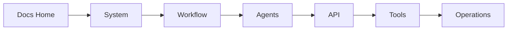

# System Documentation

> **Navigation:** [Docs Home](../README.md) | Section Index: System | Previous: [Docs Home](../README.md) | Next: [System Architecture](./architecture.md)

Read this section when you want the general system shape first, then the deeper implementation details. It starts with the overall architecture, then explains LangChain/LangGraph, classes/functions, deployment, persistence, caching, and observability.

## Reading Order

1. [System Architecture](./architecture.md)
2. [LangChain And LangGraph Runtime](./langchain-langgraph.md)
3. [Runtime Classes And Function Map](./runtime-classes-functions.md)
4. [Deployment](./deployment.md)
5. [Data Model And Persistence](./data-model.md)
6. [Caching And Observability](./caching-observability.md)

## Where This Section Fits

Use [Workflow Lifecycle](../workflow/run-lifecycle.md) after this section to see how these components behave during a real run.

