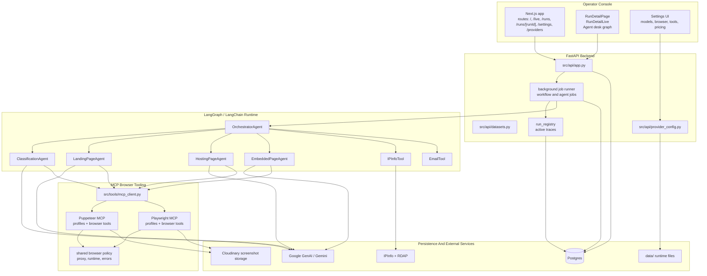
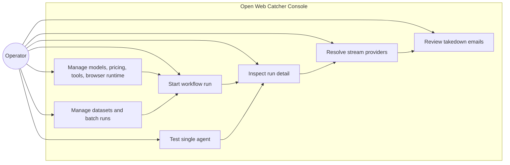
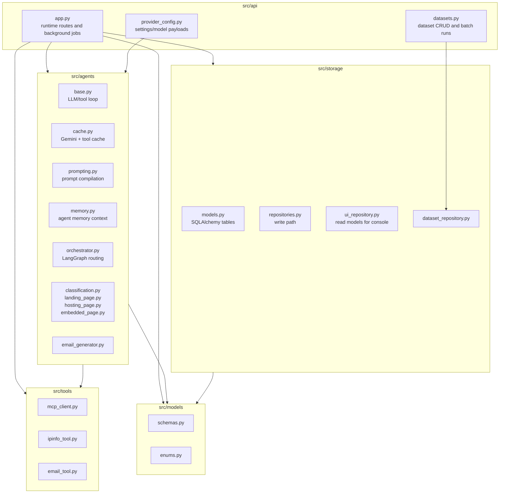
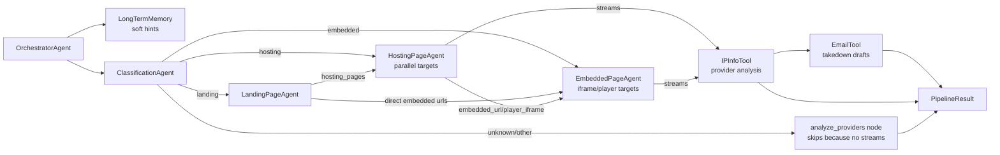
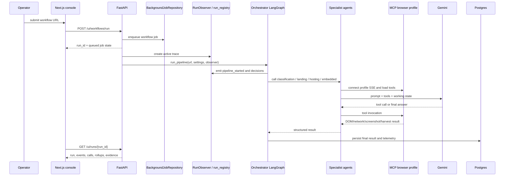

# System Architecture

> **Navigation:** [Docs Home](../README.md) | [Section Index](./README.md) | Previous: [System Index](./README.md) | Next: [LangChain And LangGraph](./langchain-langgraph.md)

Open Web Catcher is an agentic evidence-collection system for streaming sites. The operator starts workflow or single-agent runs from the Next.js console. The FastAPI backend schedules background jobs, creates a runtime trace, executes LangGraph/LangChain agents, calls profile-scoped MCP browser tools, persists normalized records in Postgres, and exposes run-detail payloads back to the UI.

## Component Diagram

## Use Case Diagram

## Backend Module Map

## Agent Interconnection

## Architecture Decisions

The system is split this way because browser automation, LLM reasoning, persistence, and dashboard rendering have different failure modes.

The Next.js console does not connect to Postgres directly. It calls FastAPI endpoints through `web/lib/api.js`; FastAPI owns the database access through repository classes. This keeps the UI thin and makes run payload assembly testable from `GET /ui/runs/{run_id}`.

The browser runtime is separated into MCP tool services locally because Chrome and Playwright/Puppeteer dependencies are heavier and less predictable than the API process. In Docker Compose, this lets the backend restart independently from browser tooling and keeps tool health checks separate. For Azure Container Apps Jobs, a single-container variant can still be useful because each job is isolated and short-lived; that deployment is documented in [Azure Container Apps Job With Service Bus](../operations/azure-container-app-job-service-bus.md).

The orchestrator owns routing because routing is operationally important. If a page is unknown or inaccessible, provider analysis and email generation are skipped because there are no stream URLs to resolve. If a hosting page returns an embedded iframe, the embedded agent receives a handoff. If streams exist, provider analysis and email generation become meaningful downstream stages.

The database stores both product evidence and observability. Product evidence is stream URLs, screenshots, providers, and emails. Observability is events, model calls, tool calls, prompt compilations, and model usage. The dashboard needs both: a final answer without the failure path is not enough for debugging agent runs.

## Runtime Sequence

## Current Architecture Rules

- The orchestrator owns routing. Prompt text is important, but the deterministic graph and handoff builders decide which agent runs next.
- Memory is soft guidance. The orchestrator still calls classification to re-check the current page.
- Browser tools are profile-scoped. Agents only see tools registered for their MCP profile.
- The run-detail page is backend-connected. `GET /ui/runs/{run_id}` is the page-level payload, and SSE is used only for active/live updates.
- Provider and email stages run only when stream URLs exist.
- Runtime settings flow through `/ui/config`, backend settings resolution, and browser runtime bridge files before they affect agents and tools.
