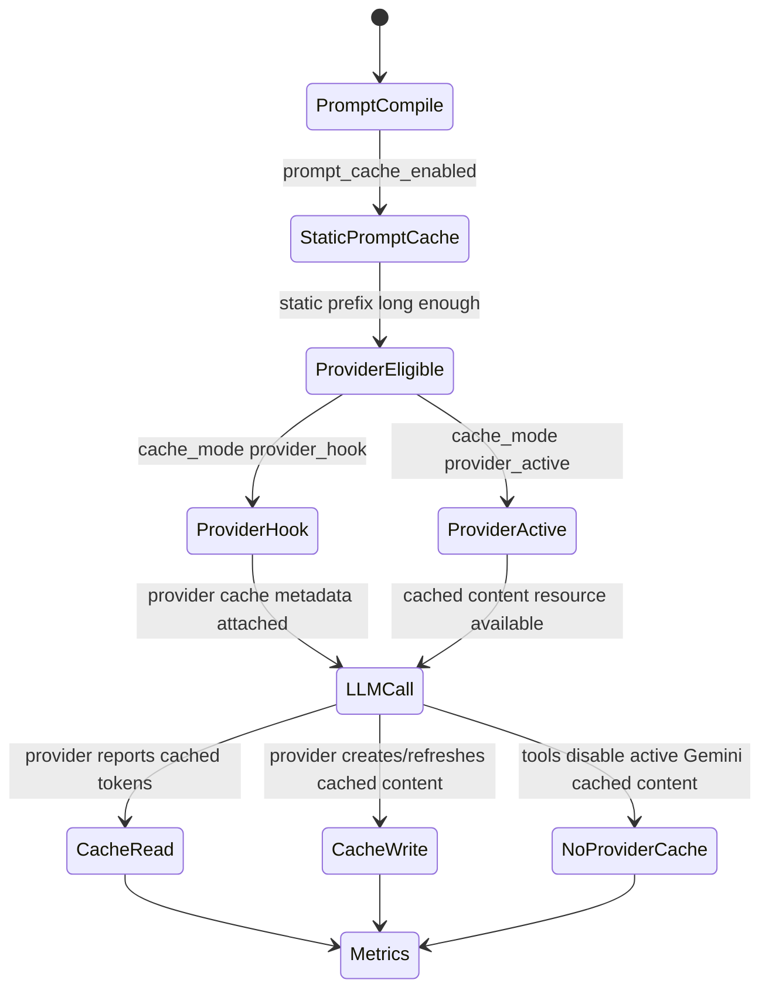
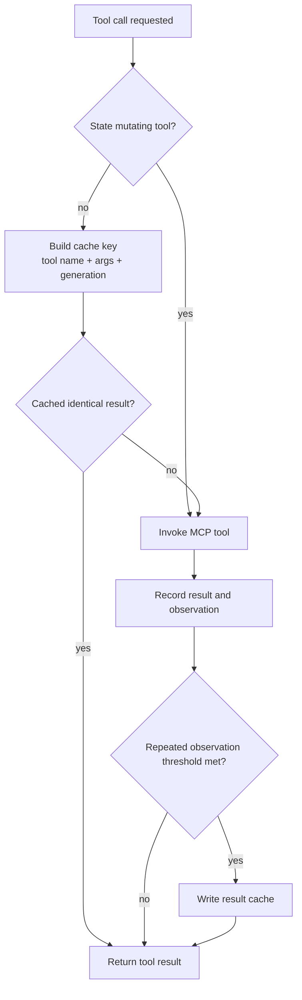
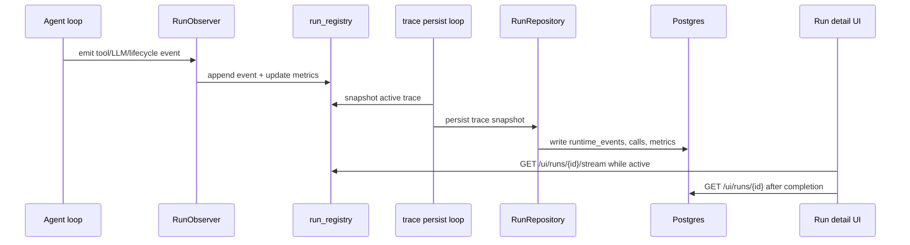
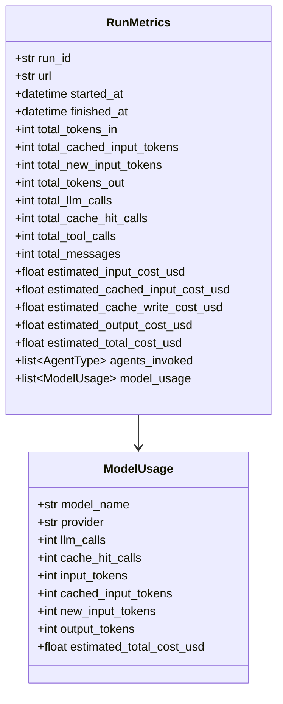
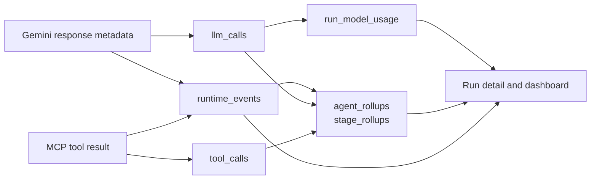

# Caching And Observability

> **Navigation:** [Docs Home](../README.md) | [Section Index](./README.md) | Previous: [Data Model](./data-model.md) | Next: [Workflow Index](../workflow/README.md)

The runtime records what each model and tool did, how much it cost, whether cache was used, and why an agent stopped. This is the data behind the dashboard, run detail, Agent desk, provider view, and cost/context panels.

## Cache Layers

## Tool Result Cache

## Observability Event Flow

## Metrics Class Diagram

## Telemetry Data Flow

## Important Event Kinds

| Event | Meaning |
| --- | --- |
| `pipeline_started` / `pipeline_finished` | workflow lifecycle |
| `orchestrator_decision` | route choice, handoff, skip reason, or final routing explanation |
| `agent_started` / `agent_finished` / `agent_failed` | agent lifecycle |
| `prompt_compiled` | prompt hash, sections, cache mode, provider cache eligibility |
| `tool_session_connecting` / `tool_session_ready` / `tool_session_closed` | MCP session lifecycle |
| `tool_call_started` / `tool_call_finished` | tool execution and error surface |
| `llm_turn_started` / `llm_response` | model invocation and output |
| `llm_retry_scheduled` | transient provider retry handling |
| `llm_timeout` / `llm_rate_limited` / `llm_error` | provider failure visibility |
| `agent_stop_requested` | cancellation and cooperative stop |

