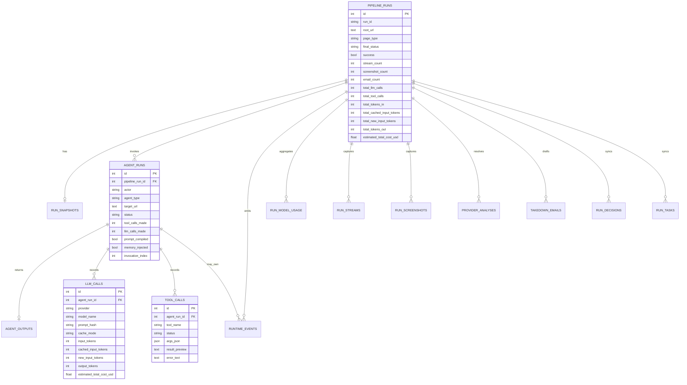
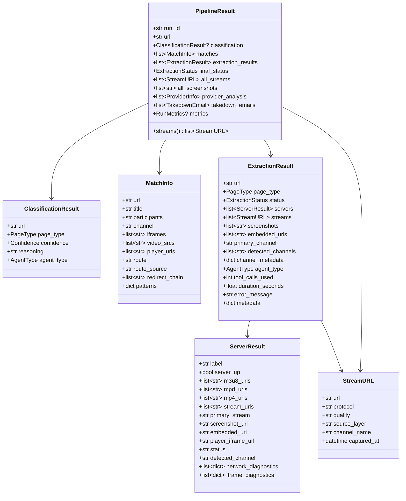
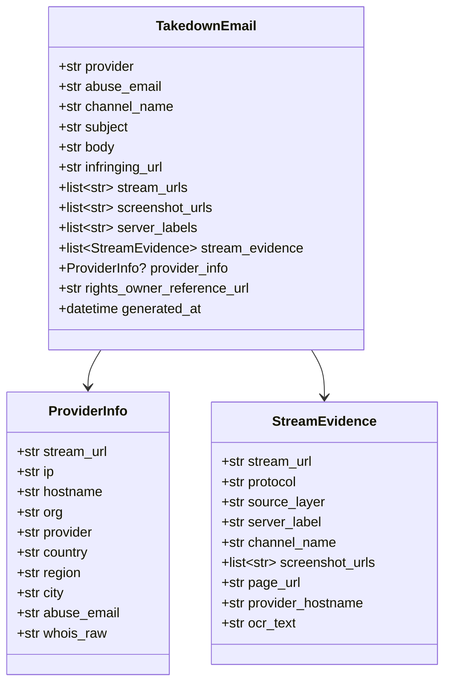
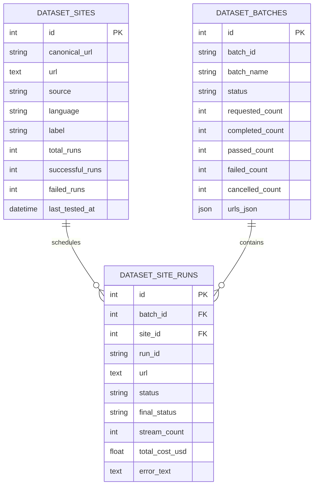
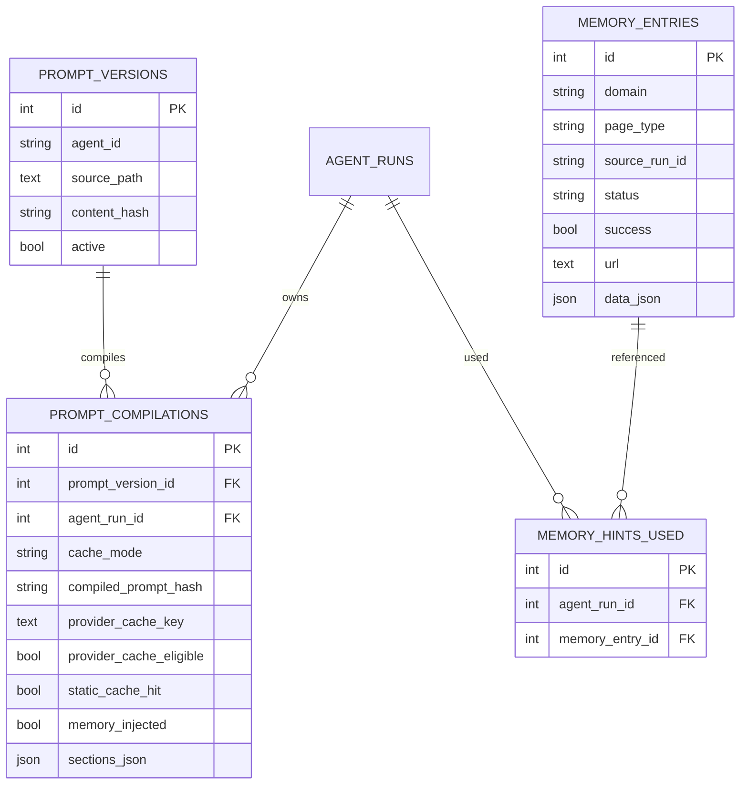
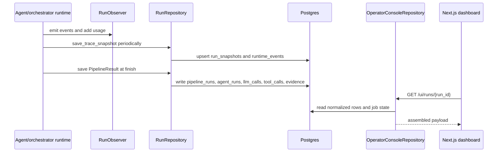

# Data Model And Persistence

> **Navigation:** [Docs Home](../README.md) | [Section Index](./README.md) | Previous: [Deployment](./deployment.md) | Next: [Caching And Observability](./caching-observability.md)

Postgres stores both the final run result and the observability detail needed by the operator console. The central table is `pipeline_runs`; most runtime records link back to it by `pipeline_run_id`.

The schema is intentionally normalized because the dashboard asks different questions than the final pipeline output. A takedown review needs stream, provider, screenshot, and email evidence. A debugging session needs tool calls, model calls, prompt compilations, runtime events, and background job state. Storing those separately avoids treating the final JSON snapshot as the only source of truth.

## Table Families

| Family | Tables | Why it exists |
| --- | --- | --- |
| Run identity and summary | `pipeline_runs`, `run_snapshots`, legacy `runs` | stable run row, final status, aggregate counts, fallback full snapshot |
| Background execution | `background_jobs` | durable queued/running/retrying/cancelled job state before and after `pipeline_runs` exists |
| Agent observability | `agent_runs`, `agent_outputs`, `runtime_events` | actor-level timeline, stage status, normalized output summaries |
| Model telemetry | `llm_calls`, `run_model_usage`, `prompt_versions`, `prompt_compilations` | provider/model usage, cache fields, costs, prompt lineage |
| Tool telemetry | `tool_calls`, `tool_playground_calls` | browser tool attempts, result previews, playground history, reliability views |
| Evidence | `run_streams`, `run_screenshots`, `provider_analyses`, `takedown_emails` | final investigation evidence and email drafts |
| Operator annotations | `run_decisions`, `run_tasks` | event-derived or manually edited decisions/tasks in the run-detail UI |
| Memory | `memory_entries`, `memory_hints_used` | domain/page hints used as soft guidance |
| Datasets | `dataset_sites`, `dataset_batches`, `dataset_site_runs` | batch workflow testing and site-run tracking |
| Pricing | `pricing_configs` | provider/model pricing and context windows used by UI estimates |

## Run Observability ER Diagram

## Runtime Schema Class Diagram

## Provider And Email Evidence Diagram

## Dataset ER Diagram

## Prompt And Memory ER Diagram

## Persistence Flow

## Why Snapshot And Normalized Rows Both Exist

`run_snapshots` preserves a broad trace/result payload that can be used as fallback when a run is still active or when normalization did not capture every field. Normalized rows make dashboards, filters, cost rollups, and provider/email views practical.

The dashboard should prefer normalized rows when available because they support table views and aggregation. It can fall back to snapshots or `background_jobs.result_json` to avoid a blank detail page when a run failed before full persistence.
