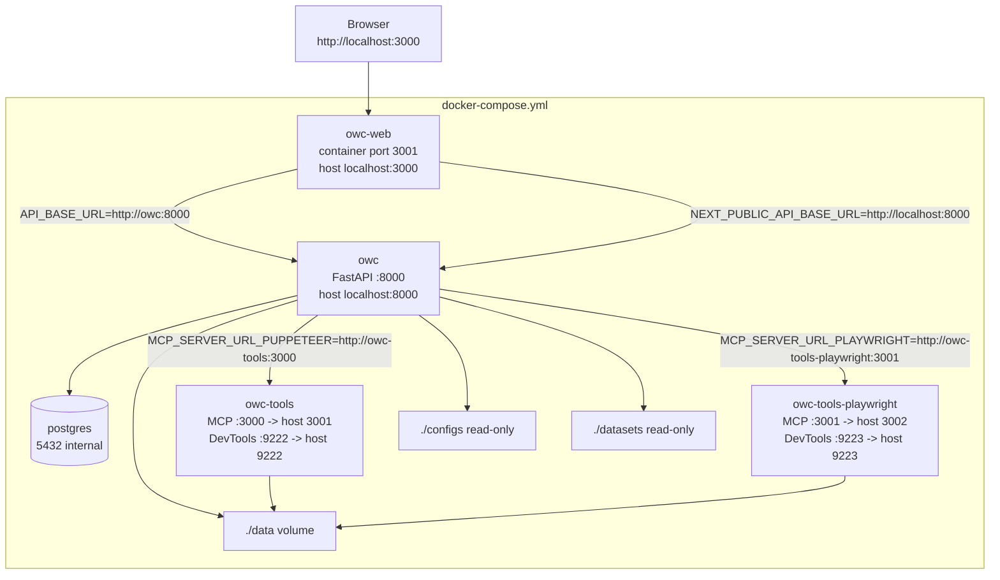
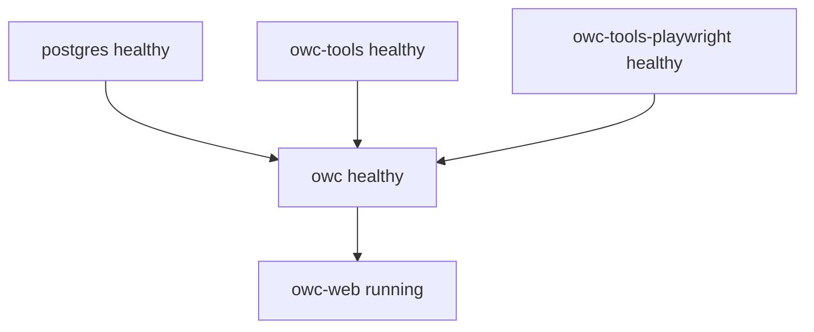
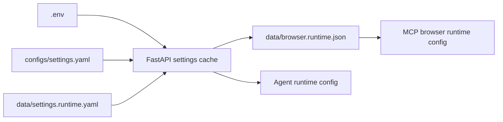

# Deployment And Physical Runtime

> **Navigation:** [Docs Home](../README.md) | [Section Index](./README.md) | Previous: [Runtime Classes And Functions](./runtime-classes-functions.md) | Next: [Data Model](./data-model.md)

The local product stack is Docker-first. The browser opens the operator console on port `3000`, while the backend API is exposed on port `8000`. Browser automation is split into Puppeteer and Playwright tool containers so both engines can be tested and kept available.

## Docker Topology

## Port Matrix

| Service | Container | Internal port | Host port | Purpose |
| --- | --- | ---: | ---: | --- |
| `owc-web` | Next.js console | `3001` | `3000` | Operator console |
| `owc` | FastAPI backend | `8000` | `8000` | Runtime API and SSE |
| `postgres` | PostgreSQL | `5432` | internal | Run history and telemetry |
| `owc-tools` | Puppeteer MCP | `3000` | `3001` | Puppeteer profile tools |
| `owc-tools` | Chrome DevTools | `9222` | `9222` | Browser diagnostics |
| `owc-tools-playwright` | Playwright MCP | `3001` | `3002` | Playwright profile tools |
| `owc-tools-playwright` | DevTools | `9223` | `9223` | Browser diagnostics |

## Service Dependencies

## Runtime Environment Flow

## Operational Notes

- The web service talks to the API by Docker service name internally, but the browser talks to `http://localhost:8000`.
- If the page looks stale after docs or frontend changes, check whether Docker is serving an older built image.
- `owc-tools` can be healthy while the browser endpoint is unhealthy. Use `/ui/browser/status` to distinguish MCP profile health from browser DevTools reachability.
- `./data` is shared by backend and tool containers for runtime state, memory files, browser runtime config, and generated artifacts.

