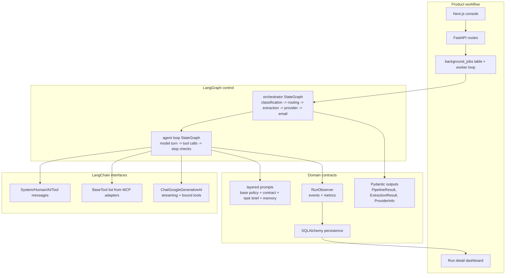
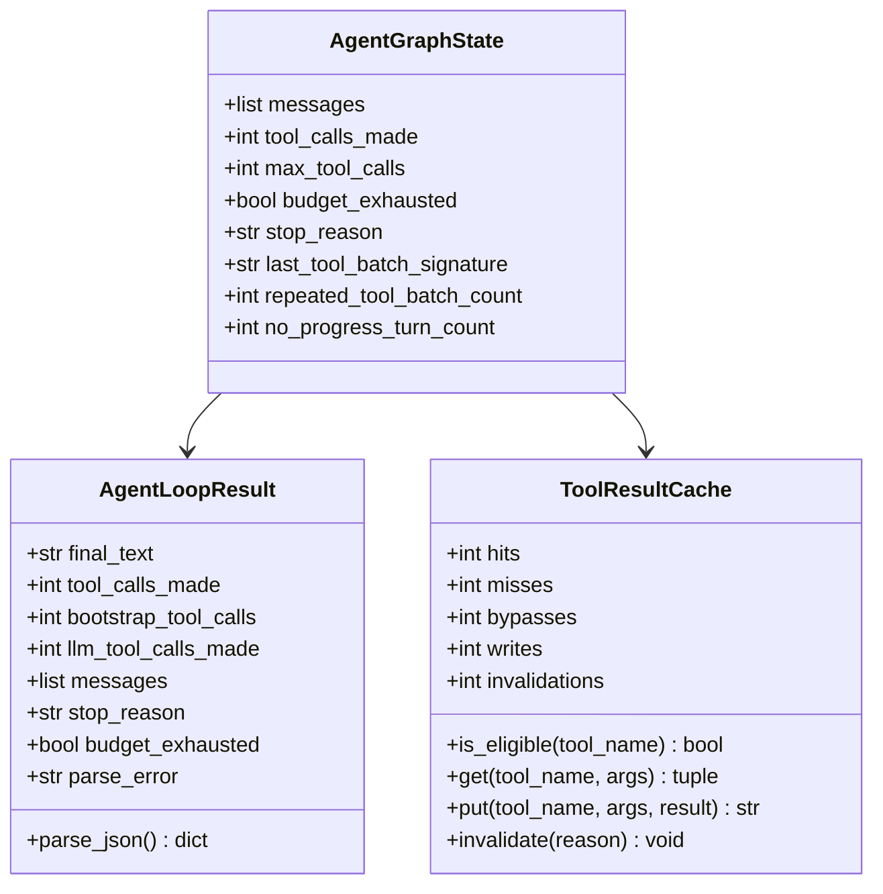
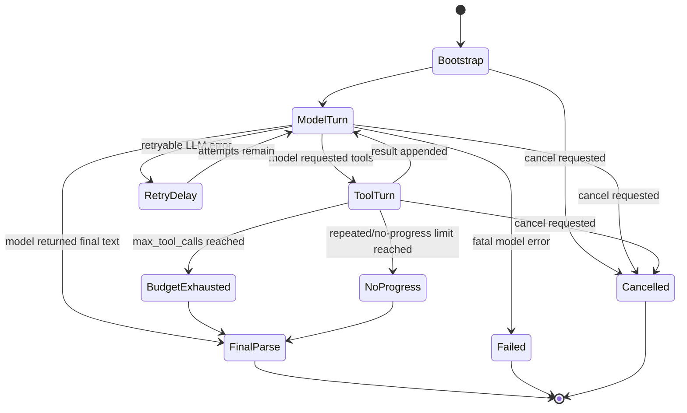
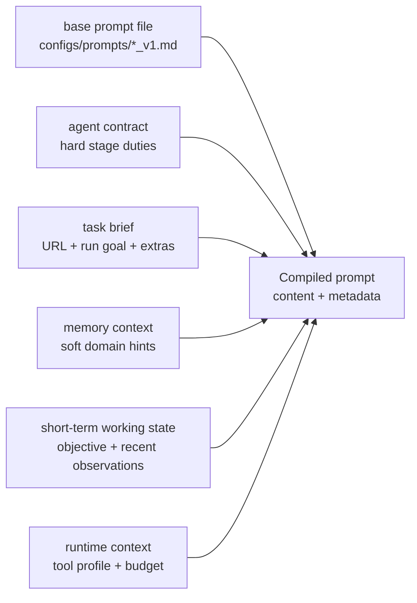

# LangChain And LangGraph Runtime

> **Navigation:** [Docs Home](../README.md) | [Section Index](./README.md) | Previous: [System Architecture](./architecture.md) | Next: [Runtime Classes And Functions](./runtime-classes-functions.md)

This system uses LangChain for model/tool abstractions and LangGraph for deterministic agent control flow. The distinction matters: LangChain provides messages, tool binding, and the Gemini chat model wrapper; LangGraph provides explicit state machines for the agent loop and the orchestrator route; the application code owns the domain policy.

The result is not a single unconstrained chatbot. It is a controlled workflow where LLM calls are one step inside a larger graph.

## Why This Fits This Project

Streaming-site extraction has several properties that make a graph-based runtime useful. The page type is not known until a browser checks the live page. Different page types need different tool profiles and different prompts. Browser state can drift because of ads, redirects, iframes, and server switches. A useful run is also not just a final answer; it needs screenshots, stream URLs, provider rows, model usage, tool history, and a replayable event log.

LangGraph keeps those decisions explicit. The model can propose tool calls and produce structured JSON, but the graph decides the next node and the backend records every step.

## Current Source Map

| Concern | Current source |
| --- | --- |
| Gemini model construction | `src/agents/base.py::build_llm` |
| Tool-calling loop | `src/agents/base.py::run_agent_loop` |
| Agent loop state | `src/agents/base.py::AgentGraphState` |
| Tool/result wrapper | `src/agents/base.py::AgentLoopResult` |
| Orchestrator graph | `src/agents/orchestrator.py::build_graph` |
| Orchestrator state | `src/agents/orchestrator.py::PipelineState` |
| Handoff text | `src/agents/orchestrator.py::render_handoff` |
| Runtime events and metrics | `src/utils/observability.py` |
| Prompt layering | `src/agents/prompting.py` |
| Gemini/tool caches | `src/agents/cache.py` |

## Layered Runtime Diagram



## Agent Loop Mechanics

Each browser-facing specialist agent follows the same broad pattern:

1. Build a `LongTermMemory` client when memory is enabled.
2. Create `ShortTermMemory` for this run.
3. Compile a layered prompt from the base prompt file, agent contract, task brief, memory context, working state, and runtime context.
4. Open profile-scoped MCP tools with `agent_tools(profile, settings, observer=observer)`.
5. Run `run_agent_loop` with the Gemini model, tools, max tool-call budget, bootstrap behavior, and runtime profile.
6. Parse the final model text into JSON using `AgentLoopResult.parse_json`.
7. Normalize the output into Pydantic schemas.
8. Remember the run and emit `agent_finished`.

The bootstrap behavior is important. Most agents can start by calling memory lookup and navigation before the first normal model turn. That puts real page evidence into the conversation and prevents the model from deciding from URL shape alone.

```mermaid
sequenceDiagram
  participant A as Specialist agent
  participant P as compile_agent_prompt
  participant M as LongTermMemory
  participant MCP as agent_tools(profile)
  participant Loop as run_agent_loop
  participant LLM as Gemini
  participant T as Browser tool
  participant O as RunObserver

  A->>M: build_memory_context(url, page_type)
  M-->>A: prior hints or empty context
  A->>P: base policy + contract + task + memory + runtime
  P-->>A: compiled prompt + cache metadata
  A->>O: prompt_compiled
  A->>MCP: open profile session
  A->>Loop: settings, llm, tools, prompt, bootstrap flags
  Loop->>T: bootstrap memory_lookup when available
  Loop->>T: bootstrap navigate/open_url
  Loop->>T: bootstrap inspect/get_page_context
  loop model and tool turns
    Loop->>LLM: messages + bound tools
    LLM-->>Loop: AIMessage with tool calls or final text
    Loop->>O: llm_response and usage metrics
    opt requested tool call
      Loop->>T: invoke tool with timeout
      T-->>Loop: serialized tool result
      Loop->>O: tool_call_finished
    end
  end
  Loop-->>A: AgentLoopResult
  A->>A: parse and normalize result
  A->>O: agent_finished
```

## Agent Loop State

`AgentGraphState` is intentionally small. It tracks the conversation, budget, repeated tool batches, and no-progress count. More durable state lives outside the graph in `RunObserver`, `ShortTermMemory`, and Postgres.



## Stop Conditions

The loop is not allowed to run forever. The current runtime checks `max_tool_calls`, `agent_timeout_seconds`, `llm_turn_timeout_seconds`, `tool_timeout_seconds`, repeated identical tool batches, no-progress turns, user cancellation, and bounded provider retries.

These checks are logged as events so the dashboard can show the difference between a genuine extraction failure, a tool timeout, a cancelled run, and a model/provider problem.



## Prompt Layering

Prompt compilation exists because the same base runtime rules must be combined with agent-specific behavior. Classification is not allowed to extract downstream streams, while hosting is expected to activate players and collect server-level evidence.



## Why Not Let The LLM Route Everything

The system still uses an LLM for page understanding, but routing is mostly deterministic because the consequences of a bad route are expensive. A host page sent to an embedded agent may miss server controls. A landing page sent directly to provider analysis has no streams. A broken page should not trigger email generation. Keeping graph routes explicit makes failures explainable in the dashboard.

The model is best used for the parts where static code is brittle: reading messy DOM context, interpreting page intent, deciding which visible control to inspect next, and summarizing evidence. The graph is better for lifecycle control, persistence, cancellation, retries, and deciding which specialist owns the next stage.
