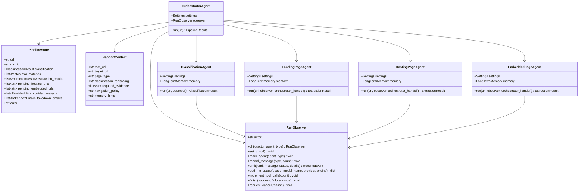
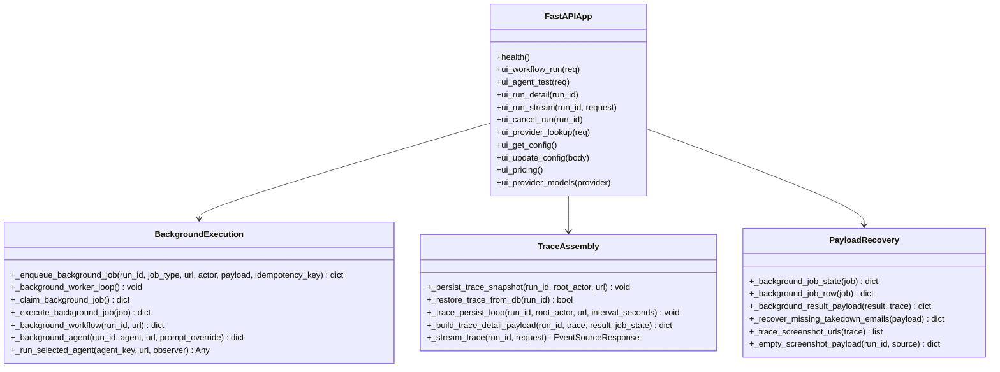
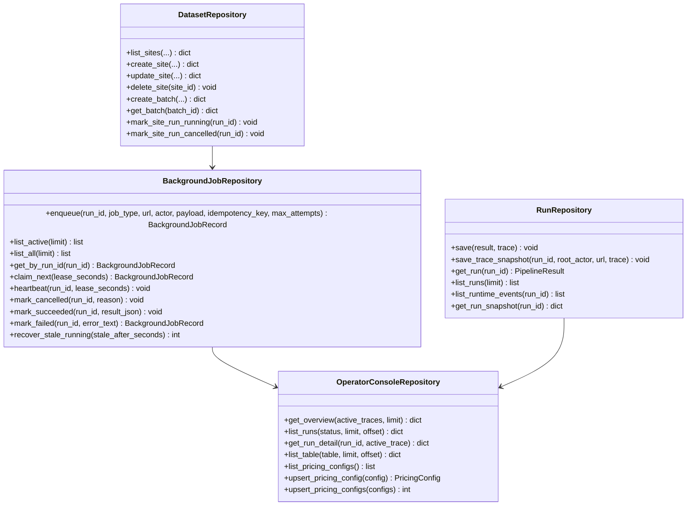
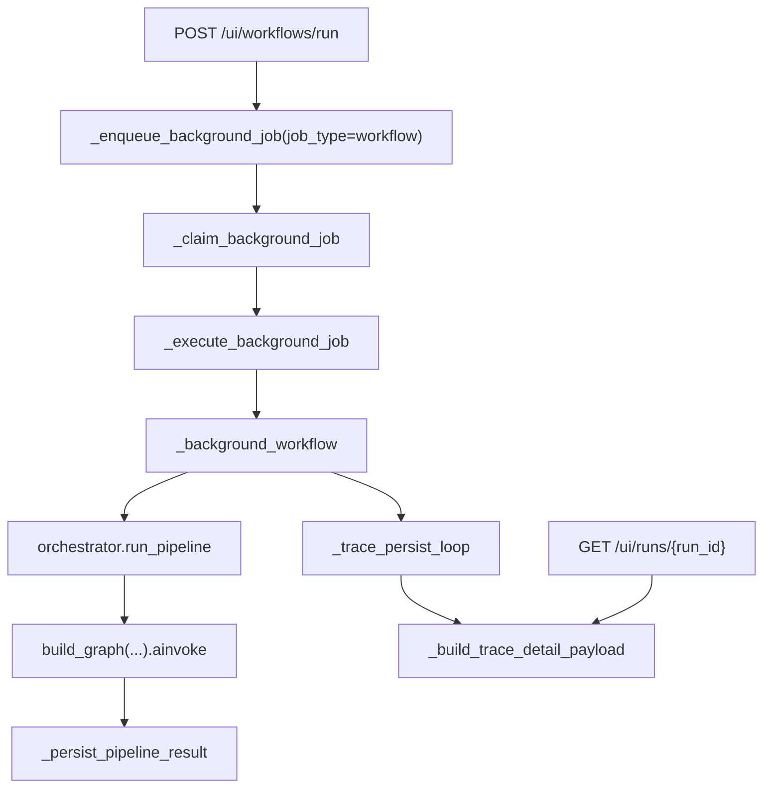

# Runtime Classes And Function Map

> **Navigation:** [Docs Home](../README.md) | [Section Index](./README.md) | Previous: [LangChain And LangGraph](./langchain-langgraph.md) | Next: [Deployment](./deployment.md)

This page is a source-oriented map of the runtime code. It is not a generated API reference; it focuses on the classes and functions that matter when a workflow run, single-agent run, dashboard payload, metric, tool call, provider lookup, or takedown email is created.

## Backend Execution Class Diagram

## FastAPI Runtime Functions

The backend route module is large because it owns public API routes, operator-console routes, and background execution. These are the functions to check first when debugging behavior.

`_enqueue_background_job` is the durable entry point for `/ui/workflows/run`, `/ui/agents/test`, and prompt-test agent jobs. It writes a `background_jobs` row when the database is available. If the background job table is unavailable, the current code falls back to in-memory task execution.

`_background_worker_loop` is the in-process worker. It repeatedly claims queued/retrying jobs up to `background_job_concurrency`, runs them as asyncio tasks, and logs task failures.

`_execute_background_job` dispatches by `job_type`. `workflow` calls `_background_workflow`; `agent` calls `_background_agent`.

`_background_workflow` creates an orchestrator trace, starts the trace persistence loop, runs `src.agents.orchestrator.run_pipeline`, persists the `PipelineResult`, and returns a UI-ready result payload.

`_background_agent` creates a trace for a single selected agent, resolves that agent runtime profile, calls `_run_selected_agent`, wraps the result into a `PipelineResult`, persists it, and returns a UI-ready result payload.

## Storage Repository Map

## Full SQLAlchemy Class Diagram

```mermaid
classDiagram
  class RunRecord {
    +run_id
    +url
    +page_type
    +status
    +streams_found
    +tokens_in
    +tokens_out
    +tool_calls
    +result_json
  }

  class PipelineRunRecord {
    +run_id
    +root_url
    +page_type
    +final_status
    +success
    +failure_mode
    +stream_count
    +screenshot_count
    +email_count
    +provider_analysis_count
    +total_llm_calls
    +total_tool_calls
    +total_tokens_in
    +total_cached_input_tokens
    +total_new_input_tokens
    +total_tokens_out
    +estimated_total_cost_usd
  }

  class BackgroundJobRecord {
    +job_id
    +run_id
    +job_type
    +status
    +idempotency_key
    +url
    +actor
    +payload_json
    +result_json
    +error_text
    +attempts
    +max_attempts
    +lease_expires_at
    +heartbeat_at
  }

  class AgentRunRecord {
    +pipeline_run_id
    +actor
    +agent_type
    +target_url
    +page_type
    +status
    +tool_call_budget
    +tool_calls_made
    +llm_calls_made
    +prompt_compiled
    +memory_injected
    +invocation_index
  }

  class LLMCallRecord {
    +agent_run_id
    +seq
    +provider
    +model_name
    +prompt_hash
    +cache_mode
    +input_tokens
    +cached_input_tokens
    +new_input_tokens
    +cache_creation_input_tokens
    +output_tokens
    +context_window
    +estimated_total_cost_usd
    +tool_calls_requested
    +tools_requested
    +content_preview
    +usage_metadata_json
    +response_metadata_json
  }

  class ToolCallRecord {
    +agent_run_id
    +seq
    +tool_name
    +args_json
    +target_summary
    +status
    +duration_seconds
    +result_preview
    +error_text
  }

  class RuntimeEventRecord {
    +pipeline_run_id
    +agent_run_id
    +actor
    +seq
    +kind
    +status
    +message
    +details_json
  }

  class PromptCompilationRecord {
    +prompt_version_id
    +agent_run_id
    +cache_mode
    +compiled_prompt_hash
    +provider_cache_key
    +provider_cache_eligible
    +static_cache_hit
    +memory_injected
    +sections_json
  }

  class RunModelUsageRecord {
    +pipeline_run_id
    +provider
    +model_name
    +llm_calls
    +cache_hit_calls
    +input_tokens
    +cached_input_tokens
    +new_input_tokens
    +output_tokens
    +estimated_total_cost_usd
  }

  class RunStreamRecord {
    +pipeline_run_id
    +stream_url
    +source_url
    +protocol
    +quality
    +source_layer
    +server_label
    +dedupe_hash
  }

  class ProviderAnalysisRecord {
    +pipeline_run_id
    +stream_url
    +ip
    +hostname
    +org
    +provider
    +country
    +abuse_email
    +whois_raw
  }

  class TakedownEmailRecord {
    +pipeline_run_id
    +provider
    +abuse_email
    +channel_name
    +subject
    +body
    +infringing_url
    +stream_urls_json
    +screenshot_urls_json
    +stream_evidence_json
    +provider_info_json
  }

  class MemoryEntryRecord {
    +domain
    +page_type
    +source_run_id
    +source_agent_run_id
    +status
    +success
    +url
    +data_json
  }

  class RunSnapshotRecord {
    +pipeline_run_id
    +run_id
    +snapshot_json
  }

  class AgentOutputRecord {
    +agent_run_id
    +output_json
    +summary_text
    +stream_count
    +embedded_url_count
    +hosting_page_count
    +validation_status
  }

  class PromptVersionRecord {
    +agent_id
    +source_path
    +semantic_version
    +content_hash
    +prompt_text
    +active
  }

  class ToolPlaygroundCallRecord {
    +call_id
    +origin
    +related_run_id
    +profile
    +tool_name
    +status
    +duration_seconds
    +args_json
    +result_json
    +error_text
  }

  class ProviderLookupCheckRecord {
    +lookup_id
    +stream_url
    +hostname
    +ip
    +org
    +provider
    +country
    +abuse_email
    +whois_raw
  }

  class RunDecisionRecord {
    +pipeline_run_id
    +run_id
    +title
    +summary
    +actor
    +category
    +status
    +details_json
  }

  class RunTaskRecord {
    +pipeline_run_id
    +run_id
    +title
    +description
    +actor
    +priority
    +status
    +details_json
  }

  class RunScreenshotRecord {
    +pipeline_run_id
    +agent_run_id
    +screenshot_url
    +source_url
    +label
    +actor
    +agent_type
    +invocation_index
    +tool_name
    +target_url
    +seq
  }

  class MemoryHintUsedRecord {
    +agent_run_id
    +memory_entry_id
  }

  class PricingConfigRecord {
    +provider
    +model_name
    +input_per_million
    +output_per_million
    +cached_input_per_million
    +cache_write_per_million
    +context_window
    +active
    +notes
  }

  class DatasetSiteRecord {
    +canonical_url
    +url
    +source
    +language
    +label
    +total_runs
    +successful_runs
    +failed_runs
    +last_tested_at
  }

  class DatasetBatchRecord {
    +batch_id
    +batch_name
    +status
    +source
    +language_filter
    +label_filter
    +requested_count
    +completed_count
    +passed_count
    +failed_count
    +cancelled_count
    +urls_json
  }

  class DatasetSiteRunRecord {
    +batch_id
    +site_id
    +run_id
    +url
    +language
    +label
    +status
    +final_status
    +stream_count
    +total_cost_usd
    +error_text
  }

  PipelineRunRecord --> AgentRunRecord
  PipelineRunRecord --> RunSnapshotRecord
  PipelineRunRecord --> RuntimeEventRecord
  PipelineRunRecord --> RunModelUsageRecord
  PipelineRunRecord --> RunStreamRecord
  PipelineRunRecord --> RunScreenshotRecord
  PipelineRunRecord --> ProviderAnalysisRecord
  PipelineRunRecord --> TakedownEmailRecord
  PipelineRunRecord --> RunDecisionRecord
  PipelineRunRecord --> RunTaskRecord
  AgentRunRecord --> LLMCallRecord
  AgentRunRecord --> ToolCallRecord
  AgentRunRecord --> AgentOutputRecord
  AgentRunRecord --> PromptCompilationRecord
  AgentRunRecord --> RunScreenshotRecord
  AgentRunRecord --> MemoryHintUsedRecord
  AgentRunRecord --> MemoryEntryRecord
  PromptVersionRecord --> PromptCompilationRecord
  MemoryEntryRecord --> MemoryHintUsedRecord
  DatasetBatchRecord --> DatasetSiteRunRecord
  DatasetSiteRecord --> DatasetSiteRunRecord
```

## Function-Level Run Flow

## SQLAlchemy Coverage Note

The class diagram above includes the runtime tables and the supporting tables from `src/storage/models.py` in one place. `RunRecord` is the legacy result table; `PipelineRunRecord` and its linked tables are the normalized run store; `ToolPlaygroundCallRecord`, `ProviderLookupCheckRecord`, `PricingConfigRecord`, and the dataset records are active console/support tables even though they do not all hang directly from one pipeline run.

## Why This Shape Is Useful

The application needs more than a final extraction object. The dashboard asks whether the model call happened, which provider and model were used, whether tools were requested, which browser tool timed out, whether memory was injected, and whether provider/email stages were skipped because there were no streams.

That is why the runtime has both domain result tables and observability tables. `pipeline_runs`, `run_streams`, `provider_analyses`, and `takedown_emails` answer product questions. `runtime_events`, `agent_runs`, `llm_calls`, `tool_calls`, `prompt_compilations`, and `run_model_usage` answer debugging and cost questions.
