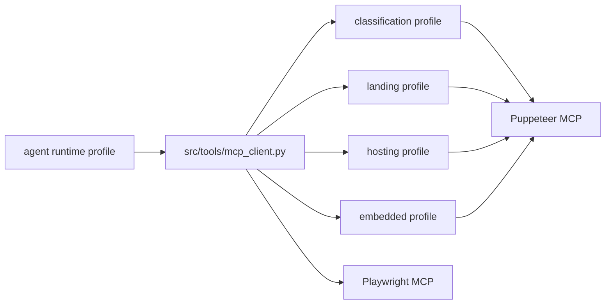

# Tooling Documentation

> **Navigation:** [Docs Home](../README.md) | [Section Index](./README.md) | Previous: [Operator Console API](../api/operator-console.md) | Next: [MCP Browser Tools](./mcp-browser-tools.md)

The active tooling documentation focuses on the MCP browser tools currently used by agents. Older tool notes are archived under `docs/archive/legacy/tools`.

## Reading Order

1. [MCP Browser Tools](./mcp-browser-tools.md)
2. [LangChain And LangGraph Runtime](../system/langchain-langgraph.md)
3. [Dashboard Logging And Run Telemetry](../workflow/dashboard-logging.md)

## Why Tools Are Profile-Scoped

Each agent receives a smaller tool surface than the whole system owns. This keeps prompts shorter, reduces accidental misuse, and lets the backend tune timeouts and budgets by stage.

The broad rule is: inspect first, then use focused detail tools. Broad context tools should summarize page structure and candidates; detail tools should return selector, XPath, frame, media, and network details for a specific target.
