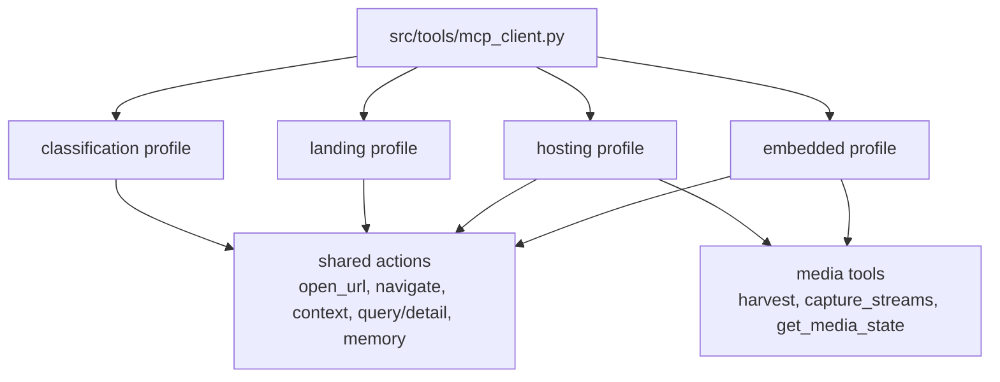
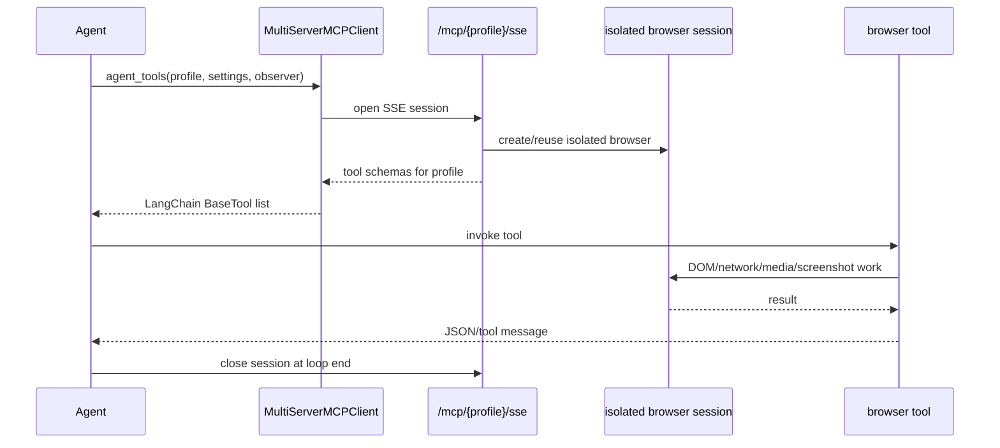
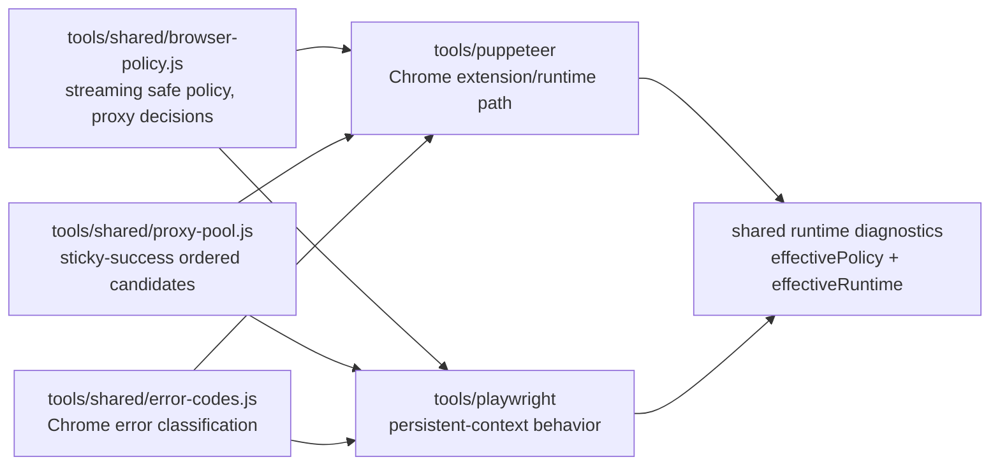
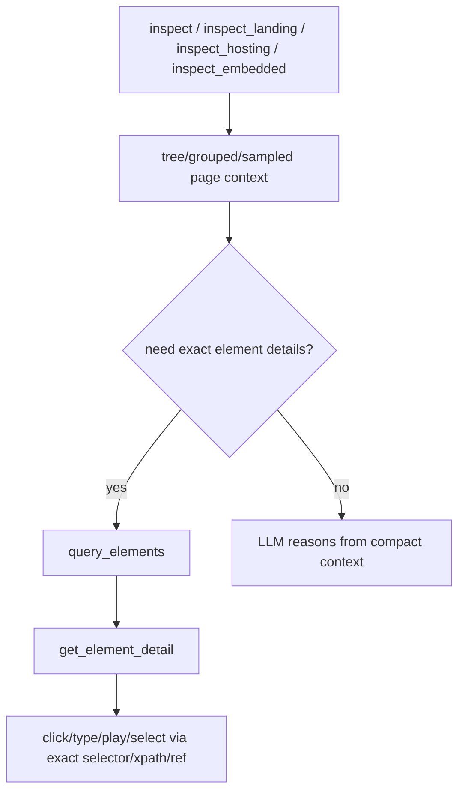

# MCP Browser Tools

> **Navigation:** [Docs Home](../README.md) | [Section Index](./README.md) | Previous: [Tools Index](./README.md) | Next: [Operations Index](../operations/README.md)

Browser tools are exposed through profile-scoped MCP servers. The backend loads profile tools with `src/tools/mcp_client.py`, which converts MCP tool schemas into LangChain `BaseTool` objects and pins one SSE session for the agent loop.

## Profile Tool Exposure

## Tool Profile Matrix

| Tool group | Classification | Landing | Hosting | Embedded |
| --- | --- | --- | --- | --- |
| Memory | `memory_lookup`, `memory_update` | same | same | same |
| Navigation | `navigate`, `open_url`, `go_back`, waits | same | same | same |
| Broad inspect | `inspect` | `inspect_landing` | `inspect_hosting` | `inspect_embedded` |
| Context/detail | `get_page_context`, `get_frame_tree`, `query_elements`, `get_element_detail` | same | same | same |
| Actions | selected interaction/screenshot/scroll tools | full click/type/select/play/scroll tools | full action tools | full action tools |
| Media extraction | no | no | `harvest`, `capture_streams`, `get_media_state` | `harvest`, `capture_streams`, `get_media_state` |

## MCP Session Sequence

## Browser Engine Split

## Broad Context First, Detail Second

## Tool Categories

| Category | Examples | Purpose |
| --- | --- | --- |
| Memory | `memory_lookup`, `memory_update` | reuse domain/page patterns as soft hints |
| Navigation | `open_url`, `navigate`, `go_back`, `wait_for_page_state` | load and recover pages |
| Context | `inspect_*`, `get_page_context`, `get_frame_tree` | broad structural page understanding |
| Detail | `query_elements`, `get_element_detail` | exact selectors, XPath, text, attributes |
| Actions | `click_*`, `type_into`, `select_option`, `play_media`, `scroll_*` | player and page interaction |
| Media | `harvest`, `capture_streams`, `get_media_state` | stream capture and playback evidence |
| Evidence | `screenshot` | screenshot checkpoints |

