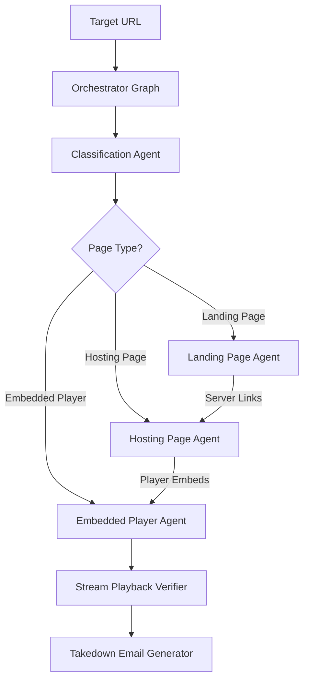

# Welcome to the Open Web Catcher Wiki

**Open Web Catcher (OWC)** is an enterprise-grade, autonomous multi-agent anti-piracy intelligence and stream verification platform. It crawls, classifies, navigates, and extracts live streaming sources (`.m3u8` HLS, `.mpd` DASH) from complex web infrastructures, bypasses intrusive anti-bot and sandbox overlays, verifies playable media streams, and correlates hosting infrastructures to generate verifiable DMCA takedown reports.

---

## 📚 Table of Contents

- [**System Architecture**](Architecture) — High-level design, orchestrator state machine, and data flow.
- [**Multi-Agent Pipeline**](Multi-Agent-Pipeline) — The 4 specialized agents: Classification, Landing, Hosting, and Embedded Player.
- [**Playwright MCP Runtime**](Playwright-MCP-Runtime) — Headless browser execution, isolated contexts, and uBlock Origin Lite integration.
- [**Operator Console**](Operator-Console) — Next.js 15 dashboard, live telemetry, interactive graph inspector, and dataset manager.
- [**Deployment & Docker**](Deployment-and-Docker) — Docker Compose stack, GitHub Container Registry (GHCR) images, and configuration.
- [**API Reference**](API-Reference) — FastAPI endpoints for runs, datasets, telemetry, settings, and health monitoring.

---

## 🚀 Quick Overview

### Core Technologies
- **Backend**: Python 3.11, FastAPI, LangGraph, LangChain, Pydantic V2, SQLAlchemy 2.0.
- **Browser Automation**: Model Context Protocol (MCP) sidecar running Playwright 1.62.1 with uBlock Origin Lite (MV3) adblocker.
- **Operator Console**: Next.js 15 App Router, React 19, Tailwind CSS, Radix UI primitives, Recharts data visualization.
- **Storage & Caching**: PostgreSQL 16 with pgvector, Redis 7 (ephemeral state).
- **LLM Routing**: Provider-neutral LiteLLM integration supporting Google Gemini, OpenAI, Anthropic, OpenRouter, and local models.
