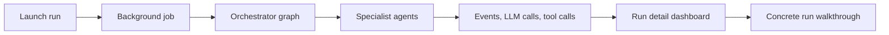

# Workflow Documentation

> **Navigation:** [Docs Home](../README.md) | Section Index: Workflow | Previous: [Caching And Observability](../system/caching-observability.md) | Next: [Run Lifecycle](./run-lifecycle.md)

Read this section when you want to understand what happens from launch to final run payload. It connects the backend run lifecycle, dashboard telemetry, Agent desk UI, and the concrete `db970f27-aadc-4a77-a976-781903658d56` run.

## Reading Order

1. [Run Lifecycle](./run-lifecycle.md)
2. [Dashboard Logging And Run Telemetry](./dashboard-logging.md)
3. [Agent Desk](./agent-desk.md)
4. [Example Run: db970f27](./run-db970f27.md)

## Workflow Map

Use [Agents](../agents/README.md) after this section when you want each agent's input, output, and behavior.

