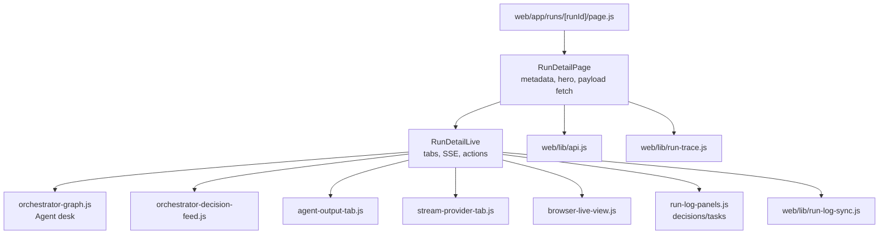
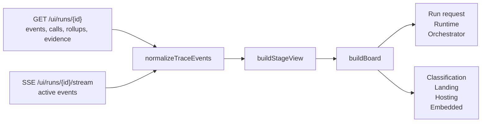
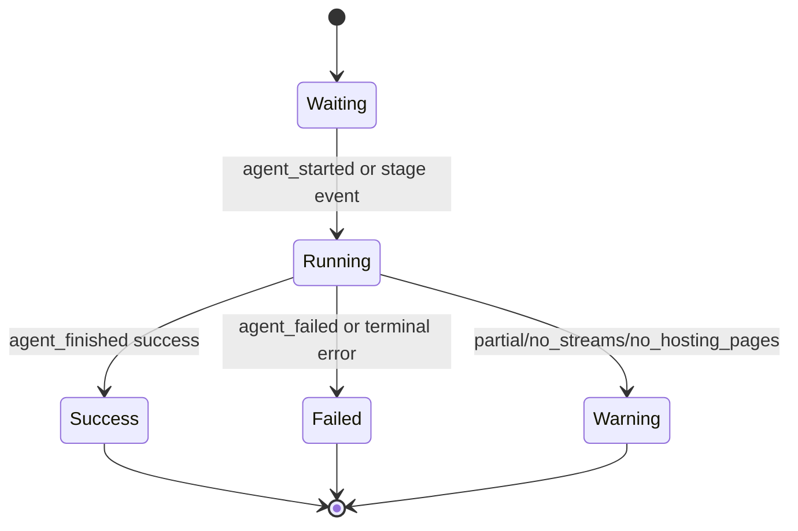
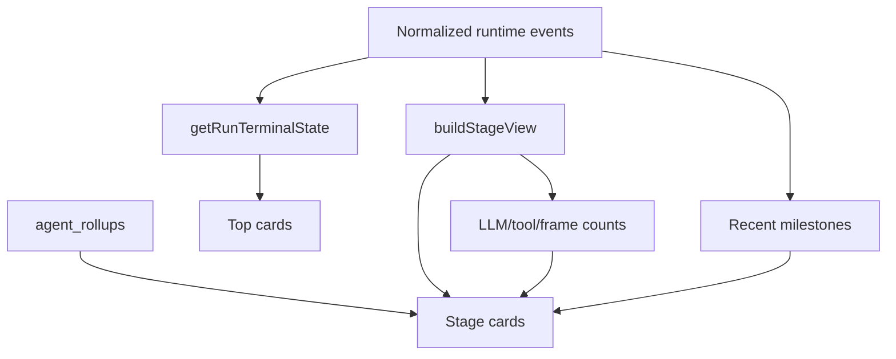
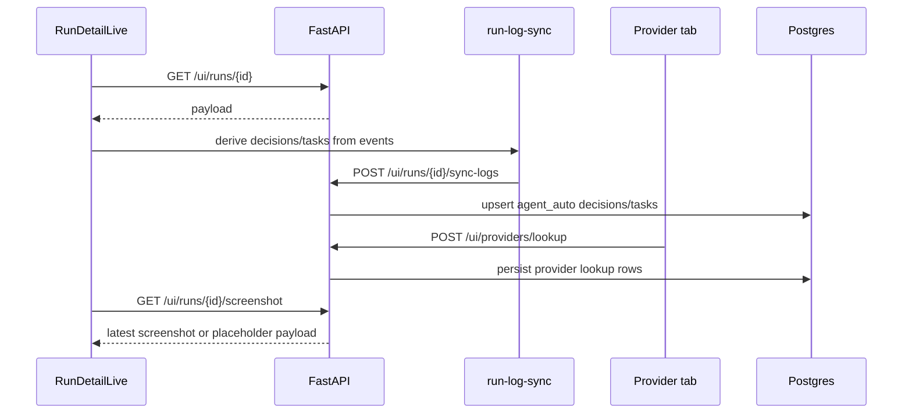
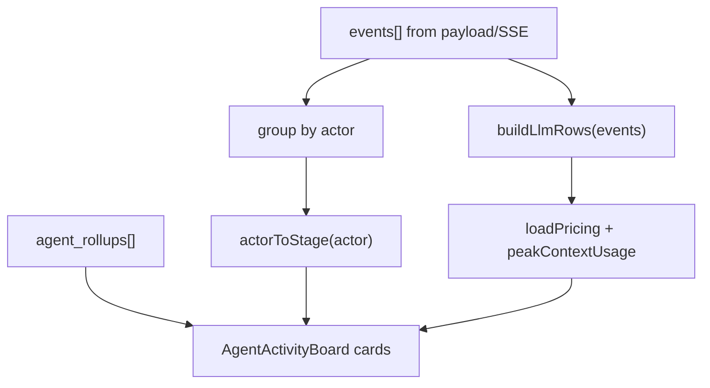

# Agent Desk

> **Navigation:** [Docs Home](../README.md) | [Section Index](./README.md) | Previous: [Dashboard Logging](./dashboard-logging.md) | Next: [Example Run db970f27](./run-db970f27.md)

The Agent desk is the run-detail graph surface. It converts runtime events, tool calls, LLM calls, agent rollups, and stage rollups into a compact execution board that shows what the orchestrator is doing and what each specialist stage has done.

Primary frontend sources:

- `web/components/console/run-detail/run-detail-page.js`
- `web/components/console/run-detail/agent-activity-board.js`
- `web/components/run-detail-live.js`
- `web/components/orchestrator-graph.js`
- `web/lib/run-trace.js`
- `web/lib/run-log-sync.js`

## Frontend Component Map

## Agent Desk Data Flow

## Agent Desk Stage States

## Board Construction Logic

## UI Action Sequence

## What The Board Shows

| Surface | Source fields |
| --- | --- |
| Run request | `pipeline_started` event |
| Runtime card | first runtime/model/tool event |
| Orchestrator card | latest `orchestrator_decision`, terminal event |
| Stage status | normalized events plus `agent_rollups.status` |
| Model attempts | `llm_turn_started`, `llm_response`, persisted `llm_calls` |
| Tool count | `tool_call_started`, `tool_call_finished`, persisted `tool_calls` |
| Recent milestones | last stage events excluding noisy session-ready events |
| Evidence | screenshots, stream URLs, provider rows, email rows |

## How Agent Cards Are Built

`AgentActivityBoard` groups runtime events by `actor`, merges them with `agent_rollups`, and computes a stage label with `actorToStage`. It also synthesizes LLM rows from events using `buildLlmRows`, then uses pricing helpers to show context-window usage and estimated spend. This is why the board can still show partial activity while a run is live, before every normalized DB row is available.

The current card logic prefers concrete activity over generic labels. For example, `orchestrator_decision` becomes route/intent text, `prompt_compiled` becomes cache or memory status, `tool_call_started` becomes a tool-running state, and `llm_response` becomes a model-response milestone. That is the reason the dashboard can show what the orchestrator says it wants to do instead of only showing a stage name.

## Dashboard Logging Semantics

The Agent desk should be read as a live execution board, not as a static final report. Some data comes from event streams and some comes from persisted rows. While a run is active, SSE can add events before the database snapshot catches up. After a run finishes, the page reload path should rely on `GET /ui/runs/{run_id}` and the normalized rows.

The important distinction is:

- `runtime_events` explain sequence and intent;
- `agent_rollups` summarize each actor invocation;
- `llm_calls` explain model/provider/token/cost detail;
- `tool_calls` explain tool-level browser behavior;
- `stage_rollups` and frontend normalization decide the compact board state.

If a run only has a `background_job_result` payload, the UI can still show a result, but the desk should treat telemetry as degraded because call-level rows may not exist.
