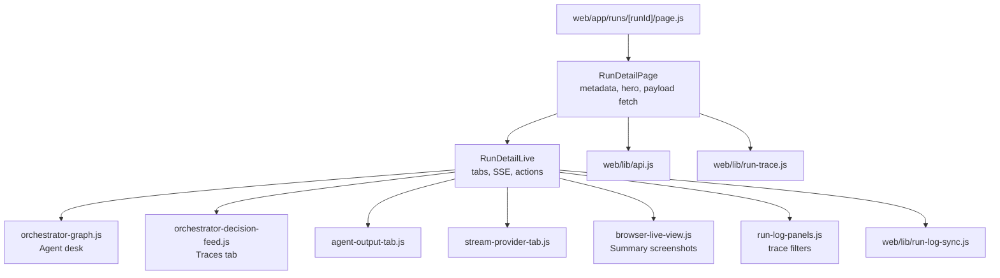
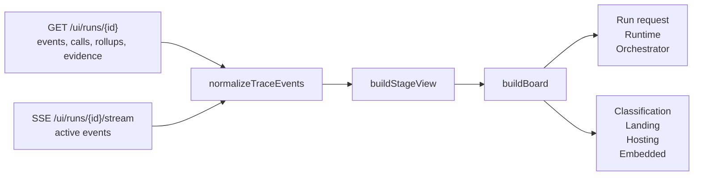
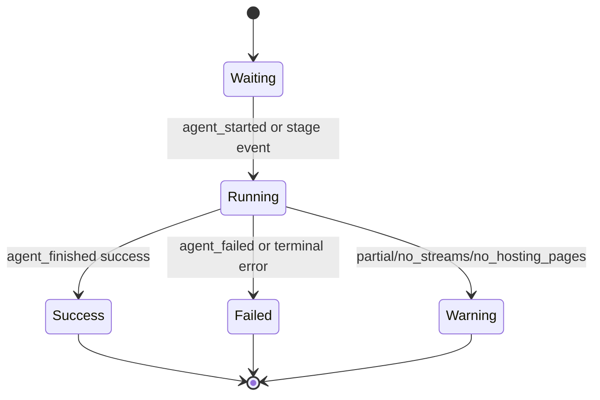
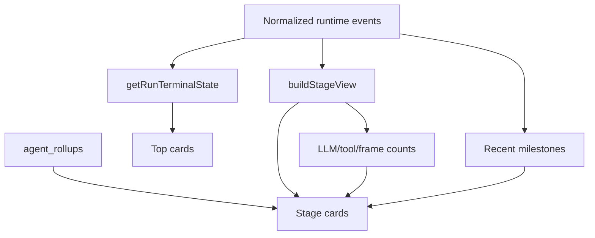
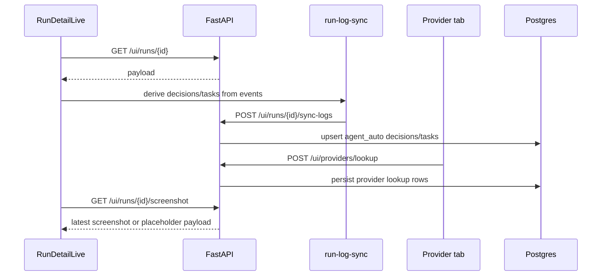
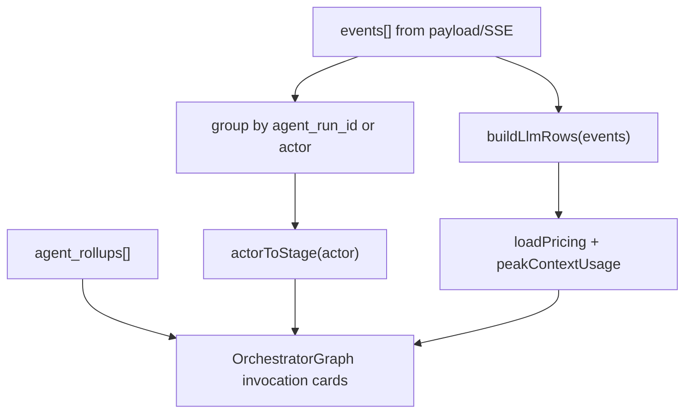

# Agent Desk

> **Navigation:** [Docs Home](../README.md) | [Section Index](./README.md) | Previous: [Dashboard Logging](./dashboard-logging.md) | Next: [Example Run db970f27](./run-db970f27.md)

The Agent desk is the run-detail graph surface. It converts runtime events, tool calls, LLM calls, agent rollups, and stage rollups into a compact execution board that shows what the orchestrator is doing and what each specialist stage has done.

Primary frontend sources:

- `web/components/console/run-detail/run-detail-page.js`
- `web/components/console/run-detail/agent-activity-board.js`
- `web/components/run-detail-live.js`
- `web/components/orchestrator-graph.js`
- `web/lib/run-trace.js`
- `web/lib/run-log-sync.js`

## Frontend Component Map

## Agent Desk Data Flow

## Agent Desk Stage States

## Board Construction Logic

## UI Action Sequence

## What The Board Shows

| Surface | Source fields |
| --- | --- |
| Run request | `pipeline_started` event |
| Runtime card | first runtime/model/tool event |
| Orchestrator card | latest `orchestrator_decision`, terminal event |
| Stage status | normalized events plus `agent_rollups.status` |
| Model attempts | `llm_turn_started`, `llm_response`, persisted `llm_calls` |
| Tool count | `tool_call_started`, `tool_call_finished`, persisted `tool_calls` |
| Recent milestones | last stage events excluding noisy session-ready events |
| Evidence | attributed screenshots, stream URLs, provider rows, email rows |

## How Agent Cards Are Built

`OrchestratorGraph` now keys persisted cards by exact `agent_rollup.agent_run_id` and `invocation_index`, not only by stage. That matters when several hosting or embedded agents run in parallel, and when context continuation starts a later invocation for the same actor. Live events are grouped by `agent_run_id` when the persisted event row has one, then fall back to actor/invocation grouping while the run is still streaming.

Each card has a dedicated context-window block. Persisted rollups provide `provider`, `model_name`, `context_tokens`, `context_window`, and `context_usage_pct`; live LLM events can fill the same values from event details, and pricing metadata is used as a fallback when only provider/model is known. If the provider never reported a window, the block remains visible and says `not reported`.

Each card also exposes hover controls for the agent and its output. The agent hover shows actor, `agent_run_id`, invocation index, model/provider, context tokens/window, LLM/tool counts, duration, and output evidence. Landing cards surface hosting URLs. Hosting and embedded cards surface server labels, states, and stream counts before the raw output JSON.

The current card logic prefers concrete activity over generic labels. For example, `orchestrator_decision` becomes route/intent text, `prompt_compiled` becomes cache or memory status, `tool_call_started` becomes a tool-running state, and `llm_response` becomes a model-response milestone. That is the reason the dashboard can show what the orchestrator says it wants to do instead of only showing a stage name.

## Dashboard Logging Semantics

The Agent desk should be read as a live execution board, not as a static final report. Some data comes from event streams and some comes from persisted rows. While a run is active, SSE can add events before the database snapshot catches up. After a run finishes, the page reload path should rely on `GET /ui/runs/{run_id}` and the normalized rows.

Screenshots are no longer a standalone tab. `RunDetailLive` keeps Browser live view under Summary and passes attributed `screenshots` rows from the API when available. `BrowserLiveView` accepts either legacy URL strings or attributed screenshot rows, then labels frames with actor, invocation, tool, target URL, and stage.

The old Decisions tab is now Traces. The trace surface uses runtime events directly and does not show the manual decision log editor. It highlights orchestrator decisions, handoffs, agent lifecycle events, continuation events, and loop stop reasons.

Output uses an evidence-first layout. `AgentOutputPanel` renders stage/agent metrics, then extracts the most useful fields from each agent output before the raw structured payload: landing hosting URLs, hosting server states and streams, embedded player/server rows, and continuation count. Raw payloads still use `StructuredDataCard`, which supports decoded JSON strings, recursive search, compact row limits, tree/table/json modes, and long-value truncation.

The important distinction is:

- `runtime_events` explain sequence and intent;
- `agent_rollups` summarize each actor invocation;
- `llm_calls` explain model/provider/token/cost detail;
- `tool_calls` explain tool-level browser behavior;
- `stage_rollups` and frontend normalization decide the compact board state.

If a run only has a `background_job_result` payload, the UI can still show a result, but the desk should treat telemetry as degraded because call-level rows may not exist.
