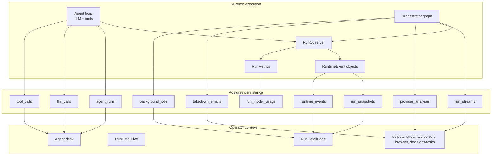
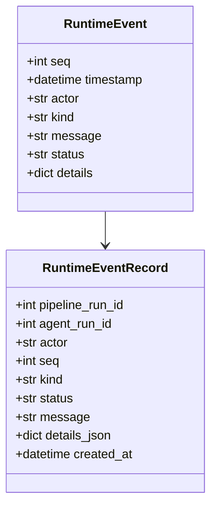
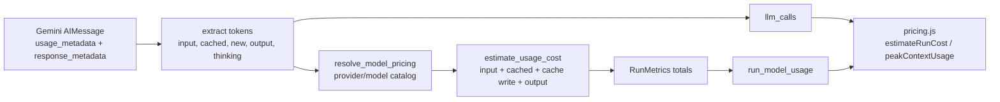
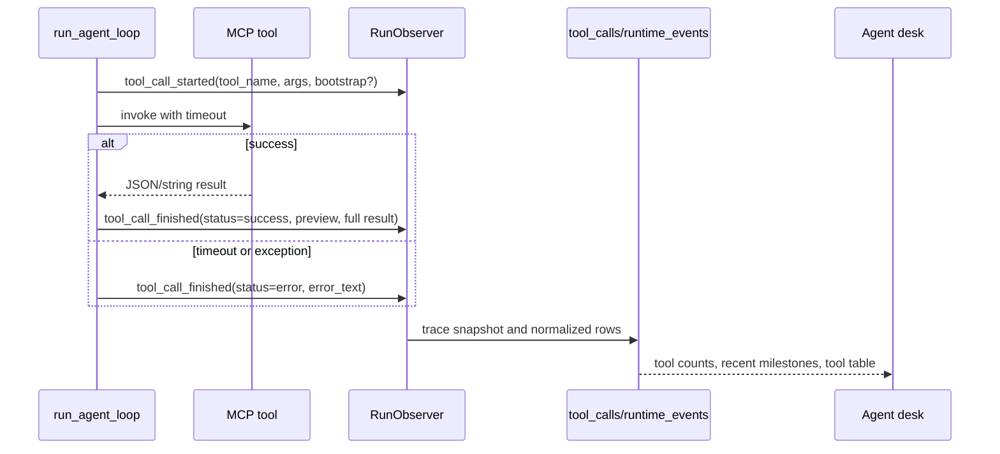
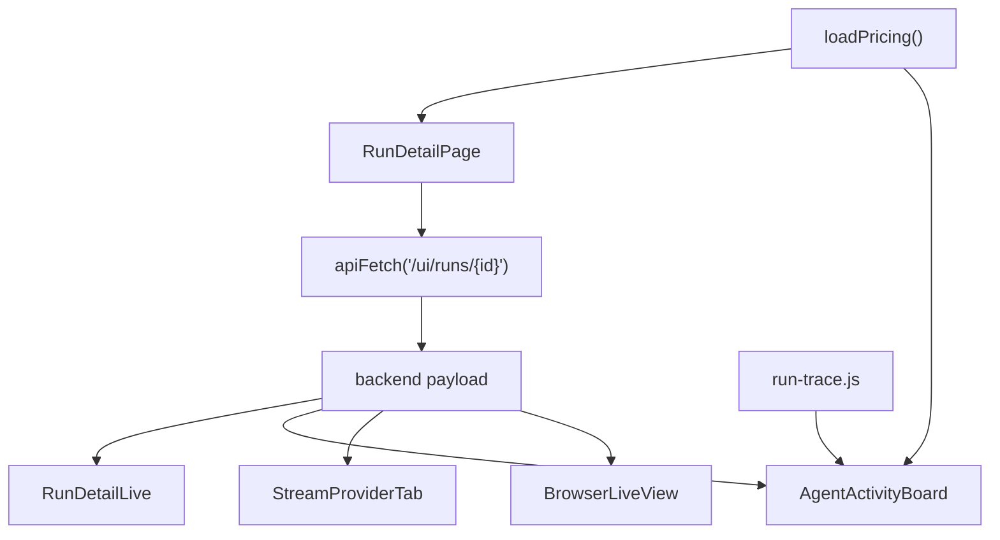
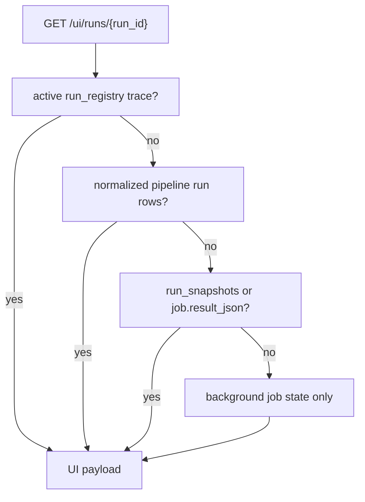

# Dashboard Logging And Run Telemetry

> **Navigation:** [Docs Home](../README.md) | [Section Index](./README.md) | Previous: [Run Lifecycle](./run-lifecycle.md) | Next: [Agent Desk](./agent-desk.md)

The dashboard is not reading raw terminal logs. It is assembled from active in-memory traces from `run_registry`, normalized Postgres rows written by `RunRepository`, and background job rows or fallback result payloads when normalized telemetry is incomplete.

This matters because a run can be visible before it finishes, after it finishes, or after a server restart. The UI needs to keep showing a coherent run detail page in all three cases.

## Logging Architecture

## Runtime Events

`RunObserver.emit` creates an ordered event with `seq`, `actor`, `kind`, `status`, `message`, and `details`. The dashboard should prefer `details` when it needs machine-readable facts, and `message` when it needs short human text.

## LLM Usage Logging

`RunObserver.add_llm_usage` aggregates model usage immediately when an LLM response is observed. It reads provider usage metadata, extracts cache counters where available, resolves pricing, and updates both run totals and per-model totals.

The persisted `llm_calls` rows provide per-call detail. The persisted `run_model_usage` rows provide grouped totals by provider and model. The frontend uses detailed LLM rows for call timelines and model attempts, grouped usage rows for cost and model summary cards, and pricing catalog rows to estimate cost when a call did not store complete cost fields.

## Tool Output Logging

Tools are logged in two forms: runtime events, which are available immediately over SSE, and normalized `tool_calls`, which are useful after the run and for reliability summaries.

The event layer records `tool_call_started` and `tool_call_finished`. The finished event includes result previews and, when available, full serialized result text. The persistence layer stores arguments, target summary, status, duration, preview, and error text.

Tool output can be large, so the UI should show previews by default and expose details where needed. For browser tools, the important evidence is usually not the raw payload alone; it is the screenshot URL, stream URL, selected element, frame path, network observation, or timeout/error string extracted from the tool result.

## What The Frontend Uses

The current run detail route is `web/app/runs/[runId]/page.js`, which renders `RunDetailPage`. `RunDetailPage` fetches `GET /ui/runs/{run_id}` through `web/lib/api.js`. It also loads pricing through `web/lib/pricing`.

`RunDetailLive` attaches to `GET /ui/runs/{run_id}/stream` for live updates and calls `POST /ui/runs/{run_id}/cancel`, `POST /ui/runs/{run_id}/sync-logs`, screenshot endpoints, and `POST /ui/providers/lookup`.

`AgentActivityBoard` builds compact per-actor cards from `agentRollups`, runtime `events`, and synthesized LLM rows. It uses `web/lib/run-trace.js` to map actors to stages and `web/lib/pricing.js` to compute context-window and cost information.

## Payload Source Priority

`GET /ui/runs/{run_id}` can return data from several paths. The current backend checks for active trace data, persisted normalized rows, snapshots, and job fallback payloads.

If the payload source is `background_job_result`, the UI should treat telemetry as degraded. The page can still show final output, but some call-level rows may be missing.

## Dashboard Interpretation Rules

- `agent_rollups` tell the dashboard which actors ran and their status.
- `runtime_events` explain what those actors did and why.
- `llm_calls` answer model/provider/token/cost questions.
- `tool_calls` answer browser/tool behavior questions.
- `run_model_usage` gives a grouped cost and token summary.
- `run_streams`, attributed `run_screenshots`, `provider_analyses`, and `takedown_emails` are the evidence products of the run.
- `background_jobs` explains queued/running/retrying/cancelled job state even before a normalized `pipeline_runs` row exists.

For screenshots, the compatibility list `all_screenshots` still exists, but the richer UI path reads `screenshots[]` rows with `agent_run_id`, `actor`, `agent_type`, `invocation_index`, `tool_name`, `target_url`, and `seq`. This is how Summary can show which parallel hosting or embedded invocation produced each frame.

This separation is intentional. A failed run with no streams can still be a valuable run if it records the reason: page inaccessible, classification unknown, tool timeout, no hosting pages, no streams, or cancellation.
