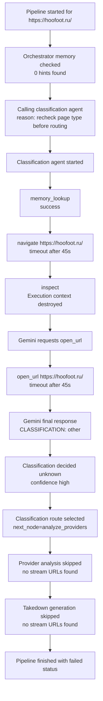
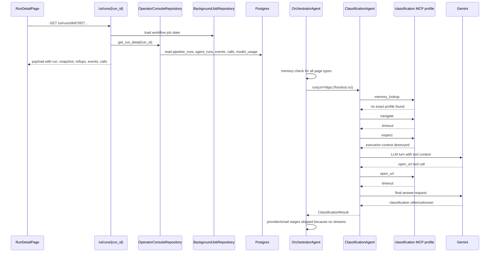
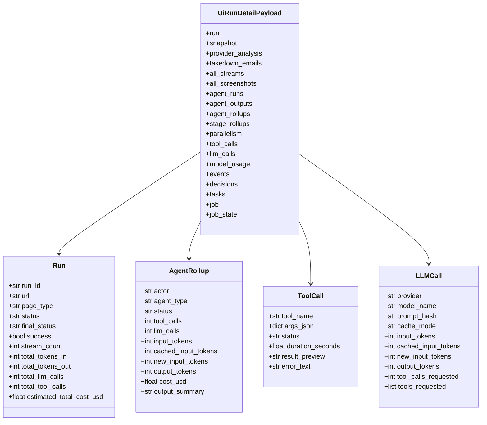
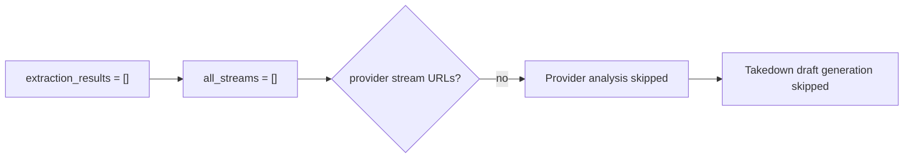
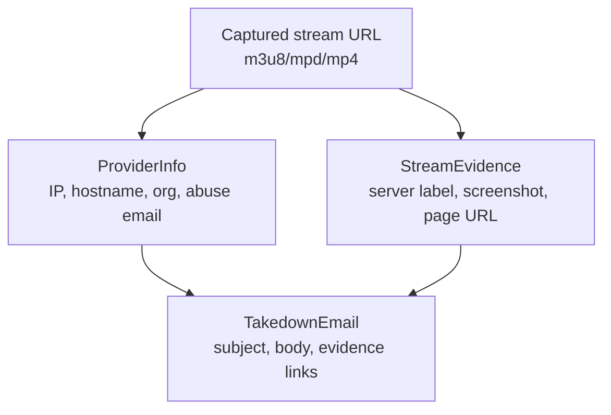

# Example Run: db970f27-aadc-4a77-a976-781903658d56

> **Navigation:** [Docs Home](../README.md) | [Section Index](./README.md) | Previous: [Agent Desk](./agent-desk.md) | Next: [Agents Index](../agents/README.md)

The provided URL is:

`http://localhost:3000/runs/db970f27-aadc-4a77-a976-781903658d56`

The backend payload is loaded from:

`GET http://localhost:8000/ui/runs/db970f27-aadc-4a77-a976-781903658d56`

This run targeted `https://hoofoot.ru/`. It is a useful failure-path example because it shows how the system records memory checks, tool failures, model attempts, route decisions, skipped provider/email stages, and cost/token metrics even when no stream is found.

## Observed Outcome

| Field | Value |
| --- | --- |
| Run ID | `db970f27-aadc-4a77-a976-781903658d56` |
| URL | `https://hoofoot.ru/` |
| Root actor | `orchestrator` |
| Primary provider/model | `google` / `gemini-3.1-flash-lite` |
| Classification | `unknown` with high confidence |
| Final status | failed / page inaccessible path |
| Streams | 0 |
| Screenshots | 0 |
| Provider analyses | 0 |
| Emails | 0 |
| LLM calls | 2 |
| Tool calls | 4 persisted in the classification agent rollup |
| Total estimated cost | about `$0.0036245` in the persisted payload |

## Failure Flow

## Backend Sequence For This Run

## Payload Shape Used By The UI

## Tool Calls In The Failed Run

| Seq | Tool | Status | Meaning |
| ---: | --- | --- | --- |
| 1 | `memory_lookup` | success | No exact profile for `hoofoot.ru`; gather fresh evidence |
| 2 | `navigate` | error | Bootstrap navigation timed out after 45 seconds |
| 3 | `inspect` | error | Browser execution context was destroyed during navigation |
| 4 | `open_url` | error | Gemini-requested navigation also timed out after 45 seconds |

## Why Provider And Email Were Skipped

Provider analysis consumes provider-like stream URLs: HLS/DASH/MP4 URLs, tokenized stream manifests, or stream-like media paths. This run produced no `all_streams`, no server stream rows, and no screenshot evidence. The orchestrator therefore emitted explicit skip decisions instead of fabricating provider rows or email drafts.

## Separate Success-Path Email Example

The run above did not generate emails. Current persisted email rows show the success shape from other runs: a provider, abuse contact, infringing page, stream URLs, screenshot URLs, and correlated `StreamEvidence`.

