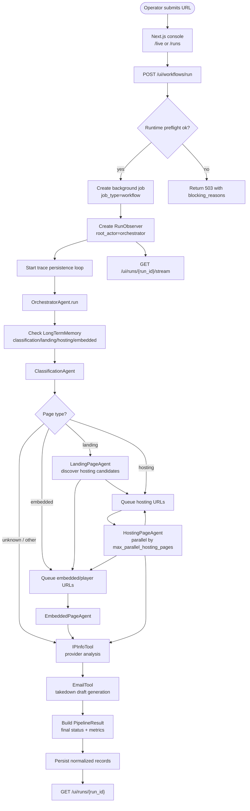
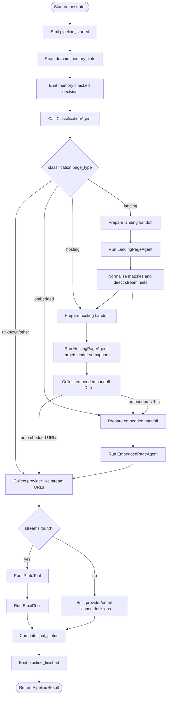
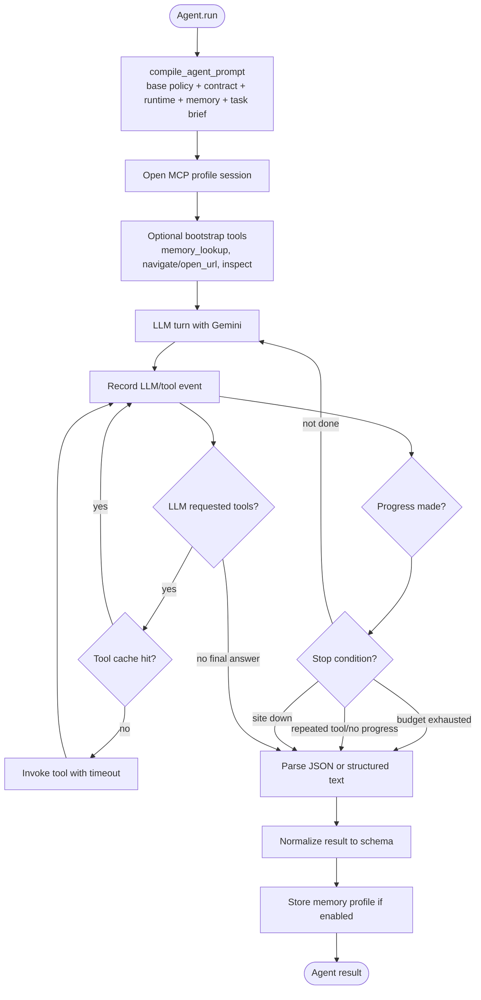
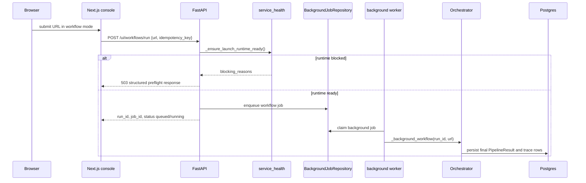
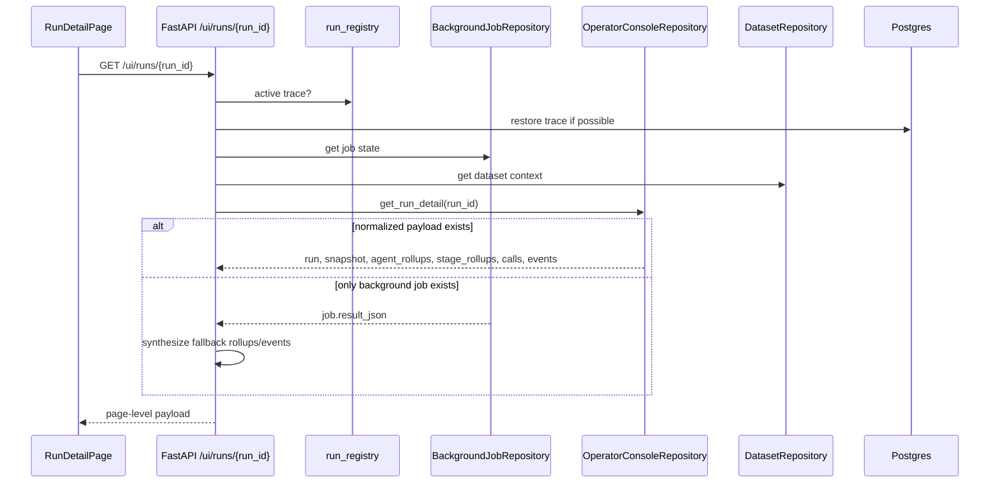
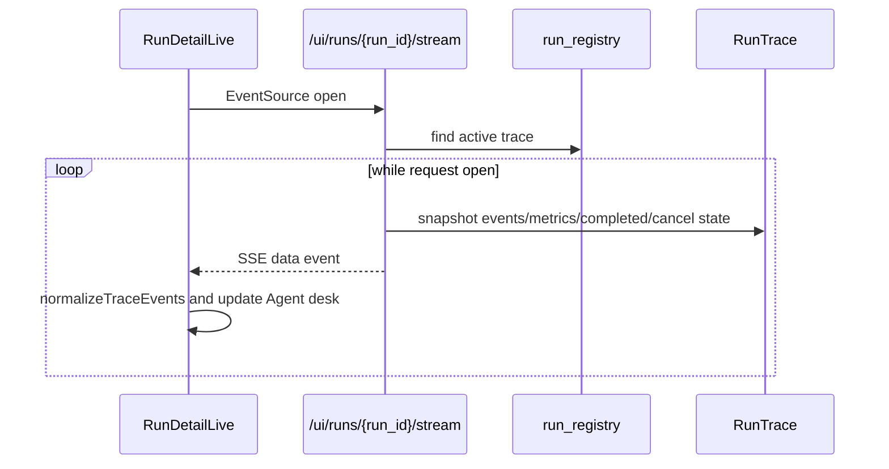
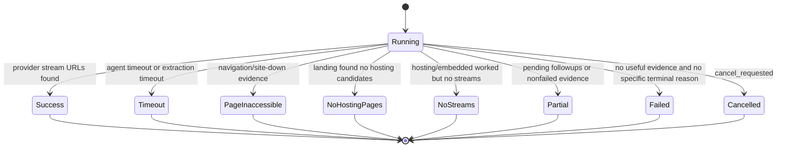
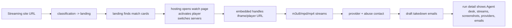

# Workflow Lifecycle

> **Navigation:** [Docs Home](../README.md) | [Section Index](./README.md) | Previous: [Workflow Index](./README.md) | Next: [Dashboard Logging](./dashboard-logging.md)

A workflow run starts from the operator console and ends as a persisted `PipelineResult` plus normalized telemetry. The current route is deterministic: the orchestrator always checks memory, calls classification, routes to the correct specialist path, then aggregates streams, providers, email drafts, screenshots, metrics, and final status.

## End-To-End Flowchart

## Orchestrator Activity Diagram

## Agent Loop Activity

## Sequence: Workflow Launch

## Sequence: Run Detail Load

## Sequence: SSE Live Trace

## Final Status State Diagram

## Happy Path

## Failure Path

```mermaid
flowchart LR
  URL["URL"]
  Memory["orchestrator memory check"]
  Classify["classification"]
  ToolErrors["navigate/inspect/open_url errors"]
  Unknown["classification returns unknown/other"]
  NoStreams["no stream URLs"]
  SkipProvider["provider analysis skipped"]
  SkipEmail["email generation skipped"]
  Failed["final_status failed or page_inaccessible"]

  URL --> Memory --> Classify --> ToolErrors --> Unknown --> NoStreams --> SkipProvider --> SkipEmail --> Failed
```

