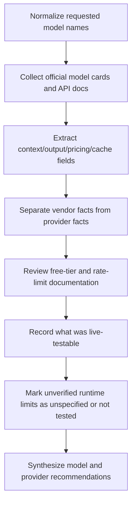

# Comparative Report on Selected LLMs and Free API Providers

## Executive summary

This review covers the models the request named, normalizing **“gml 4.5 air” to “GLM 4.5 Air”** because the current primary-source model card and provider listings use the **GLM** spelling. Across the set, the clearest large-context leaders with strong documentation are **Gemini 2.5 Flash** and **Gemini 3.1 Flash-Lite**, both documented at **1,048,576-token context windows** with **65,535 maximum output tokens** in Google’s model documentation. **GPT-5.4 nano** is the most clearly documented OpenAI text model in this set, with **400,000 input tokens** and **128,000 maximum output tokens**. Among open-weight or OpenRouter-exposed models, **Qwen3-Coder-480B-A35B** is the standout coding-focused long-context option, with **262,144 native context** and **extension to 1M tokens via YaRN** in the official Hugging Face model card, while **Devstral 2 123B Instruct 2512** targets agentic software engineering with a **256k context window**. citeturn15view0turn44view2turn2view0turn38view5turn41view1

On caching, the three providers differ materially. **OpenAI** prompt caching is automatic for prompts of **1,024 tokens or more**, with cache hits reducing latency and cost, and official pricing explicitly distinguishes **cached input** from regular input. **Gemini** now documents **implicit caching by default for Gemini 2.5 and newer models** in the Interactions API, with model-specific minimums; Google’s official context-caching page lists **2,048 tokens** as the minimum for **Gemini 2.5 Flash** and **4,096 tokens** for **Gemini 3.5 Flash** and **Gemini 3.1 Pro Preview**. **DeepSeek** enables context caching by default, persists reusable prefix units to disk, and exposes `prompt_cache_hit_tokens` and `prompt_cache_miss_tokens` in usage metadata. **OpenRouter** adds its own platform-layer **response caching** and **provider-sticky prompt caching**, but free-model access is tightly rate-limited. citeturn20view0turn19view7turn52view0turn36view0turn47view0turn49view0

For provider selection, **Gemini** has the best-documented free pricing among the three providers reviewed, with explicit **“Free of charge”** pricing rows for **Gemini 2.5 Flash**, **Gemini 2.5 Flash-Lite**, and **Gemini 3.1 Flash-Lite** in Google’s pricing docs. **OpenRouter** is the broadest catalog and easiest path to multiple free models, but its official free limits are only **20 requests per minute** and **50 free-model requests per day** unless the account has purchased at least **10 credits**, in which case the daily cap rises to **1,000**. **OpenAI** documentation reviewed here did not expose a comparable public free API tier; rate limits are organization- and project-level, model-dependent, and usage-tier dependent. citeturn56view0turn55view0turn22view2turn22view3turn20view1

A key limitation: this environment did **not** have authenticated access to Gemini, OpenAI, or OpenRouter API keys or credit-backed accounts, so **live empirical stress tests** for request-size ceilings, latency, and undocumented runtime errors could not be executed. Accordingly, all cells labeled **“not tested”** or **“unspecified”** reflect an honest absence of authenticated runtime verification rather than a guess. citeturn53view5turn20view1turn22view2

## Methodology and scope

This report prioritized **official vendor documentation, official model cards, and first-party provider pages**. The research set included Google AI for Developers and Google Cloud Gemini pages, OpenAI developer documentation, DeepSeek API docs and official Hugging Face cards, official Hugging Face cards for Qwen, Z.ai, Mistral, and OpenAI’s open-weight release, plus OpenRouter’s official model and documentation pages. All cited web sources were accessed on **2026-06-28** in the user’s stated local date context. citeturn25view0turn7view4turn18view1turn20view0turn36view0turn28view0turn28view2turn28view3turn28view4turn41view1

The testing portion of the original request was only partially achievable. I could review **documented limits**, **free-tier rules**, **error semantics**, and **cache behavior**, but I could not make authenticated API calls because no provider credentials or billable accounts were available in this environment. Therefore, the “practical limits” section distinguishes between **documented limits** and **live-tested limits**, and it leaves live-test fields as **not tested** where direct execution was impossible. citeturn53view5turn20view1turn22view2

The request named **“Gemini 3.1 Flash”**, but current Google model listings reviewed here surfaced **Gemini 3.1 Flash-Lite**, **Gemini 3.1 Flash Live**, and **Gemini 3.1 Flash TTS**, not a standard text-model page titled simply **Gemini 3.1 Flash**. I therefore treat that row as **not independently verified as a current plain-text Gemini model SKU** in the sources reviewed. citeturn44view0turn44view1

Environment note: the report was produced from a remote research environment whose **exact OS, egress region, and network path were not exposed** to the model. The only reliable location/time metadata available was the conversation context date and user timezone. Consequently, the methodology can describe the logical research environment, but not a concrete test host specification such as “Ubuntu 24.04 in eu-west-1 on fiber.” That information was **unspecified**. 

## Model comparison

### Core model and API characteristics

| Model | Current source-verified identity | Input context window | Max output / generation | Pricing or free access | Cache behavior | Parameters / quantization | Known strengths | Known weaknesses / caveats | Official sources |
|---|---|---:|---:|---|---|---|---|---|---|
| **GLM 4.5 Air** | Z.ai / `z-ai/glm-4.5-air` | **131K** on OpenRouter | **unspecified** in sources reviewed | OpenRouter lists **$0.13 / $0.85 per 1M** in/out | OpenRouter pages advertise effective pricing “after prompt caching,” but no upstream GLM cache spec was surfaced here | Official HF card says **106B total / 12B active**, open-sourced with **FP8 versions**; HF lists **110B params** artifact size | Hybrid reasoning + non-thinking modes; positioned for agent-centric applications | Max output limit and official API cache semantics were not surfaced in reviewed primary docs | citeturn33view3turn33view6turn33view7 |
| **Gemini 2.5 Flash** | Google `gemini-2.5-flash` | **1,048,576** | **65,535** | Google pricing shows **Free of charge** on free tier and paid pricing thereafter | Implicit caching supported on Gemini 2.5+; Google docs say Interactions API supports only implicit caching | Parameters not publicly specified in docs reviewed | Best price/performance among Google reasoning-capable fast models; 1M context; “thinking budgets” | Exact active free-tier interactive rate caps are dynamic in AI Studio rather than fully exposed in static docs | citeturn15view0turn56view0turn52view0 |
| **Gemini 2.5 Flash-Lite** | Google `gemini-2.5-flash-lite` | **unspecified in sources reviewed** | **unspecified in sources reviewed** | Google pricing shows **Free of charge** on free tier | Caching support is documented at provider level for newer Gemini families, but a 2.5 Flash-Lite-specific context/output page was not recovered here | Parameters unspecified | Cheapest Gemini text model in reviewed pricing docs; high-volume / cost-sensitive usage | I could verify pricing, but not recover a primary-source token-limit page for this exact SKU in the remaining sources reviewed | citeturn56view0 |
| **Gemini 3.1 Flash** | **Not independently verified** as a current standard text SKU in sources reviewed | unspecified | unspecified | unspecified | unspecified | unspecified | n/a | Google model listings reviewed surfaced **Gemini 3.1 Flash-Lite**, **Gemini 3.1 Flash Live**, and **Gemini 3.1 Flash TTS**, but not a plain “Gemini 3.1 Flash” page | citeturn44view0turn44view1 |
| **Gemini 3.1 Flash-Lite** | Google `gemini-3.1-flash-lite` | **1,048,576** | **65,535** | Google pricing shows **Free of charge** on free tier | Cloud docs show **context caching supported**; API docs describe implicit caching for Gemini 2.5+ and newer models | Parameters unspecified | Cost-efficient, low-latency, high-volume agentic and simple processing workloads | Less documentation on internal architecture than open-weight alternatives | citeturn44view2turn55view0turn52view0 |
| **Devstral 2 2512** | Mistral `Devstral-2-123B-Instruct-2512` | **256k** | **unspecified** | No free hosted tier verified in sources reviewed; self-hostable open-weight artifact | No first-party managed API caching behavior surfaced in model card; caching depends on serving stack/provider | **123B** instruct model in **FP8**; HF shows quantizations available; vLLM/SGLang examples use **tensor parallel size 8** | Agentic software engineering, tool use, SWE-bench performance | Context/output runtime ceilings depend on serving stack; not a “free hosted API” in the reviewed first-party material | citeturn41view1turn41view8 |
| **GLM 4.7** | Z.ai / `z-ai/glm-4.7` | **203K** on OpenRouter | HF card documents **max new tokens 131,072** in eval settings | OpenRouter lists **$0.40 / $1.75 per 1M** in/out | OpenRouter prompt-caching economics may apply depending on provider routing; upstream GLM 4.7 cache semantics not surfaced here | HF lists **358B params**; model card emphasizes interleaved/preserved thinking | Strong multilingual agentic coding, tool use, and multi-step reasoning; improved SWE-bench and terminal benchmarks vs GLM-4.6 | Output cap cited here comes from official eval/local settings, not an explicitly published API hard cap | citeturn29view0turn31view6turn31view7 |
| **Qwen / qwen3-coder:free** | OpenRouter free route to Qwen3-Coder-480B-A35B-Instruct | OpenRouter page lists **1M**; upstream HF says **262,144 native**, **extendable to 1M via YaRN** | HF example uses **max_new_tokens=65536** | OpenRouter model page lists **Free** | On OpenRouter, free-model access is subject to OpenRouter free-model limits; provider-side prompt caching varies | HF card: **480B total / 35B active**, Apache-2.0; quantizations available through HF ecosystem | Exceptional coding and repository-scale understanding; strong tool calling | Free-route operational stability and latency are provider-dependent; native context is 262k even though routed offering advertises 1M | citeturn21view0turn38view1turn38view2turn38view5turn38view7 |
| **GPT-5.4 nano** | OpenAI `gpt-5.4-nano` | **400,000 input** | **128,000 output** | OpenAI pricing page lists paid token pricing; no public free API tier surfaced in docs reviewed | OpenAI automatic prompt caching on supported recent models; minimum cacheable prompt size **1,024 tokens** | Parameters unspecified in public docs reviewed | Very large documented context for a small, low-cost OpenAI model; good for long prompts when cost matters | Public docs reviewed did not expose model size or a public free tier | citeturn2view0turn19view7turn20view0 |
| **DeepSeek V3.2 reasoning** | OpenRouter `deepseek/deepseek-v3.2` with `reasoning.enabled=true` | **131K** on OpenRouter | unspecified | OpenRouter lists **$0.2288 / $0.3432 per 1M** in/out | OpenRouter page says reasoning can be toggled; upstream DeepSeek docs document automated context caching semantics broadly | HF card: **685B params**, BF16 / FP8 / F32 artifacts | Strong reasoning and agentic tool-use; DSA designed for long-context efficiency | Output ceiling for the V3.2 routed offering was not explicitly surfaced; latency likely higher in reasoning mode but not live-tested | citeturn35view0turn35view3turn34view2turn34view5 |
| **DeepSeek V3.2 non-reasoning** | OpenRouter `deepseek/deepseek-v3.2` with `reasoning.enabled=false` | **131K** on OpenRouter | unspecified | Same OpenRouter pricing page | Same automatic prefix caching principles upstream; faster mode inferred from reasoning toggle | Same as above | Better for lower-latency general chat/tool workflows where full reasoning is unnecessary | Exact speedup and output length were not live-tested | citeturn35view0turn35view3turn34view2 |
| **openai/gpt-oss-120b:free** | OpenRouter free route to OpenAI open-weight `gpt-oss-120b` | **131K** on OpenRouter | unspecified | OpenRouter page lists **Free** | OpenRouter response caching and provider-level prompt caching may apply; upstream model card is about local/open-weight deployment | OpenAI HF card describes **117B parameters with 5.1B active**, **MXFP4** post-training quantization; OpenRouter page calls it a **117B-parameter MoE** | High reasoning, agentic use, tool use, single-80GB-GPU local viability in MXFP4 | Free-route runtime limits are OpenRouter-limited; upstream API characteristics differ from routed free access | citeturn21view1turn39view5turn39view6turn39view7 |

### Deployment, effective usable context, and prompting implications

For **Gemini 2.5 Flash**, **Gemini 3.1 Flash-Lite**, and **GPT-5.4 nano**, the safe practical interpretation is that the **advertised context window is the hard upper envelope**, but the **effective usable document space is smaller** once you account for your own system/developer messages, tool schemas, response budget, and multimodal tokens. Google and OpenAI do not publish a single fixed “meta-token overhead” number for these models in the sources reviewed, so the right operational rule is to reserve output tokens explicitly and keep a margin below the headline window. Both vendors’ caching guidance also points in the same direction: keep **large static prefixes first** and **dynamic user-specific tail content last** to maximize cache hits and avoid accidental truncation pressure. citeturn15view0turn44view2turn2view0turn20view0turn52view0

For **DeepSeek**, the official cache design is more explicit. DeepSeek says caching is enabled by default, cache units are persisted at request boundaries, for common prefixes, and at fixed token intervals for long inputs or outputs; due to its sliding-window attention design, a subsequent request must **fully match a persisted cache prefix unit** to hit cache. That makes DeepSeek especially well-suited to workflows where a long invariant prefix is reused across many calls, but less forgiving if the reused prefix mutates in the middle. citeturn36view0

For the self-hostable open-weight models, **Devstral 2**, **Qwen3-Coder**, **GLM 4.5 Air**, **GLM 4.7**, and **gpt-oss-120b** are all better thought of as **serving-stack-dependent** rather than “managed API” models. Their usable context, truncation behavior, kv-cache efficiency, and output ceilings will vary materially with **vLLM**, **SGLang**, **Transformers**, quantization choice, tensor-parallel configuration, and hardware memory headroom. The most concrete hardware guidance surfaced here came from the model cards themselves: **Devstral 2** examples use **tensor parallel size 8**, while **gpt-oss-120b** is explicitly described as fitting on a **single 80GB GPU** such as an H100 or MI300X under **MXFP4**. citeturn41view8turn39view5turn39view6

## Provider comparison and practical-limit findings

### Provider comparison table

| Provider | Public free API availability in sources reviewed | Auth method | Rate-limit model | Free-tier or free-model limits from reviewed docs | Caching behavior | Error behavior documented | Practical-test status |
|---|---|---|---|---|---|---|---|
| **Gemini** | **Yes**. Google pricing docs show free-tier pricing rows for **Gemini 2.5 Flash**, **2.5 Flash-Lite**, and **3.1 Flash-Lite** | Gemini API supports **standard** and **authorization** API keys; Google is transitioning to auth keys by default | Rate limits are **per project**, tied to **usage tier**, evaluated on a **rolling 10-minute window**; active limits are shown in AI Studio | Exact interactive free limits are dynamic in AI Studio; docs do expose free-tier pricing and some grounded free allowances such as **500 RPD** for certain grounded Flash/Flash-Lite uses | Implicit caching enabled by default for Gemini 2.5+ and newer models in Interactions API; Google documents token minimums per model | Google docs say hitting spend-based rate limits returns **`429 RESOURCE_EXHAUSTED`**; RPD resets at **midnight Pacific** | **Not live-tested** due lack of authenticated access | citeturn25view0turn53view5turn56view0turn52view0 |
| **OpenAI** | **No public free API tier was surfaced in the reviewed API docs** | **Bearer** token via `Authorization: Bearer $OPENAI_API_KEY` | Rate limits are **organization-level and project-level**, vary by **model** and **usage tier**, and are visible in the console | Static public free-tier limits not surfaced in reviewed docs | Prompt caching is automatic on supported recent models; minimum prompt size **1,024 tokens** | Rate-limit docs describe tiered usage limits; long-context models may have separate long-context limits | **Not live-tested** due lack of authenticated access | citeturn26view0turn20view1turn20view0turn19view7 |
| **OpenRouter** | **Yes**, through free model variants (`:free`) and a small new-user free allowance | **Bearer** token with OpenRouter API key; OpenAI-compatible API base supported | Free-model limits are explicit and independent of per-model provider routing | Official docs: **20 RPM** for `:free` models; **50 free-model requests/day** if < $10 credits purchased, **1,000/day** if ≥ $10 credits purchased | Platform-layer **response caching** is available and works with streaming and non-streaming; provider-sticky **prompt caching** is supported across multiple providers | Official docs note possible **402** with negative credit balance even for free models; Cloudflare DDoS protection may block abusive patterns | **Not live-tested** for runtime latency or max-body size; only docs reviewed | citeturn22view2turn22view3turn23view0turn47view0turn49view0 |

### Practical limits that were documented vs not tested

| Provider | Max request size | Max response length | Observed latency | Observed error behavior | Undocumented limits | Evidence quality |
|---|---|---|---|---|---|---|
| **Gemini** | Effectively bounded by per-model context windows; reviewed text models in scope reach **1,048,576 input tokens** for 2.5 Flash and 3.1 Flash-Lite | **65,535** on the model pages reviewed for 2.5 Flash and 3.1 Flash-Lite | **Not tested** | **429 RESOURCE_EXHAUSTED** documented for spend/rate-limit hits | Exact free interactive RPM/TPM for a specific account are dynamic in AI Studio; raw payload-body size ceiling not independently tested | High for published model limits, low for live runtime behavior citeturn15view0turn44view2turn53view5 |
| **OpenAI** | Bounded by model context; **GPT-5.4 nano** officially lists **400,000 input tokens** | **128,000** for GPT-5.4 nano | **Not tested** | Rate-limit handling exists, but the reviewed docs emphasize dashboard-specific limits rather than one static table | No public free tier surfaced in reviewed docs; max HTTP payload bytes and live tail-latency not tested | High for model window, medium for generic rate-limit behavior, low for live runtime behavior citeturn2view0turn20view1 |
| **OpenRouter** | Bounded by routed model window plus platform limits; e.g., **Qwen3-Coder free 1M**, **gpt-oss-120b free 131K**, **GLM 4.5 Air 131K** | Usually bounded by underlying model/provider; not uniformly published in routed free model pages | **Not tested** | Official docs expose **20 RPM**, **50/day** or **1,000/day**, and possible **402** for negative balances | Per-provider routing, fallback, and cache behavior can make practical behavior vary even for the same model slug; no authenticated runtime tests were possible here | High for official free limits, low for latency/body-size/runtime edge cases citeturn21view0turn21view1turn33view3turn22view2turn22view3 |

The strongest provider-level operational takeaway is that **documentation quality and predictability** differ more than raw model count. Google’s docs were the most explicit about **model token windows, output limits, and free-tier pricing** for the Gemini models in scope. OpenAI’s docs were the most explicit about **prompt caching mechanics and pricing**, but not about a public free-tier API. OpenRouter’s docs were the most explicit about **free-model RPM/day caps** and about its own **platform-layer caching**, but practical model behavior can vary more because each logical model slug may be routed across different back-end providers. citeturn55view0turn20view0turn22view2turn47view0turn49view0

## Conclusions and recommendations

If the primary requirement is **large-context work with a free or low-friction starting path**, the best-documented choices in this set are **Gemini 2.5 Flash** and **Gemini 3.1 Flash-Lite**. They combine **1M-token windows**, published **65,535-token outputs**, and explicit free-tier pricing rows in Google’s pricing docs. For coding-heavy long-context use, **Qwen3-Coder** is the strongest open-weight / routed free option in this set on paper, especially when repository-scale understanding matters, though its most trustworthy context claim is the upstream **262,144 native** context, with **1M via YaRN extension**, not simply the routed free-page headline. citeturn15view0turn44view2turn55view0turn38view5turn21view0

For **caching strategy**, the cross-provider best practice is consistent: keep large invariant content at the **front** of the prompt, put user-specific variability at the **end**, and preserve stable prefixes across calls. If you are building on **OpenAI**, exploit automatic caching for prompts above **1,024 tokens**. If you are building on **Gemini**, use the Interactions API’s implicit caching and maintain stable prefixes. If you are building on **DeepSeek**, design around full-prefix reuse because cache hits depend on matching persisted prefix units. If you are building on **OpenRouter**, distinguish between **prompt caching** and **response caching**: response caching can replay identical successful requests, including streaming responses, while prompt caching depends on the routed provider’s semantics. citeturn20view0turn52view0turn36view0turn47view0turn49view0

For **API selection**, choose **Gemini** if you want the cleanest official free-tier documentation and 1M-context access. Choose **OpenAI** if you want the most mature prompt-caching documentation and a clearly specified large-context production model like GPT-5.4 nano, but do **not** assume a public free API tier. Choose **OpenRouter** if you value model breadth and easy access to many free slugs, but treat it as a **convenience router with strict free-model quotas**, not as a production-grade free provider for sustained throughput. citeturn55view0turn20view0turn22view2turn22view3

## Open questions and limitations

A few items remain unresolved because the necessary authenticated runtime tests were not feasible here. First, **live maximum request-body size**, **true maximum response length under free tiers**, **cold-start vs warm-cache latency**, and **provider-specific undocumented runtime errors** could not be measured for Gemini, OpenAI, or OpenRouter. Second, the requested **“Gemini 3.1 Flash”** plain text model could not be independently confirmed in the reviewed Google sources; only **Gemini 3.1 Flash-Lite**, **Gemini 3.1 Flash Live**, and **Gemini 3.1 Flash TTS** were clearly surfaced. Third, several open-weight model pages did not publish explicit managed-API cache semantics or universal output ceilings, so those fields are marked **unspecified** rather than inferred. citeturn44view0turn44view1turn53view5

## Appendix

### Research log and evidence notes

The report request and model list were also reflected in the uploaded conversation artifact, which served as the scope anchor for this synthesis. fileciteturn0file0L1-L1

No authenticated API transaction logs were available. The closest thing to raw observable runtime evidence in this environment was the documentation and page-access layer. During research, one direct attempt to open an OpenRouter model URL for a Devstral free route was blocked by the research tool’s URL-safety gate, which is **not evidence of OpenRouter API failure** but does explain why no additional first-party routed page was extracted for that slug. A separate direct OpenRouter auth-doc URL open also initially failed, and the information was recovered by navigating from the official docs link structure instead. citeturn21view2turn21view8turn23view0

The most important “negative finding” was about **Gemini 3.1 Flash**. In the Google model catalog reviewed, the relevant entries were **Gemini 3.1 Pro**, **Gemini 3.5 Flash**, **Gemini 3 Flash**, **Gemini 3.1 Flash-Lite**, **Gemini 3.1 Flash Live**, and **Gemini 3.1 Flash TTS**. Because a normal text-model page for **Gemini 3.1 Flash** itself did not surface in those sources, this report treats that name as **unverified in current primary sources reviewed** rather than silently substituting another model. citeturn44view0turn44view1